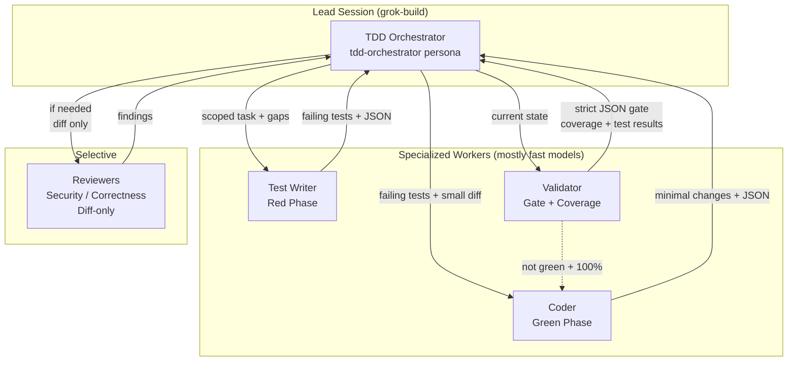
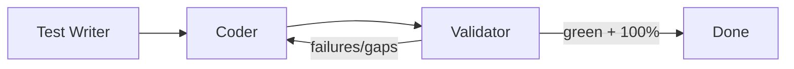
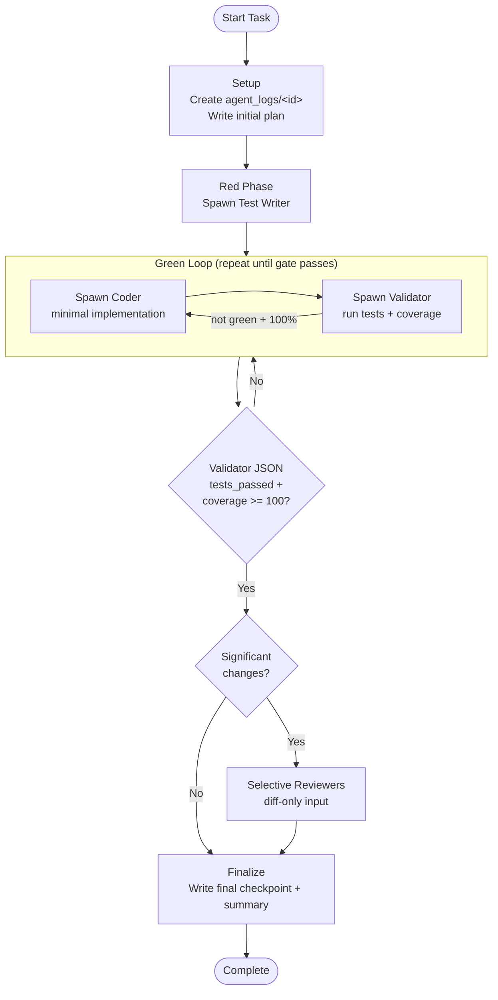
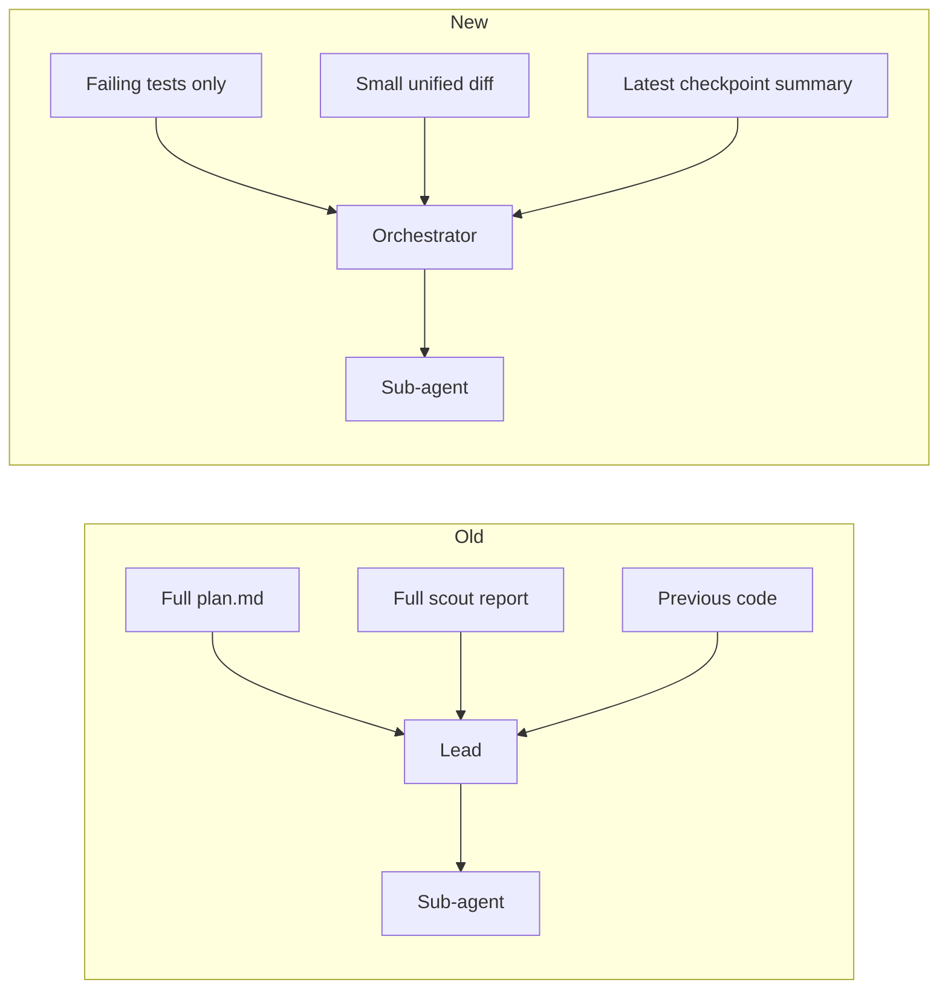
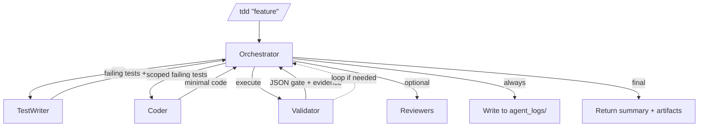

# TDD Workflow: Architecture & Usage Guide

**Project**: julia-tachikoma-ui-test (Julia + Tachikoma TUI)  
**Date**: 2026-06-27  
**Status**: Canonical reference for the new hierarchical TDD architecture

This document explains the full architecture and how to use the new TDD workflow. It replaces the older monolithic `/pipeline` pattern with a more efficient, reliable, test-driven approach.

---

## 1. Why This Architecture Exists

The previous workflow (classic `/pipeline`) had a major problem:

- The **lead orchestrator** accumulated massive context (often 200k–400k+ tokens).
- Sub-agents received large dumps of plans, scout reports, full code, and history.
- This led to 14M–25M token sessions on moderately complex tasks.
- Tests were often added late (or not at all with proper coverage).
- Reviews were always run in parallel regardless of need.

### Key Goals of the New Design
- **Context isolation** — sub-agents only ever see what they need
- **Strict TDD** — tests first, validator is a hard gate
- **100% coverage** target on changed code
- **Persistent, resumable state** in the repo (`agent_logs/`)
- **Token efficiency** through scoping + structured handoffs
- **Clear separation of concerns** (orchestrator vs specialized workers)

---

## 2. High-Level Architecture

The system is **hierarchical** with a thin orchestrator at the top.



**Core Principle**: The Orchestrator **never** writes production code or runs tests itself. It only coordinates and makes decisions based on structured feedback.

---

## 3. The Three Core Actions

These are the only roles that do real work. Full contracts are in [`.grok/docs/tdd-3-actions.md`](tdd-3-actions.md).

### 1. Test Writer (Red Phase)

**Goal**: Write the smallest set of tests that will currently fail.

- Input is always scoped
- Must produce tests that **fail** until implementation exists
- Strong emphasis on Tachikoma `TestBackend` for UI
- Outputs: unified diff + JSON summary

### 2. Coder / Implementer (Green Phase)

**Goal**: Write the *minimal* code needed to make the current failing tests pass.

- Receives **only** the failing tests + recent small diff + checkpoint summary
- No unrelated features or early refactors
- Outputs: code changes + JSON summary

### 3. Validator (Gate)

**Goal**: Execute tests + measure coverage. Provide an objective gate.

- Always runs real commands (`julia --project=.`)
- Enforces coverage >= 100% on changed code
- For UI: must drive `TestBackend` + assertions
- **Never** claims success without evidence
- Outputs: strict JSON gate



---

## 4. The TDD Orchestrator Agent

This is the "brain" that runs the workflow.

- **Persona**: `tdd-orchestrator.toml` (uses `grok-build`)
- **Runnable entry point**: the `tdd` skill (`/tdd`)

Its responsibilities:
- Owns the TDD state machine (Red → Green → Refactor)
- Maintains `todo_write`
- Creates and updates artifacts in `agent_logs/`
- Decides when to loop, when to call reviewers, and when to escalate to you
- Enforces scoping on every delegation

It is deliberately "thin" — it coordinates rather than does the work.

---

## 5. Full TDD Loop (Red → Green → Refactor)



**Important**: The loop is **not** capped by default. It continues until the validator is satisfied (or you intervene).

---

## 6. Context Scoping — The Efficiency Secret

This is the biggest difference from the old workflow.

**Old way** (context explosion):
- Sub-agents received full plans + full scout reports + large code chunks + conversation history.

**New way** (scoped packets):



Every prompt tells sub-agents:
> "Read plan.md and agent_logs/<id>/checkpoint-*.md from disk. You are only given the failing tests + relevant diff."

---

## 7. Persistent State & Artifacts (`agent_logs/`)

All durable state lives on disk so the conversation can stay small.

Typical structure:

```
agent_logs/
  add-filter-abc123/
    plan.md
    checkpoint-1-red.md
    checkpoint-2-green-1.md
    checkpoint-3-green-2.md
    coverage-report.json
    changes.diff
    state.json
    final-summary.md
```

The orchestrator writes checkpoints after every major phase. Sub-agents are instructed to read from these files.

You can resume work later by pointing a new session at the run ID.

---

## 8. How to Use the New Workflow

### When to Use What

| Task Type                    | Recommended Command                          | Notes |
|-----------------------------|----------------------------------------------|-------|
| Trivial (typo, small guard) | Direct edit + `/test` or `/review`           | Don't over-engineer |
| Small-medium feature        | `/tdd Your description`                      | Default choice for TDD |
| Large / architectural       | `/design "..."` then `/execute-plan`         | Or feed plan into `/tdd` |
| Want maximum isolation      | `/design` + `/execute-plan --instructions "Use TDD..."` | Uses worktrees + resume |

### Primary Invocation

```bash
/tdd Add a status filter dropdown to the metrics table with full TestBackend coverage

/tdd trivial: true Fix label alignment on the header
```

### Typical Session Experience

1. You start with `/tdd ...`
2. The orchestrator (ideally using `tdd-orchestrator` persona) sets up `agent_logs/`
3. You see it spawn **Test Writer** → produces failing tests
4. You see it spawn **Coder** (with very small context)
5. You see it spawn **Validator** — it actually runs Julia commands
6. Validator returns JSON. If not perfect, it loops back to Coder
7. Once it passes the gate, it may do selective reviews
8. It writes final artifacts and gives you a summary

### Manual / Advanced Usage

You can also run it without the skill by:
- Using the `tdd-orchestrator` persona as your lead
- Pasting the orchestrator prompt from [`.grok/docs/tdd-workflow.md`](tdd-workflow.md)
- Manually spawning the three personas with scoped prompts

---

## 9. Integration with Other Skills & Personas

- **`/design` + `/execute-plan`**: Excellent for big work. You can inject TDD instructions.
- **`/implement`**: Good middle ground when you want effort-scaled reviews + memory.
- **Old `/pipeline`**: Being phased toward the TDD pattern.
- **Personas**:
  - `tdd-orchestrator` — the workflow agent
  - `test-writer`, `coder`, `validator` — the three workers
  - `reviewer`, `planner`, `scout` — used selectively

---

## 10. Julia + Tachikoma Rules (Non-Negotiable)

- Always invoke with `julia --project=.`
- UI changes **must** use `Tachikoma.TestBackend` (render + `char_at` / `find_text` / `row_text` + `update!` / `handle_key!` + re-render)
- Coverage target is 100% on changed modules (use `Pkg.test(coverage=true)`)
- Model must follow Elm contract (`mutable struct <: Model`, mutations only in `update!`)

The Validator will actually execute these rules and block progress if they are not followed.

---

## 11. Quick Reference

**Main files**:
- `.grok/skills/tdd/SKILL.md` — the `/tdd` command
- `.grok/docs/tdd-3-actions.md` — exact contracts for the three workers
- `.grok/docs/tdd-workflow.md` — copy-paste orchestrator prompts + schemas
- `.grok/personas/tdd-orchestrator.toml` — the dedicated agent persona
- `AGENTS.md` — project rules + "when to use which workflow"

**Key artifacts**:
- `agent_logs/<id>/` — state of the run
- `todo_write` — live phase tracking inside the session

**Mental model**:
> Tests first. Minimal code. Hard gate on coverage. Tiny context. State on disk.

---

## Summary Diagram: Full System



This architecture gives you the reliability of strict TDD with the efficiency of scoped, hierarchical delegation.

---

**Related Reading**
- [`.grok/docs/tdd-3-actions.md`](tdd-3-actions.md)
- [`.grok/docs/tdd-workflow.md`](tdd-workflow.md)
- [AGENTS.md](../AGENTS.md) (TDD Orchestration section)
- The `tdd-orchestrator`, `test-writer`, `coder`, and `validator` personas

Use this file as your primary reference when you want to remember how the new workflow works.