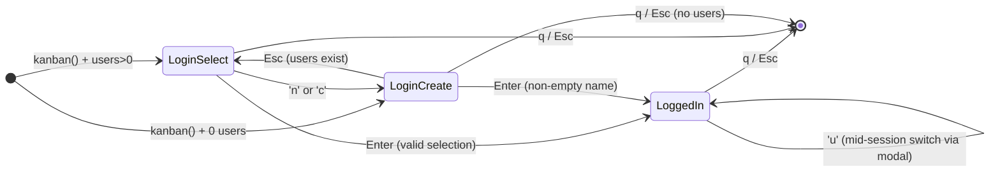
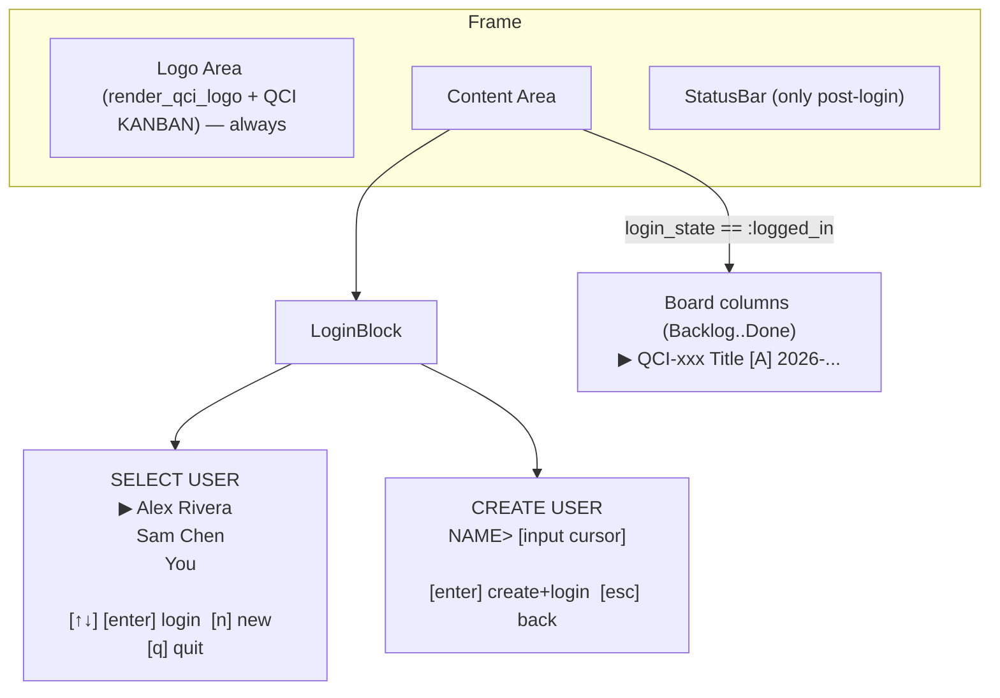

# Design: Startup Login for QCI Kanban TUI

**Author:** Grok (systems architect)  
**Date:** 2026-06-27  
**Status:** Draft  
**Project:** QCI Kanban (julia-tachikoma-ui-test/qci-kanban)  
**Related:** AGENTS.md (mandatory TestBackend coverage), existing user picker (Phase 4), seed card "Design login screen"

---

## Overview

This design specifies an explicit login (identity selection or creation) flow that occurs on `kanban()` startup. The user must actively choose or create a user identity before the Kanban board (columns, card navigation, creation/editing, status changes) becomes visible and interactive. After login, `current_user_id` is set and the app transitions to the normal board view. Existing mid-session user switching via `'u'` is preserved.

The solution reuses/extends the existing user infrastructure (`users` table, `list_users`/`create_user!`, `user_selected`, picker rendering patterns, QCI branding colors, `Block`/`render`/`split_layout`, `TextInput`), adds minimal state to `KanbanModel`, gates behavior in `update!`/`view`, and provides comprehensive `Tachikoma.TestBackend` coverage via `update!` + `visual_rows` + `find_text`/`row_text` sequences.

All changes are isolated to `qci-kanban/`. Run command unchanged: `julia --project=qci-kanban -e 'using QciKanban; QciKanban.kanban()'`.

---

## Background & Motivation

Current startup (QciKanban.jl:738):

```julia
function kanban(; db_path::AbstractString = DB.DEFAULT_DB_PATH)
    m = KanbanModel(db_path = db_path)
    load_board!(m)   # initial load + demo seed
    app(m)
end
```

`load_board!` (QciKanban.jl:76) → `ensure_db!` (QciKanban.jl:69) → `DB.open_db` + `DB.seed_demo!` → `load_users!` (QciKanban.jl:110):

```julia
if m.current_user_id === nothing && !isempty(m.users)
    m.current_user_id = m.users[1]["id"]   # silent auto-pick
end
```

Pain points:
- No explicit "who am I?" at launch; first user is silently chosen.
- New cards always inherit `assignee_id = current_user_id` (QciKanban.jl:254) without confirmation.
- Existing user picker (`'u'` → `modal = :user_picker`, QciKanban.jl:118, render ~692) is optional and mid-session only.
- Irony noted in seed data (db.jl:228): card titled "Design login screen".
- First-run UX and multi-identity local use cases are weak.
- README advertises "User switching ('u') + assignee display on cards".

Users schema already exists (db.jl:49): `users(id, name, created)`. `create_user!`, `list_users`, `get_user` are implemented. Card assignee display and inheritance already work. The change is purely the forced explicit startup experience + create capability.

All UI must obey AGENTS.md: "UI changes require TestBackend coverage", use `julia --project=qci-kanban`, `visual_rows`, `T.update!` + re-render assertions, `T.find_text`/`row_text`.

---

## Goals & Non-Goals

**Goals:**
- On `kanban()` launch, present login screen (select existing or create new) before any interactive board state.
- Board columns/cards/nav/edit/move/calendar are neither rendered nor actionable until `login_state == :logged_in` and `current_user_id` set.
- Smooth transition: after explicit choice, load board data, set `current_user_id`, show board with user in status.
- Support create-user directly in login UI and in mid-session `'u'` picker (press 'n'/'c' to create).
- Handle first-run (0 users after open) and empty-name validation; on pure first-user create, seed 2-3 demo cards for that user.
- Last-user persistence: optional `~/.qci-kanban/last_user` file for pre-selection (explicit Enter still required).
- 100% TestBackend coverage for new flows (select, create, edges, gating, picker 'n', last-user preselect, animated login elements, visual render before/after login).
- Preserve `'u'` mid-session switcher exactly (now enhanced with create).
- Keep `KanbanModel(); QciKanban.load_board!(m)` + existing tests passing with no/minimal test changes (via `auto_select` default).
- Reuse QCI colors (`QCI_CYAN`, `QCI_NAVY`, `QCI_SECONDARY`), `render_qci_logo`, `Block`, layouts.
- Enhance login branding with dynamic title + stylized/animated logo using existing primitives + `tick`.
- No DB schema changes.

**Non-Goals:**
- Passwords, PINs, hashing, or real auth (local only).
- Auto-login from last-user file (always explicit confirmation).
- Changing `seed_demo!` behavior for normal loads or deleting the demo card (only extend for first-user-create path).
- New exported public API (internal helpers ok).
- Overloading view_mode (e.g. `:login`) or separate LoginModel (evaluated in Alternatives; rejected for dispatch pollution and test impact).
- Performance metrics or network.

---

## Proposed Design

### State Additions (QciKanban.jl:36 KanbanModel)

```julia
@kwdef mutable struct KanbanModel <: Model
    # ... existing ...
    # Users (Phase 4)
    current_user_id::Union{String,Nothing} = nothing
    users::Vector{Dict{String,Any}} = Dict{String,Any}[]
    user_selected::Int = 1

    # Login on startup (new)
    login_state::Symbol = :logged_in          # :select_user | :create_user | :logged_in
    login_selected::Int = 1
    login_input::TextInput = TextInput(; focused=true)

    # ... rest unchanged
end
```

Defaults ensure direct `KanbanModel()` + `load_board!` paths (tests) behave as before.

**State transition hygiene note** (add near helpers and in create paths):
- On every entry to `:create_user` (startup decision, 'n'/'c' from select, or future picker), **always** (re)assign:
  `m.login_input = TextInput(; focused = true)`
  (Exactly analogous to `open_edit_modal!` at QciKanban.jl:223/236 which resets edit_title/edit_desc. Prevents stale focus/text from prior create attempts.)

### Modified `load_users!` (QciKanban.jl ~110)

**Exact current body** (before this change, verified):

```julia
function load_users!(m::KanbanModel)
    ensure_db!(m)
    m.users = DB.list_users(m.db)
    if m.current_user_id === nothing && !isempty(m.users)
        m.current_user_id = m.users[1]["id"]
    end
end
```

Proposed (add optional kwarg with default for full backward compat):

```julia
function load_users!(m::KanbanModel; auto_select::Bool = true)
    ensure_db!(m)
    m.users = DB.list_users(m.db)
    if auto_select && m.current_user_id === nothing && !isempty(m.users)
        m.current_user_id = m.users[1]["id"]
    end
end
```

- Default `auto_select=true` keeps `load_board!` (and thus all tests + record_demo) unchanged.
- Startup path calls with `false`. All call sites (load_board!, open_user_picker!) continue to work.

### Startup Entry (replace load_board! auto behavior)

(QciKanban.jl:738)

Clear, verifiable seed rule (to resolve "first-run demo" vs. "pure no-users → create"):

- Seed demo data **only on absolute first run**: when **both** users table is empty **and** issues table is empty at the moment of first open.
- This preserves the 3 demo users + 10 cards (including ironic "Design login screen") for normal fresh installs.
- The `:create_user` branch is hit on subsequent "no users" states (e.g. users manually removed while issues remain, or test paths that delete only the users table after open).
- After create in a no-prior-users case, the board may contain pre-existing issues (if any) or start empty.

```julia
function kanban(; db_path::AbstractString = DB.DEFAULT_DB_PATH)
    m = KanbanModel(db_path = db_path)
    if m.db === nothing
        m.db = DB.open_db(m.db_path)
    end
    # Exact seed decision (verifiable + produces documented create-first state)
    pre_users = DB.list_users(m.db)
    pre_issues = DB.list_issues(m.db)
    if isempty(pre_users) && isempty(pre_issues)
        DB.seed_demo!(m.db)   # only here: creates demo users + issues
    end
    load_users!(m; auto_select = false)
    if isempty(m.users)
        m.login_state = :create_user
        m.login_input = TextInput(; focused = true)
    else
        m.login_state = :select_user
        m.login_selected = 1
    end
    app(m)
end
```

Helper for test/edge "force pure create" path (produces empty-users state **without** re-seeding demo users). To avoid exposing DBInterface in the main QciKanban module (see Issue 1 resolution), we propose adding a thin test-oriented wrapper inside the DB submodule:

```julia
# In src/db.jl (add near other exports)
export clear_users_for_test!

function clear_users_for_test!(db::SQLite.DB)
    DBInterface.execute(db, "DELETE FROM users")
end
```

Then (in QciKanban.jl context):

```julia
function force_create_user_state_for_test!(m::KanbanModel)
    # Assumes db already opened (e.g. via ensure or direct open)
    DB.clear_users_for_test!(m.db)  # uses exported DB wrapper
    load_users!(m; auto_select = false)
    m.login_state = :create_user
    m.login_input = TextInput(; focused = true)
    m.login_selected = 1
end
```

(The DELETE recipe using the DB wrapper (or direct DBInterface in tests) is documented in one recommended location: the TestBackend Coverage Requirements section below. The `force_create...` name is retained near the startup sketch only for reference; prefer the centralized test helper `startup_login_state`.)

`ensure_db!` updated to support optional seed (backward compatible; default preserves old callers). To avoid duplication of the "should we seed?" decision, we suggest simply calling `DB.seed_demo!(m.db)` and **relying on seed_demo!'s own guard** (db.jl:209 `if !isempty(u) || !isempty(iss) return`) plus a clarifying comment. The explicit both-empty check in kanban/ensure is illustrative only; production code can delegate to the existing guard.

```julia
function ensure_db!(m::KanbanModel; seed::Bool = true)
    if m.db === nothing
        m.db = DB.open_db(m.db_path)
        if seed
            DB.seed_demo!(m.db)   # safe: seed_demo! self-guards on both-empty
        end
    end
end
```

`load_board!` and other internal call sites unchanged (default seed=true). Direct use of `force_create_user_state_for_test!` in tests allows the documented "create first + empty board" path.

**load_board! compat shim note** (narrow, harmless): the one-line append `m.login_state = :logged_in` at the end of load_board! (proposed for PR1) is a **narrow compatibility shim only for the direct test/record paths** (`KanbanModel(); load_board!(m)` and record_demo callers). It is harmless because those paths already populate current_user_id and expect full board behavior; it has no effect on the new `kanban()` login flow (which explicitly sets :select/:create and never calls load_board! until after login).

### Login Helpers (new, near load_users!)

- `select_user_and_login!(m)`
- `create_and_login!(m, name::AbstractString)`
- `switch_to_create_user!(m)`

`create_and_login!` validates non-empty stripped name, calls `DB.create_user!`, refreshes users, sets `current_user_id` + `:logged_in`, then `load_board!(m)`.

### Gating in `update!` (QciKanban.jl:291)

Place the login guard **immediately after the basic q/esc block (and any special-case 'r' reload if desired)** and **before the view-mode switches** ('b'/'c'/'L' at current QciKanban.jl:305-314). This ensures:

- View switches are intentionally suppressed pre-login (no accidental :calendar or :list bleed).
- Login keys ('n'/'c' for create, j/k/enter) take priority without conflict.
- 'r' may be special-cased inside the guard to reload the users list (or ignored); the design chooses to ignore 'r' pre-login for simplicity (no partial board state).

Current code structure reminder (exact from source):
```julia
function update!(m::KanbanModel, evt::KeyEvent)
    if evt.key == :char && evt.char == 'q'
        m.quit = true
        return
    elseif evt.key == :escape && m.modal == :none
        m.quit = true
        return
    elseif evt.key == :char && evt.char == 'r'
        load_board!(m)
        return
    end

    # View switching (works in any mode)   <--- these move AFTER the new guard in the gated startup path
    if evt.key == :char && evt.char == 'b' ...
```

Proposed guarded block (placed right after the 'r' stanza):

```julia
    if m.login_state != :logged_in
        # q/esc handled above (quit always allowed). 'r' intentionally NOT forwarded here.
        if m.login_state == :create_user
            if evt.key == :enter
                name = strip(text(m.login_input))
                if !isempty(name)
                    create_and_login!(m, name)
                end
                return
            elseif evt.key == :escape
                if !isempty(m.users)
                    m.login_state = :select_user
                    m.login_selected = 1
                else
                    m.quit = true
                end
                return
            end
            if handle_key!(m.login_input, evt)
                return
            end
            return
        else  # :select_user
            nu = length(m.users)
            if nu > 0
                if evt.key == :up || (evt.key == :char && evt.char == 'k')
                    m.login_selected = max(1, m.login_selected - 1)
                    return
                elseif evt.key == :down || (evt.key == :char && evt.char == 'j')
                    m.login_selected = min(nu, m.login_selected + 1)
                    return
                elseif evt.key == :enter
                    select_user_and_login!(m)
                    return
                elseif evt.key == :char && evt.char in ('n', 'c')
                    switch_to_create_user!(m)
                    return
                end
            end
            if evt.key == :escape
                m.quit = true
            end
            return
        end
    end

    # View switching (works in any mode)  -- now only reachable when logged_in
    if evt.key == :char && evt.char == 'b'
        ...
```

Later board guard (around QciKanban.jl:365) becomes:

```julia
if m.view_mode == :board && m.modal == :none && m.login_state == :logged_in
```

All view-mode switches, card create/edit, moves, delete, 'u'/'m' etc. remain inside (or after) the logged-in guard. Modal handlers are unreachable pre-login. The early return for login_state prevents any bleed.

### Rendering Changes in `view` (QciKanban.jl:497)

- Logo area always rendered (prominent on login).
- Content area:
  - `if m.login_state == :logged_in && m.view_mode == :board` → existing column/cards logic (QciKanban.jl:527 block).
  - `elseif m.login_state == :select_user || m.login_state == :create_user` → new login content.
  - Calendar/list still gated.
- StatusBar only when `login_state == :logged_in && m.modal == :none`.
- Modals (card/user/move) unchanged; unreachable pre-login.
- **No clear-rect** for login (correct; login replaces content_area entirely, unlike overlay modals at 654).

**Annotated concrete login view block**:

**Implementation / insertion point note** (critical for fidelity):
- Immediately after the existing `render_qci_logo(buf, logo_area)` line.
- Immediately before `mode_str = uppercase(string(m.view_mode))`.
- **Reuse** the already-computed `logo_area`, `content_area`, `status_area` locals produced by the single `rows = split_layout(Layout(Vertical, [Fixed(7), Fill(), Fixed(1)]), main)` at ~line 515 (do **not** duplicate the split_layout call).
- The existing guard `if length(rows) < 3 return` (right after the split) is respected; login block only executes for normal-sized frames.
- The inner `if m.login_state != :logged_in { ... return }` early-returns and completely bypasses all subsequent board/calendar/status/modal rendering (correctly gates the rest of the function).
- Dynamic title is set on the outer Block before the split (see Branding section); login sketch below can assume the title is already "QCI KANBAN — LOGIN". Animation lives inside the enhanced render_qci_logo (or login branch) using m.tick.

```julia
# Inside view(...)  -- insertion point:
#   (after render_qci_logo(buf, logo_area) )
#   (before mode_str = ... )

if m.login_state != :logged_in
    # Login primary content (full content_area, not centered modal overlay)
    # Narrow terminal handling: uses a slightly more permissive threshold on the
    # already-computed content_area (vs. the top-of-view `area` guard of <20/<6)
    # so that a minimal login header is still shown in borderline-small terminals
    # while still falling back early. Rationale: login is the primary UX at this
    # point and should be usable down to ~30x8.
    if content_area.width < 30 || content_area.height < 8
        set_string!(buf, content_area.x + 1, content_area.y + 1, "QCI KANBAN - LOGIN (small)", Style(; fg=QCI_CYAN, dim=true))
        return   # early; logo already shown; bypasses everything below
    end

    is_create = m.login_state == :create_user
    title = is_create ? "CREATE USER" : "SELECT USER"
    lblock = Block(
        title = title,
        border_style = Style(; fg = QCI_CYAN),
        title_style = Style(; fg = QCI_CYAN, bold = true),
    )
    # Note: outer Block title (earlier in view) is already set to "QCI KANBAN — LOGIN" for the whole login_state.
    # Use nearly full content_area (small padding like user_picker; not full bleed)
    lw = min(44, content_area.width - 4)
    lh = min(12, content_area.height - 2)
    lx = content_area.x + (content_area.width - lw) ÷ 2
    ly = content_area.y + 1
    linner = render(lblock, Rect(lx, ly, lw, lh), buf)

    y = linner.y + 1
    if is_create
        # Create form (exact "NAME>" prompt + focused TextInput, mirroring card_edit ~670)
        set_string!(buf, linner.x + 1, y, "NAME>", Style(; fg = QCI_CYAN, bold = true))
        input_rect = Rect(linner.x + 7, y, max(12, linner.width - 10), 1)
        render(m.login_input, input_rect, buf)
        y += 2
        if y < bottom(linner)
            set_string!(buf, linner.x + 1, y, "[enter] create + login   [esc] back", Style(; fg = QCI_SECONDARY, dim = true))
        end
    else
        # Select list (reuses exact user_picker style ~700)
        nu = length(m.users)
        for (i, u) in enumerate(m.users)
            if y > bottom(linner) - 2; break; end
            sel = (i == m.login_selected)
            p = sel ? "▶ " : "  "
            sty = sel ? Style(; fg = QCI_CYAN, bold = true) : Style(; fg = QCI_SECONDARY)
            set_string!(buf, linner.x + 1, y, p * get(u, "name", "?"), sty)
            y += 1
        end
        if nu == 0
            set_string!(buf, linner.x + 2, y, "No users — press 'n' to create", Style(; fg = QCI_SECONDARY, dim = true))
            y += 1
        end
        if y < bottom(linner)
            set_string!(buf, linner.x + 1, y, "[↑↓/jk] select  [enter] login  [n/c] new  [q/esc] quit",
                        Style(; fg = QCI_SECONDARY, dim = true))
        end
    end
    return   # important: do not fall through to board content or status
end

# ... existing board / calendar content when logged_in ...
```

Exact instruction strings (hard-coded in the sketch above for reproducibility):
- Create: "[enter] create + login   [esc] back"
- Select: "[↑↓/jk] select  [enter] login  [n/c] new  [q/esc] quit"  + conditional "No users — press 'n' to create"

Integration note: reuses the *already-computed* `logo_area` / `content_area` / `status_area` from the outer split at ~515 (see insertion point note above); the login `if` + early `return` sits right after `render_qci_logo` and bypasses `mode_str`, the big board `if`, calendar, status rendering, and all modals. No duplicate split. No rect clearing (login is not an overlay). The top-of-view small-area guard (area <20/<6) and the `if length(rows)<3 return` are left in place; login adds its own content-derived narrow guard for usability.

This gives pixel-faithful + keyboard-faithful reproduction.

### Seed Handling Strategy

Exact rule (see startup code above):
- Seed **only** when `isempty(users) && isempty(issues)` on open (absolute first-ever DB).
- Normal first run: seed_demo runs → 3 demo users appear in the login picker (explicit choice required) + full demo cards.
- "Pure no-users → create" path (to exercise the create UI + potentially empty board): achieved by (a) manual DB edit, or (b) the `force_create_user_state_for_test!` helper (DELETE users after open but before state decision; seed is not re-invoked because the both-empty guard was already evaluated). Issues may be left or also cleared in the test helper.
- `load_board!` (tests + post-login) unchanged; `seed_demo!` body (db.jl:209) untouched.
- This eliminates the previous contradiction while preserving "data seeded on first run".

### Keyboard Model (Login)

- Select: `j`/`k`/`↑`/`↓`, `Enter` (login), `n`/`c` (create), `q`/`Esc` (quit), `r` ignored or reloads users list minimally.
- Create: typing (via `TextInput`), `Enter` (if non-empty name), `Esc` (back to select if users exist, else quit).
- No bleed into board keys.
- Reuses same nav vocabulary as user_picker / board (QciKanban.jl:412).

### Mid-session User Picker Create (per resolved Q1)

The existing `open_user_picker!` / `:user_picker` modal (triggered by 'u' post-login) is extended:
- In the user_picker nav block (currently ~QciKanban.jl:412), also handle `evt.key == :char && evt.char in ('n','c')`: switch to create mode using shared `login_input` (or a picker-scoped TextInput), keep modal = :user_picker or a new :user_create substate for clarity.
- On Enter in create (non-empty name): `DB.create_user!`, refresh users, select the new one via `select_current_user!` logic (or direct), close modal (`modal = :none`), set message.
- Create flow inside the picker reuses the same TextInput handling as startup create (state hygiene, focused=true on switch).
- After create+select, new cards will use the new assignee as before.
- Existing 'u' picker list navigation, Enter-to-select, Esc unchanged.
- Requires TestBackend coverage for picker 'n' sequences + create inside modal (visual_rows while modal open, post-create board update).

### Last-User Persistence (per resolved Q2)

Add simple last-user file support (`~/.qci-kanban/last_user`, just the id string):
- On any successful login (startup `select_user_and_login!` / `create_and_login!`, or mid-session via picker): write the id (e.g. using `write(expanduser("~/.qci-kanban/last_user"), current_user_id)`).
- In `kanban()` startup, after `load_users!(m; auto_select=false)` and before setting initial `login_selected`:
  - Try read last_id = strip(read(..., String)) if file exists.
  - If last_id matches one in m.users, set `login_selected` to its index (pre-select for convenience).
  - Explicit Enter is still required to confirm login (never auto-transition to :logged_in from file alone).
- If file user no longer exists, ignore silently and fall back to first user or create prompt.
- File is plain text, best-effort (ignore IO errors); no new DB table.
- Update tests for preselect + re-confirmation.

### First-Create Demo Seeding (per resolved Q3)

In the first-user create success path (detected when pre-create `length(users) == 0`):
- After `create_user!`, set current, login_state=:logged_in, load_board! (or direct create issues):
  - Call a small helper `seed_demo_for_new_user!(db, user_id)` that creates 2-3 simple issues (e.g. "Welcome to QCI Kanban", "Explore the board", "Create your first card") in Backlog/To Do, assigned to user_id or left unassigned, using minimal position/key logic borrowed from seed_demo!.
- This only triggers on absolute first user creation at startup (not on later 'n' in picker or when demo users already existed).
- Keeps board immediately usable without being completely empty.
- Tests: after first-create transition, assert demo cards present via visual_rows / find_text.

### Login Branding + Stylized/Animated Logo (per resolved Q4)

- Dynamic title: In the outer Block construction (view), use `title = (m.login_state != :logged_in ? "QCI KANBAN — LOGIN" : "QCI KANBAN")`.
- Enhanced `render_qci_logo` (or login-only branch when !logged_in):
  - "SVG digitize" style: Instead of (or alongside) plain BigText("QCI"), construct a geometric mark with multiple `set_string!` calls using box-drawing chars (e.g. "┌─┐" forms, accents, positioned lines for a vector-like Q/C/I emblem in QCI_CYAN). Example glyph layout in a small Rect.
  - Cool lightweight animation driven by `m.tick` (incremented on input):
    - Pulsing/scanning accent: under the logo, draw a repeating "═" or "─" segment that shifts position or brightness (dim/bright cycle) every few ticks.
    - Tagline: "QCI KANBAN" that progressively "types" (length = (tick % 20)) or has a moving highlight cursor.
    - Orbiting decoration: 2-4 unicode dots/blocks (• ○ ◉) that cycle positions around the logo using simple modulo math on tick (no trig-heavy code).
  - Only active on login screen; keep total work O(1) per frame.
- Logo area remains the prominent Fixed(7) top row from split_layout.
- Update annotated login view sketch and TestBackend expectations (tick-driven strings visible after updates).

### Transition & Post-Login

- `select...` / `create...` set `current_user_id`, `:logged_in`, call `load_board!(m)`, set friendly `message`.
- `view` now renders full board + assignee display (existing logic).
- Status shows username abbreviation (QciKanban.jl:634 path).
- New cards use the chosen user (existing).

### TestBackend Coverage Requirements (mandatory for PR 5 + all render changes)

All new/modified UI and flows **must** use the established idiom (see test_board_render.jl, test_modal_move.jl, test_users.jl, runtests.jl:9):

```julia
m = KanbanModel()
m.db_path = ":memory:"
# ... setup ...
rows = visual_rows(m; w=80, h=20)
tb = T.TestBackend(80, 20)
T.reset!(tb.buf)
T.view(m, ...)
@test T.find_text(tb, "FOO") !== nothing
@test occursin("...", T.row_text(tb, N))
```

Expanded required assertions (beyond basic nav/enter/create):
- Startup: after ensure + load_users!(;auto=false) + explicit `m.login_state = :select_user` (or :create), visual_rows shows "SELECT USER" or "CREATE USER", logo "QCI", no "QCI-" card keys.
- Select: j/k (or arrows), enter → login_state==:logged_in, current_user_id set, re-render shows board "QCI-" keys + status contains user name abbreviation.
- Post-transition: verify assignee display on a card (initial + due) + status bar user name using find_text/row_text after the enter that logs in.
- Create: force pure empty-users via the documented helper (or DELETE + load), `T.set_text!(m.login_input, "New Person")` or char-by-char + `handle_key!` sequences (AGENTS.md), enter → new user in list_users + current set + board visible.
- Empty name: set_text!(""), enter → stays in :create_user, no transition.
- Gating / suppression:
  - Pre-login: 'n', 'l', '>', enter, 'u', 'b', 'c' have no effect on modal/view_mode/selection (assert after update!).
  - Pre-login 'r' ignored (or no load_board side effects on cards).
- Narrow terminal: visual_rows(w=28, h=7) still renders login header without crash; "small" text or short login prompt visible.
- Unreachable: after login_state=select, 'b'/'c'/'L' + calendar/list content must not appear until successful login.
- Re-render hygiene: update! (enter) then visual_rows again; board content now present, login texts gone.
- Esc behaviors + post-login 'u' picker still works (visual + state).
- Helper for forcing empty-users (used in tests):

```julia
function startup_login_state(m; empty_users::Bool=false)
    m.db_path = ":memory:"
    QciKanban.ensure_db!(m)
    if empty_users
        # Test-visible recipe: tests already do `using DBInterface` (see test/test_db.jl).
        # Prefer the centralized DB wrapper added for src (see Startup Entry):
        #   DB.clear_users_for_test!(m.db)
        # Fallback (tests only):
        DBInterface.execute(m.db, "DELETE FROM users")
    end
    QciKanban.load_users!(m; auto_select=false)
    m.login_state = isempty(m.users) ? :create_user : :select_user
    m.login_selected = 1
    m.login_input = TextInput(; focused=true)
    m
end
```

All sequences must be after `T.update!(m, evt)` then fresh render + assertions (no reliance on prior frames). Coverage target: 100% on new login paths + any touched view/update branches.

### Diagrams

#### Startup Sequence

```mermaid
sequenceDiagram
    participant CLI as User / julia
    participant K as kanban()
    participant M as KanbanModel
    participant D as DB
    CLI->>K: kanban()
    K->>M: KanbanModel()
    K->>M: open_db (schema only)
    K->>M: pre_users = list; pre_issues = list
    alt first-ever (empty users AND empty issues)
        K->>D: seed_demo! (users + issues)   # only this path
    end
    K->>M: load_users!(auto_select=false)
    alt still no users (manual delete or force_create helper)
        M->>M: login_state = :create_user
    else
        M->>M: login_state = :select_user
    end
    K->>Tachikoma: app(m)  # event loop
    loop until :logged_in
        CLI->>M: KeyEvent (j/k/enter/n/...)
        M->>M: update! (login branch only)
        M->>Tachikoma: view (login UI)
    end
    M->>M: set current_user_id + :logged_in
    M->>M: load_board!()
    Note right of M: board now visible + interactive
    M->>Tachikoma: view (full board + status user)
```

#### Login State Machine



#### Screen Layout (Login vs Board)



---

## API / Interface Changes

**Public surface (minimal):**
- `kanban()` behavior change (explicit login required for interactive use). Direct call sites in demos/record unchanged in spirit.
- No new exported symbols required.

**Internal (QciKanban.jl):**
- `KanbanModel` gains 3 fields (see above).
- `load_users!` gains optional `; auto_select::Bool = true`.
- `ensure_db!` gains optional `; seed::Bool = true`.
- New private helpers: `select_user_and_login!`, `create_and_login!`, `switch_to_create_user!`.
- `update!` early return for `login_state != :logged_in`.
- `view` conditional for login UI vs board.

`DB` API unchanged. `app(m)` / Tachikoma contracts unchanged.

---

## Data Model Changes

- **No SQLite changes** (users table pre-existed).
- `KanbanModel` struct addition only (in-memory). Added fields for login_input etc. (already noted).
- On create via login: new row in `users`; `assignee_id` on future issues uses it (existing path).
- Last-user file: simple text file `~/.qci-kanban/last_user` (user id string) written on successful login; read for preselect only. No new DB table. (See Proposed Design.)
- First-create demo seeding uses existing issue creation paths.
- Migration: none. Existing `~/.qci-kanban/kanban.db` will just show login picker on next launch (current_user reset until chosen). last_user file is optional/best-effort.

---

## Alternatives Considered

**1. Forced non-dismissible `:user_picker` modal at startup (with board suppressed)**  
Render current modal code + extra "CREATE" option.  
**Pros:** Minimal new code, reuses modal render + user_selected.  
**Cons:** Modal semantics imply temporary overlay (current code clears only for card/move); "board underneath conceptually present" violates "not visible/functional"; create would require extending modal picker significantly; harder to make "full experience" branding. Rejected for clarity of top-level state.

**2. Separate `LoginModel` + composite runner or overload `view_mode = :login`**  
Introduce second struct, or hijack `view_mode` (set `m.view_mode = :login` at startup, special-case render/update when == :login, transition by setting :board + load).
**Pros:** Could reuse existing view_mode field/dispatch; no new state field.
**Cons (why rejected):** 
- view_mode is already a 3-value enum for post-login UX (`:board | :calendar | :list`); overloading adds confusion and requires guards in many places (current code assumes post-load board state).
- All existing tests + record_demo + direct `KanbanModel()` paths would need updates or extra defaulting logic to avoid accidentally entering login render.
- Breaks the clean "login_state is orthogonal to view_mode" (login is pre-board gate; view_mode is navigation once authenticated).
- Single-model Elm style is preserved better by a dedicated `login_state` + early guard (minimal diff).
- Would make the "suppress view switches pre-login" logic messier.
Explicit note: record_demo (which does `m=KanbanModel(); load_board!(m)`) and all direct test constructions are **unaffected** thanks to `login_state` default + `load_board!` forcing :logged_in (see PR1 and load_board compat).

**3. Silent + "press any key to continue as first user"**  
**Tradeoff:** Meets "upon startup" literally but not "explicitly 'log in'". Fails requirement. Rejected.

Chosen design (dedicated `login_state` + gated content) is minimal, follows existing picker patterns, enables clean TestBackend sequences, and makes board truly unavailable.

**Explicit note on unaffected paths (per review):** `record_demo` (QciKanban.jl ~755: m=KanbanModel(); load_board!(m); ...) and every direct `KanbanModel(); QciKanban.load_board!(m)` construction (used in runtests.jl, test_board_render.jl, test_users.jl, test_modal_move.jl etc.) remain 100% unaffected at all times because:
- `login_state` defaults to `:logged_in`
- `load_board!` (after the small compat addition) forces `m.login_state = :logged_in` once current_user is populated.
All tests and demo recording continue to exercise the full board path with zero changes required to their call sites.

---

## Security & Privacy Considerations

- **Threat model:** Pure local TUI. No network, no remote accounts. Attacker with FS access can read/edit `~/.qci-kanban/kanban.db` (SQLite plaintext).
- **Auth:** None today. Identity is just a free-text name chosen at runtime. Assignee is advisory (UI only).
- **Future extension path (not in scope):** Local hashed PIN stored alongside user row, or last-user cache file with TTL. Design leaves room (e.g. extra field or separate table).
- **Data handling:** `create_user!` uses UUID + UTC timestamp. Names are user-supplied (no sanitization beyond strip + non-empty). No PII beyond what user types.
- **Injection:** All DB access uses parameterized queries (existing). No eval of user strings.
- **Risk:** User can create many identities or delete via direct DB. Low severity; local tool.
- Mitigation: Clear doc in README; no elevated privileges.

---

## Observability

- Use existing `m.message` for "logged in as X", errors ("name required").
- No new logging/metrics in core path (Tachikoma `app` loop is silent).
- Test artifacts: `visual_rows` + `find_text` provide deterministic render evidence (already used for modals/users).
- On error paths (empty name), remain in create state; user sees no change or hint.
- For production debugging: existing `r` (post-login) + Julia logging.

No alerting. Simple TUI.

---

## Rollout Plan

- **No feature flags** (single binary TUI experience).
- **Staged:** Implement via small independent PRs (see PR Plan). Each PR includes its TestBackend tests + full `julia --project=qci-kanban -e 'using Pkg; Pkg.test()'` run.
- **Validation gate:** All new login paths must have sequences: construct → set state/db → `update!` (nav/enter/create/esc) → `visual_rows` / `TestBackend` + `find_text`/`row_text` assertions before + after transition.
- **Rollback:** Git revert of PRs. No persisted state changes (login is per-process).
- **Compatibility:** Old dbs work (users present → picker). New dbs get demo + explicit login.
- **Docs:** Update README "Run", keys list, and "User switching" paragraph in same or follow-on PR.

---

## Open Questions

**Resolved (user decisions 2026-06-27):**

1. **Should the mid-session `'u'` picker also gain a "create new" option (press 'n' while picker open)?** → **Yes**. Implication: Extend the existing `:user_picker` modal (in update! and view) to handle 'n'/'c' to switch to create flow using the shared `login_input` (or a dedicated picker create input). After successful create, auto-select the new user, set current_user_id, close modal, and set message. Keep startup login create separate but share logic/helpers. Affects test coverage (add picker 'n' sequences) and PR4.

2. **Add a "remember last user" file (e.g. `last_user.txt`) for convenience on repeat runs, with explicit re-confirmation?** → **Yes**. Implication: On successful login (startup or 'u' switch), write user id to `~/.qci-kanban/last_user`. In kanban() startup (after load_users, before deciding login_state), read it; if the id exists in current m.users, pre-set `login_selected` to that index (but still require explicit Enter to login; do not auto-log-in). Simple text IO (no DB schema change). Update tests for preselect behavior.

3. **Should we seed a couple of unassigned or self-assigned demo cards even in the pure "first user create" path?** → **Yes**. Implication: In the create-and-login success path (when no users existed before this create), after setting logged_in, invoke a lightweight `seed_first_user_demo!(m.db, new_user_id)` that adds 2-3 minimal issues (e.g. one in Backlog, one in To Do, assigned to the new user or unassigned) using pieces of seed_demo! logic but without creating extra users. Ensures board is not empty on absolute first user creation. Affects first-create transition and TestBackend (verify demo cards appear post-login).

4. **Any branding tweak (e.g. "QCI KANBAN — LOGIN" in outer Block title only during login)?** → **Yes**, plus SVG digitize / cool animation. Implication: In view, set outer Block title to "QCI KANBAN — LOGIN" (or similar) when `login_state != :logged_in`. Enhance `render_qci_logo` (or add login-specific path) for a stylized geometric QCI mark (box-drawing / positioned set_string glyphs instead of or in addition to plain BigText). Drive subtle animation with `m.tick` (pulsing underline/scan line under logo, typing or highlight-moving tagline "QCI KANBAN", light unicode orbiting dots/blocks). Keep lightweight (modulo tick), logo prominent on login. Update annotated sketch and tests for animated elements (tick-driven visuals).

---

## Incorporated Answers (2026-06-27)

User decisions incorporated as final (no further debate):

1. Mid-session 'u' picker gains "create new" ('n'/'c'): yes → extended modal handling + shared TextInput (see Proposed Design: Mid-session User Picker Create; tests in PR5; PR4).
2. Remember last user file + explicit re-confirmation: yes → `~/.qci-kanban/last_user` (id), preselect in startup picker only (see Last-User Persistence; IO in kanban/login success; PR4).
3. Seed demo cards on pure first-user-create: yes → 2-3 issues via `seed_demo_for_new_user!` after first create (see First-Create Demo Seeding; PR4).
4. Branding "QCI KANBAN — LOGIN" + SVG digitize / cool animation: yes → dynamic outer title on login; enhanced render_qci_logo with geometric box-drawing QCI + tick-driven pulsing/typing/orbit (lightweight, in login render branch; PR3).

Resulting deltas: expanded Goals/Non-Goals, new subsections in Proposed Design, updates to Key Decisions 7 + PR Plan (3/4/5/6), annotated sketch note, test expectations (picker 'n', last-user, demo cards, animation visibility), last-user file note in Data Model section (simple IO).

---

## References

- `qci-kanban/src/QciKanban.jl` (KanbanModel struct lines ~36-64 including user fields ~57-59; load_board! ~76; ensure_db! ~69; load_users! body exactly ~110-115; update! ~291 (q/esc/r at start, view switches ~305); view ~497 (split_layout ~515, board content ~527, modals ~647, user_picker ~692); render_qci_logo ~479; kanban entry ~738; small guard early in view; card modal "TITLE>" + render ~670; open_edit_modal ~218)
- `qci-kanban/src/db.jl` (users schema 49, list/create/get 83-101, seed_demo! 209 "if !isempty(u) || !isempty(iss)", ironic "Design login screen" card 228)
- `qci-kanban/test/runtests.jl` (visual_rows helper exactly lines 9-11, phase0 tests)
- `qci-kanban/test/test_users.jl` (picker sequences + visual 1-51)
- `qci-kanban/test/test_board_render.jl` + `test_modal_move.jl` (update! + visual_rows + no-bleed patterns, fresh() + :memory: + load_board!)
- `qci-kanban/test/test_db.jl` (user CRUD)
- AGENTS.md (TestBackend mandatory, `julia --project=qci-kanban`, Elm style, handle_key! usage)
- README.md (current advertised features)
- Tachikoma testing docs (TestBackend, handle_key!, row_text etc.)
- Existing modals use "clear under overlay" only for :card_edit (lines 654-656); user_picker/move do not because board render is skipped.

---

## Key Decisions

1. **Use dedicated `login_state` (not forced modal or separate model)** — Rationale: keeps single Elm `KanbanModel`, makes board truly invisible/non-functional (no column render at all), reuses existing picker/list rendering code + TextInput. Cites: view 533 "if m.modal == :none", modal renders 647.
2. **`auto_select` default on `load_users!` + default `:logged_in`** — Rationale: guarantees `KanbanModel(); load_board!(m)` in every existing test (runtests.jl, test_*.jl) continues to populate `current_user_id` and pass without edits to 30+ call sites. Startup path explicitly passes `false`.
3. **Seed only on absolute first (both users+issues empty)** — Rationale: precise verifiable rule using `isempty(pre_users) && isempty(pre_issues)`. Normal installs get demo users in picker + ironic card. "Create first" state reproducible in tests via helper that DELETEs users post-open (no re-seed). Preserves "data seeded on first run" + allows documented empty-users create path. See force_create_user_state_for_test! and updated kanban() snippet.
4. **Create-user lives only in startup login for this change** — Rationale: fulfills "support creating a new user directly from the login screen". Mid-session create left for future (keeps scope tight, no picker changes).
5. **Full gating in both `update!` and `view`** — Rationale: prevents any key bleed or partial render of board pre-login. Matches "board should not be functional/visible in its interactive state".
6. **Mandatory TestBackend coverage for login flows** — Non-negotiable per AGENTS.md. New tests will mirror modal tests (update! + visual_rows + find_text before/after transition + re-render).

7. **Mid-session picker create + last-user file + first-create demo seeding + login branding/animation** (user decisions) — Extend 'u' picker with 'n' create (reuses TextInput), persist last id to `~/.qci-kanban/last_user` (pre-select only, explicit confirm), seed 2-3 demo cards on absolute first-user create, dynamic "QCI KANBAN — LOGIN" title + tick-driven stylized geometric QCI logo (box-drawing + pulsing/typing/orbit effects). All lightweight, TestBackend-covered, no core DB schema change.

---

## PR Plan

Ordered, small, **incrementally runnable** reviewable PRs. Each PR must pass `julia --project=qci-kanban -e 'using Pkg; Pkg.test()'`. Direct construction paths (`KanbanModel(); load_board!(m)`) and `record_demo` remain fully functional after every PR (see explicit notes). Skeleton render + at least one TestBackend assertion required earlier. Manual smoke + visual_rows of the login UI (recognizable full screen) is a hard gate no later than PR 3. PR1/PR2 are logic + test scaffolding; full login UI + manual `kanban()` smoke of the screen is a hard gate no later than PR3.

**PR 1: Model fields + load/ensure + startup entry + login guard skeleton (keeps direct paths runnable)**  
- Files: `qci-kanban/src/QciKanban.jl` (KanbanModel ~36 including 3 new fields, load_users! ~110 with ;auto_select, ensure_db update, kanban() ~738 with both-empty seed rule + force_create helper sketch, update! guard placement immediately after q/esc/r before view switches, board guard, load_board! appends `m.login_state = :logged_in` for compat after its work)  
- Deps: none  
- Desc: Wiring + full early guard (with pass-through for already-logged or direct paths). Stub helpers that do nothing or set state. After this PR the new `kanban()` path sets login_state and gates keys (safe, no bleed), while `KanbanModel() + load_board!` (all existing tests, record_demo) continue to auto-user + force :logged_in and run exactly as before. **PR1 is logic + safety scaffolding only**; no login UI is visible yet (old board may still render for the new entry path until PR2/3). Add minimal unit test for state after kanban setup. Manual: direct model still renders board. The `load_board!` `login_state = :logged_in` line is a narrow harmless compat shim (see Startup Entry).

**PR 2: Skeleton login render + basic TestBackend assertion (first visual gate)**  
- Files: `qci-kanban/src/QciKanban.jl` (view changes: if login_state != logged render login Block skeleton in content_area; reuse split_layout + logo path), `qci-kanban/test/test_users.jl` (one new test using visual_rows + find_text for "SELECT USER" or "CREATE USER" + "QCI" when state set + no-auto load; also assert board keys do nothing + "QCI-" absent)  
- Deps: PR 1  
- Desc: Minimal render (Block + list stub or NAME> stub + logo integration, no full instructions yet). One solid TestBackend assertion proving pre-login screen appears and board text is suppressed. Gating already in PR1 so app is safe. Manual smoke gate: run model setup with login_state=:select, call visual_rows, confirm login text visible. **PR1/PR2 are logic + test scaffolding**; recognizable full login UI (instructions, NAME>, proper list) appears in PR3.

**PR 3: Full login rendering + instructions + narrow handling + create/select visuals + branding/animation**  
- Files: `qci-kanban/src/QciKanban.jl` (complete login block in view per annotated sketch: exact rects or full-content, instruction strings, "NAME>", ▶ lists, narrow guard, QCI colors; dynamic outer title; enhanced render_qci_logo with stylized glyphs + tick animation)  
- Deps: PR 2  
- Desc: Polish the render + login branding/animation (dynamic "QCI KANBAN — LOGIN", SVG-digited geometric mark, tick-driven pulsing/typing/orbit). **Manual `kanban()` smoke of the actual login screen + visual_rows of the full UI (SELECT/CREATE, instructions, NAME>, lists) is a hard gate no later than PR3.** Keep all prior tests green. (PR1/PR2 are explicitly logic + test scaffolding; recognizable full login UI + manual kanban() smoke of the screen is a hard gate no later than PR3.)

**PR 4: Complete helpers + state machine + create flow + edge cases + picker create + last-user + first-create seed**  
- Files: `qci-kanban/src/QciKanban.jl` (real implementations of select_user_and_login!, create_and_login!, switch_to..., input hygiene on transitions, empty-name guard, esc/back, post-login load_board + message; last_user file read/write + preselect in kanban(); picker 'n' create path in user_picker block; seed_demo_for_new_user! helper)  
- Deps: PR 3  
- Desc: End-to-end login (select + create) works; transition sets current_user + :logged_in and shows board. Add mid-session picker 'n' create (reuses input, auto-selects). Implement last-user persistence (write on login, preselect but explicit confirm). On pure first create, seed 2-3 demo cards. Add unit tests for helpers + new paths.

**PR 5: Comprehensive TestBackend coverage + post-transition checks**  
- Files: `qci-kanban/test/test_users.jl` (expand with helper `startup_login_state(m; empty_users=false)`, full sequences...)  
- Deps: PR 4  
- Desc: All edges listed in the expanded "TestBackend coverage requirements" section below (include picker 'n' create, last-user preselect, first-create demo cards, tick-driven logo animation visibility). Full suite + visual evidence required. Add coverage for new 'u' + 'n' inside modal.

**PR 6: Docs, README, final polish + validation**  
- Files: `qci-kanban/README.md`, `qci-kanban/src/QciKanban.jl` (docs), any comments  
- Deps: PR 5  
- Desc: Update keys/Run sections (include 'n' in picker, last-user behavior, animation). Final `julia --project=qci-kanban -e 'using Pkg; Pkg.test()'` + optional manual kanban() smoke. Confirm record_demo and all direct test paths unaffected. Update any "seeded on first run" wording and add note on last_user file. Include branding animation in release notes.

**Validation for all PRs:** `julia --project=qci-kanban -e 'using Pkg; Pkg.test()'` required. PRs 2+ include visual_rows + find_text evidence in description. Record_demo and direct KanbanModel paths must remain green after every PR.

---

## Brief Update Summary (User Decisions Round)

All four user decisions have been incorporated as final scope. Open Questions section rewritten as Resolved with implications. Goals/Non-Goals expanded; new dedicated subsections added under Proposed Design for mid-session picker create, last-user file (read/write + preselect), first-create demo seeding, and login branding (dynamic title + stylized geometric QCI + tick-driven animation using set_string / BigText / Style). Key Decision 7 added. Annotated login sketch and PR Plan (3/4/5/6) updated for the features. Test coverage expectations extended. "Incorporated Answers (2026-06-27)" note added before References listing deltas. All changes keep TestBackend requirement, no core DB schema impact, and use only existing primitives (tick, set_string, etc.). File remains ready for implementation.

*End of design document. Ready for /plan or implementation phase.*
