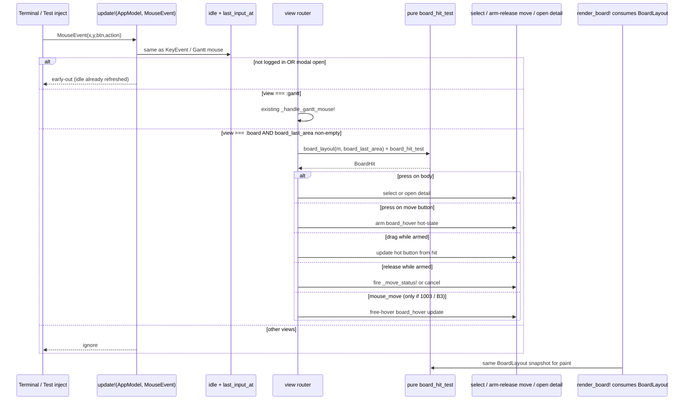
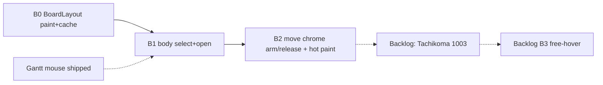

# Design: Board Mouse Interaction for Kanban Cards (Swimlane Grid)

| Field | Value |
|-------|-------|
| **Author** | design-doc-writer (Grok) |
| **Date** | 2026-07-13 |
| **Status** | Draft (rev 3 — product open questions locked) |
| **Audience** | Senior engineers implementing v2 board mouse for `kanban2()` |
| **Primary codebase** | `qci-kanban/` (v2 only; v1 `kanban()` frozen) |
| **Primary sources** | `src/ui/board.jl`, `src/ui/app.jl`, `src/ui/gantt.jl`, `src/ui/theme.jl`, `src/ui/keymap.jl`, `src/ui/modals.jl`, `src/QciKanban.jl` |
| **Prior art (shipped)** | Gantt mouse M1–M3 — `docs/design-gantt-mouse-sequencing.md`, `test/features/gantt_mouse.jl` |
| **Tests today** | Board: `test/test_board_view.jl`, `test/features/phase3_board.jl` (KeyEvent only). Mouse: Gantt-only. |
| **Review** | `/tmp/grok-1000/grok-design-review-ebba3e77.md` |

---

## Overview

The v2 Kanban **board** is fully keyboard-driven today: `h/j/k/l` navigate, `<`/`>` move status, `v`/Enter open detail. Mouse already works on **Gantt only** via `update!(m::AppModel, evt::MouseEvent)` → `_handle_gantt_mouse!`. This design extends that path to the board so operators can:

1. **Click a card body** to select it (lane/col/idx),
2. **Use ASCII move chrome** `[<]` / `[>]` **inside** the modern bordered card to advance/retreat status (same store semantics as `:move_prev` / `:move_next` / `_move_status!`),
3. **Button hot-state chrome** that highlights the armed / pointer-over move control (see K8 — free-pointer hover needs Tachikoma 1003; MVP uses 1002-compatible press/drag/release),
4. **Open card detail** without a true double-click event (Tachikoma has none) via a deterministic **select-then-activate** rule: a second left-press on the body of an **already-selected** card opens detail (same as `v`).

Architecture mirrors Gantt: pure layout snapshot consumed by **both paint and hit-test** + thin `update!` handler + area cache at render. Keyboard remains first-class with **unchanged** status-move semantics (no new `can!` on `_move_status!` in this epic). No drag-drop between columns.

---

## Background & Motivation

### Current board input model (verified on disk 2026-07-13)

| Concern | Today | File:line |
|---------|-------|-----------|
| Key bindings | `<` / `>` → `:move_prev` / `:move_next`; `v` / Enter → `:view_card`; h/j/k/l nav | `src/ui/keymap.jl:93–97` |
| Actions | `_do_action!` → `_move_status!(m, ±1)`, `_open_card_detail!` | `src/ui/app.jl:578–603`, `src/ui/board.jl:262–277`, `src/ui/modals.jl:89–96` |
| Selection | `sel_lane` / `sel_col` / `sel_idx` into pure `board_grid(m)` | `src/ui/app.jl:48–50`, `src/ui/board.jl:109–139`, `170–174` |
| Bulk select | `selected_ids` + Space / bulk ops; independent of cursor | `board.jl:298–341` |
| WIP | Soft: move always writes, then `_warn_if_over_wip!` | `board.jl:241–247`, `269–274` |
| Card paint | Modern bordered card `MODERN_CARD_H = 6`; flat degrade when lane too short | `src/ui/board.jl:497–522`, `576–601` |
| Mouse entry | Gantt-only early-out | `src/ui/app.jl:515–535` |
| Idle | Mouse already refreshes `last_input_at` at start of `MouseEvent` handler | `src/ui/app.jl:521–526` |
| Permissions | `_move_status!` does **not** call `can!`; Gantt drag uses `can!(:edit_issue)` | `board.jl:262`, `gantt.jl:1621–1623` |
| Include order | `app.jl` **before** `board.jl` | `QciKanban.jl:75–76` |

### Mouse stack already proven on Gantt

```
update!(AppModel, MouseEvent)          # app.jl:521
  → idle + last_input_at
  → gates: logged in, modal none, view, area non-empty
  → _handle_gantt_mouse!(m, evt)       # gantt.jl:1568
       → pure gantt_layout + gantt_hit_test
       → select / scroll / drag
render_gantt! sets m.gantt_last_area   # gantt.jl:1648
```

Board should **reuse this dispatcher shape**, not invent a parallel event system. Keymap stays KeyEvent-only.

### Tachikoma mouse API + terminal modes (package-verified, Manifest Tachikoma 2.2.0)

```julia
struct MouseEvent <: Event
    x::Int; y::Int
    button::MouseButton   # left/middle/right/none/scroll_*
    action::MouseAction   # press | release | drag | move  — NO double-click
    shift::Bool; alt::Bool; ctrl::Bool
end
```

**Enablement** (`terminal.jl:13–14`):

```text
MOUSE_ON  = "\e[?1000h\e[?1002h\e[?1006h"   # basic + button-event + SGR
MOUSE_OFF = "\e[?1000l\e[?1002l\e[?1006l"
```

| DECSET | Meaning | Enabled today? |
|--------|---------|----------------|
| 1000 | Basic button press/release | Yes |
| 1002 | Button-event: motion **while a button is held** → decoded as `mouse_drag` | Yes |
| 1003 | Any-event: free pointer motion without buttons → `mouse_none` + `mouse_move` | **No** |
| 1006 | SGR coordinates | Yes |

SGR parser (`events.jl:314–334`): `base ∈ 32–34` → `mouse_drag`; `base == 35` → `mouse_none` + `mouse_move` (the free-hover encoding, only sent when the terminal has 1003 on).

**Implication (blocking for naïve hover):** free-pointer `mouse_move` over buttons **will not fire** in a normal `kanban2()` session under current Tachikoma `MOUSE_ON`. Synthetic TestBackend events can fake `mouse_move` and green-wash a dead production path. See K8 for the implementable chrome path.

There is **no** double-click, click-count, or multi-click timer. Product “double-click opens detail” uses select-then-activate (K1).

### Pain points without board mouse

1. Shop-floor / touch-capable terminals benefit from click-to-select and one-tap status advance.
2. Move buttons give discoverable affordances next to the card (keyboard still primary for power users).
3. Without a **single** layout snapshot, any ad-hoc `x,y` math will drift from paint (stats strip, swimlanes, scroll-follow, flat-card degrade).

---

## Goals & Non-Goals

### Goals

1. Left-press **card body** → select that card (`sel_lane`/`sel_col`/`sel_idx`), keep keyboard chrome (`▸`) in sync.
2. **Move buttons** inside modern card border → same store path as `<` / `>` (`_move_status! ±1`), with hot-state chrome under existing 1002 modes (K8 MVP).
3. **Button hot-state** (armed / pointer-over while button held; optional free-hover later under 1003) using model state + re-render.
4. **Open detail** substitute: second left-press on body of **already-selected** card → `_open_card_detail!` (same as `v`).
5. Pure `BoardLayout` **consumed by paint and hit-test** (single geometry source); `board_last_area` cache at render.
6. Extend `update!(MouseEvent)` by view without breaking Gantt; update its docstring (today says Gantt-only).
7. Full TestBackend + BDD coverage; 100% coverage gate on gated v2 files.
8. Keyboard remains first-class; **status-move / bulk / WIP keyboard semantics unchanged** in this epic (see K7).

### Non-Goals

| Non-goal | Why |
|----------|-----|
| Drag-drop card between columns | High UX risk; separate design |
| Backlog / calendar mouse | Independent hit maps; out of this epic |
| True double-click in Tachikoma | Framework change; out of scope |
| Free-pointer hover in this epic (B3) | **Product: backlog** after B0–B2 MVP; waits until Tachikoma enables DECSET 1003 (K8) |
| Gating `_move_status!` with `can!(:edit_issue)` in this epic | Would change keyboard `<`/`>` for technicians (K7) |
| New domain action `:move_issue_status` | Separate RBAC product PR if wanted later |
| v1 `kanban()` mouse | Legacy frozen |
| Wheel over board (any mapping) | **Product: ignore** — no board wheel handling this epic; rank stays keyboard |
| Replacing keyboard as primary | Accelerator only |
| Floating buttons outside card frame | Product requires chrome **inside** border |
| Unicode chevrons (◀▶←→▸«») on buttons | Product: ASCII/box only |
| Tooltip popups | Terminal uneven; chrome = button restyle only |
| Clear or toggle `selected_ids` on mouse body select | **Product: no** — K13; Space remains bulk toggle |

---

## Key Decisions

| # | Decision | Choice | Rationale |
|---|----------|--------|-----------|
| K1 | Open-detail without double-click | **Select-then-activate**: second left-press on **body** of already-selected card opens `:card_detail` | Deterministic under TestBackend; no timers; first press always selects. Explicit `[v]` chrome rejected as clutter. Timed double-press rejected as flaky. **Accepted inconsistency with Gantt:** board re-click opens detail; Gantt never opens on mouse (Enter/`v` only — `test/features/gantt_mouse.jl`). Operators learn different rules per view by design. |
| K2 | Move chrome glyph set | ASCII **`[<]`** / **`[>]`** (3 cells each), themed fill — no Unicode arrows | Product ban on ◀▶ etc.; exact 3×1 hit cells. |
| K3 | Button placement | **Meta row, right-aligned, inside modern card border** (outer row `r.y + r.height - 2`) | Inside frame; key/title keep full width; meta chips use **meta-only** reserve. |
| K4 | Layout strategy | Pure **`BoardLayout` + `BoardCardSlot` list**; **`render_board!` / grid paint consume the same snapshot as hit-test** | Gantt G4.1 parity; eliminates dual-path drift. B0 acceptance requires paint-from-layout (or golden paint≡layout tests — prefer paint-from-slots). |
| K5 | Dispatcher | **View-switch inside existing `update!(MouseEvent)`** — `:gantt` vs `:board` | Do not break Gantt; single idle path. |
| K6 | Flat-card degrade | **No move buttons** on flat (`bordered=false`) cards; body click still selects / open-detail | Geometry too short; keyboard moves still work. |
| K7 | Permissions on status move | **Leave `_move_status!` ungated** (no `can!` in this epic). Mouse calls the same helper as keyboard. | Goal 8: keyboard semantics unchanged. Domain `:edit_issue` is assignee-scoped for **technicians** (`domain.jl:86–91`); gating would block shop-floor status advances on unassigned/peer cards that keyboard allows today. Gantt bar-drag remains gated (date edit ≠ board status advance). Future RBAC hardening is a **separate product PR** (option: new `:move_issue_status` matrix row), not a silent B2 couple. |
| K8 | Button highlight (“hover”) | **Two tiers.** **MVP (ships with B2, works under 1000/1002/1006):** press/drag/release **armed hot-state** on move chrome — no free `mouse_move` required. **Optional B3:** free-pointer hover after Tachikoma enables DECSET **1003** in `MOUSE_ON`/`MOUSE_OFF`. | Free hover is impossible under current `MOUSE_ON` (verified). 1002 **does** report motion while a button is held (`mouse_drag`). Press→arm, drag→update hot button, release-on-button→fire gives real visual feedback without an upstream dependency. Do not ship TestBackend-only free-hover as if production worked. |
| K9 | Button visibility width | Hide move chrome when card outer width `< BOARD_BTN_MIN_W` (**14**) | Prevents crushing key/title; keyboard remains complete. |
| K10 | Body vs button event model | **Body:** left **press** selects / opens (Gantt select parity). **Move buttons:** left **press arms**, **release fires** if still over same button kind; drag updates hot target; release off button **cancels**. | Enables K8 MVP hot-state under 1002; reduces accidental moves; gap chrome never opens detail (K11). |
| K11 | Button gap | Combined **move-chrome band** = `prev_btn ∪ gap ∪ next_btn`. Hits on gap → `board_hit_move_chrome` **no-op** (not body). | Prevents select-then-activate open when the user clicks the 1-cell gap between `[<]` and `[>]`. |
| K12 | Model typing for hover/arm | `board_hover::Any` (default `nothing`) on `AppModel`, like `gantt_drag::Any` | `app.jl` is included **before** `board.jl` (`QciKanban.jl:75–76`); cannot type `AppModel` fields with board-local structs. Helpers in `board.jl` may use a local `BoardHoverTarget` / NamedTuple and store it in `Any`. |
| K13 | Bulk multi-select | Mouse **does not** toggle/clear `selected_ids`. Body select only moves the keyboard cursor (`sel_*`). Space remains bulk toggle. | Avoid undefined bulk+mouse matrix in MVP; document edge case. |
| K14 | WIP | Mouse moves inherit **soft WIP** via shared `_move_status!` (write then warn). | Same as keyboard; no mouse-specific WIP modal. |

---

## Proposed Design

### 1. Architecture



### 2. Dispatcher change (`src/ui/app.jl`)

**Today** (`app.jl:514–535`) is Gantt-only. **Proposed:**

```julia
"""
    update!(m::AppModel, evt::MouseEvent)

Mouse path (not KEYMAP): idle parity, then view-local handlers when logged in
and no modal. `:gantt` → M1–M3; `:board` → click-select / move chrome / open.
"""
function update!(m::AppModel, evt::MouseEvent)
    m.tick += 1
    if _idle_expired!(m)
        return m
    end
    m.last_input_at = Dates.now(UTC)

    m.current_user === nothing && return m
    m.modal !== :none && return m

    if m.view === :gantt
        (m.gantt_last_area.width < 1 || m.gantt_last_area.height < 1) && return m
        _handle_gantt_mouse!(m, evt)
    elseif m.view === :board
        (m.board_last_area.width < 1 || m.board_last_area.height < 1) && return m
        _handle_board_mouse!(m, evt)
    end
    m
end
```

**Invariants:**

- Idle + `last_input_at` always run first (even when view ignores mouse).
- Keymap / `lookup_action` remain KeyEvent-only.
- Modal open → no board mouse (no accidental move under detail/edit).
- Login gate → no board mouse.

### 3. AppModel fields

Add next to Gantt mouse state (`app.jl` ~73–78). **Typing follows Gantt `Any` pattern (K12):**

```julia
board_last_area::Rect   # last content Rect passed to render_board!; zero default
board_hover::Any        # nothing | NamedTuple/BoardHoverTarget payload (board.jl only)
```

Constructor: both in **B0** to avoid a second positional-ctor churn when chrome lands in B2:

```julia
Rect(0, 0, 0, 0),   # board_last_area
nothing,            # board_hover
```

**Payload shape** (constructed only inside `board.jl`, stored in `Any`):

```julia
# board.jl — not referenced as a field type on AppModel
struct BoardHoverTarget
    kind::Symbol          # :move_prev | :move_next
    issue_id::String
    armed::Bool           # true while left button held for a pending move (MVP 1002 path)
end
```

Alternatively a NamedTuple `(; kind, issue_id, armed)` — either is fine; helpers normalize via accessors.

**Clear `board_hover` (mandatory):**

| Hook | Action |
|------|--------|
| `_switch_view!` | `m.board_hover = nothing` next to `gantt_drag` clear (`app.jl:736–745`) |
| `_clear_project_selection!` / project switch | clear |
| Modal open (`_open_card_detail!`, `_open_card_edit!`, help, confirm, project modals, …) | call `_clear_board_mouse_ui!(m)` at start so keyboard `v` does not leave stale hot paint under the overlay |
| Successful status move | clear (card may leave column) |
| Escape (optional) | if armed, cancel arm without move |

```julia
_clear_board_mouse_ui!(m::AppModel) = (m.board_hover = nothing; m)
```

### 4. Card geometry (modern bordered)

`MODERN_CARD_H = 6` (`board.jl:497`). For outer rect `r` passed to modern card paint:

```
 y+0  ╭────────────────────────────╮
 y+1  │▸ KEY  ▲ 3sp                │
 y+2  │  title line 1              │
 y+3  │  title line 2              │
 y+4  │  chips…           [<] [>]  │   # META + BUTTONS (inside border)
 y+5  ╰────────────────────────────╯
                         └──┬──┘
                    move-chrome band (prev ∪ gap ∪ next)
```

| Region | Cells | Hit kind |
|--------|-------|----------|
| Outer card | `Rect(r.x, r.y, r.width, r.height)` | body if not in chrome band |
| Inner content | `Rect(r.x+1, r.y+1, r.width-2, r.height-2)` | existing (`board.jl:510`) |
| Prev `[<]` | 3×1 at meta row | `board_hit_move_prev` |
| Gap | 1×1 between buttons | `board_hit_move_chrome` (**no-op**) |
| Next `[>]` | 3×1 at meta row | `board_hit_move_next` |
| Move-chrome band | union of the three | never body / never open detail |

**Formulas** (only when `bordered && r.width >= BOARD_BTN_MIN_W && r.height >= MODERN_CARD_H`):

```julia
const BOARD_BTN_MIN_W = 14
const BOARD_BTN_W = 3
const BOARD_BTN_GAP = 1
const BOARD_BTN_PAIR_W = 2 * BOARD_BTN_W + BOARD_BTN_GAP  # 7

by = r.y + r.height - 2
bx_next = r.x + r.width - 2 - (BOARD_BTN_W - 1)   # last 3 content cells
bx_prev = bx_next - BOARD_BTN_GAP - BOARD_BTN_W
prev_btn = Rect(bx_prev, by, BOARD_BTN_W, 1)
next_btn = Rect(bx_next, by, BOARD_BTN_W, 1)
gap_btn  = Rect(bx_prev + BOARD_BTN_W, by, BOARD_BTN_GAP, 1)
chrome   = Rect(bx_prev, by, BOARD_BTN_PAIR_W, 1)  # full band for hit priority
```

**ASCII mockup (selected card, next button hot/armed):**

```
╭──────────────────────────╮
│▸QCI-100 ▲ 5sp            │
│ Fix coolant valve leak   │
│ on line 3                │
│ ◆Shop  JD  7d   [<] [>]  │
╰──────────────────────────╯
                      ^^^
                      hot: inverse cyan fill on [>]
```

**Button chrome styles (Theming accessors only):**

| State | FG | BG | Bold |
|-------|----|----|------|
| Default | `col_text_dim()` | card surface bg | false |
| Hot / armed (MVP 1002 or free-hover B3) | `col_bg()` | `col_primary_hi()` | true |
| Disabled edge (first/last status) | `col_text_muted()` | card surface bg | false |

Disabled: still hit-testable; `_move_status!` no-ops when `clamp` keeps the same column (`board.jl:267`) — paint dims when status is first/last in `BOARD_STATUSES`.

**No Unicode** in button strings — only `'['`, `'<'`, `'>'`, `']'`.

### 5. Narrow / flat degradation

| Condition | Buttons painted? | Body press | Open detail |
|-----------|------------------|------------|-------------|
| Modern card, `width >= BOARD_BTN_MIN_W` | Yes | Select | Second press if selected |
| Modern card, `width < BOARD_BTN_MIN_W` | No | Select | Second press if selected |
| Flat card (`bordered=false`) | No | Select | Second press if selected |
| Hidden “+N more” row | Not a card | No-op | No-op |
| Empty cell / filter line / headers / stats | No | No-op / chrome | No-op |
| Gap between `[<]` and `[>]` | In chrome band | No-op | **No** (not body) |

### 6. Pure layout API — single source of truth (`src/ui/board.jl`)

Mirror Gantt’s `GanttLayout` / paint consumption (`gantt.jl:1138–1184`, `1646+`):

```julia
struct BoardCardSlot
    rect::Rect
    lane::Int
    col::Int
    idx::Int                 # 1-based index within cell (grid index)
    issue_id::String
    bordered::Bool
    prev_btn::Union{Nothing,Rect}
    next_btn::Union{Nothing,Rect}
    gap_btn::Union{Nothing,Rect}     # 1-cell between buttons when chrome present
    chrome::Union{Nothing,Rect}      # full prev∪gap∪next band
end

struct BoardLayout
    area::Rect                 # original body rect (pre-stats split input)
    grid_area::Rect            # after optional stats strip
    show_stats::Bool
    col_w::Int
    nlanes::Int
    slots::Vector{BoardCardSlot}
end
```

```julia
function board_layout(m::AppModel, area::Rect)::BoardLayout
    # MUST encode the same geometry as today's render path:
    # stats when show_stats && height >= STATS_HEIGHT+6; filter line; headers;
    # lane_h; scroll-follow start; bordered vs flat; Rect(cx,cy,col_w-1,ch)
    ...
end
```

#### B0 acceptance — paint consumes layout (locked)

**Preferred (A):** `render_board!` / `_render_board_grid!` **build `BoardLayout` once and paint exclusively from `layout.slots`** (lane frames/headers may still use layout metrics fields). Hit-test uses the same `board_layout` function. No parallel card-position loop with divergent formulas.

**Fallback (B) only if (A) is too large for one PR:** pure helpers shared by paint and `board_layout`, **plus golden tests** that for fixtures (stats on/off, multi-lane, scroll-follow with `sel_idx > max_cards`, flat degrade) assert every painted card rect equals the corresponding `BoardCardSlot.rect`. **Do not merge B1 until (A) or (B) is green.** Dual “hope the loops match” is not acceptable.

**Stats strip:** cache `board_last_area` as the original body rect passed into `render_board!`. `board_layout` recomputes the stats inset so hits on the stats strip are chrome/none.

```julia
function render_board!(m::AppModel, buf::Buffer, area::Rect)
    m.board_last_area = area
    layout = board_layout(m, area)
    # paint from layout only (A)
    ...
end
```

### 7. Pure hit-test

Use Tachikoma’s existing **`Base.contains(r::Rect, x, y)`** (Gantt: `gantt.jl:1598`) — do **not** invent `_rect_contains`.

```julia
@enum BoardHitKind begin
    board_hit_none
    board_hit_card_body      # select / open-detail
    board_hit_move_prev      # [<]
    board_hit_move_next      # [>]
    board_hit_move_chrome    # gap (and any non-button chrome band cell) — no-op
    board_hit_chrome         # headers, filter line, lane frame, stats
end

struct BoardHit
    kind::BoardHitKind
    lane::Union{Nothing,Int}
    col::Union{Nothing,Int}
    idx::Union{Nothing,Int}
    issue_id::Union{Nothing,String}
end

const _BOARD_HIT_NONE = BoardHit(board_hit_none, nothing, nothing, nothing, nothing)

function board_hit_test(layout::BoardLayout, x::Int, y::Int)::BoardHit
    area = layout.area
    (area.width < 1 || area.height < 1) && return _BOARD_HIT_NONE
    Base.contains(area, x, y) || return _BOARD_HIT_NONE

    # Priority: specific buttons > gap chrome band > card body > other chrome
    for s in layout.slots
        if s.prev_btn !== nothing && Base.contains(s.prev_btn, x, y)
            return BoardHit(board_hit_move_prev, s.lane, s.col, s.idx, s.issue_id)
        end
        if s.next_btn !== nothing && Base.contains(s.next_btn, x, y)
            return BoardHit(board_hit_move_next, s.lane, s.col, s.idx, s.issue_id)
        end
        if s.chrome !== nothing && Base.contains(s.chrome, x, y)
            # gap (or band padding): never body
            return BoardHit(board_hit_move_chrome, s.lane, s.col, s.idx, s.issue_id)
        end
        if Base.contains(s.rect, x, y)
            return BoardHit(board_hit_card_body, s.lane, s.col, s.idx, s.issue_id)
        end
    end
    return BoardHit(board_hit_chrome, nothing, nothing, nothing, nothing)
end
```

Coordinates are absolute terminal cells (same as `MouseEvent.x/y`).

### 8. Handler (`_handle_board_mouse!`)

```julia
function _handle_board_mouse!(m::AppModel, evt::MouseEvent)
    area = m.board_last_area
    (area.width < 1 || area.height < 1) && return m
    lay = board_layout(m, area)
    hit = board_hit_test(lay, evt.x, evt.y)

    # ── Optional B3 only: free-pointer hover (requires DECSET 1003) ──
    if evt.action === mouse_move && !_board_arm_active(m)
        return _board_update_free_hover!(m, hit)   # no-op / dead in prod until 1003
    end

    # ── MVP 1002 path: arm / drag / release for move chrome ──
    if _board_arm_active(m)
        if evt.button === mouse_left && evt.action === mouse_drag
            return _board_update_arm_from_hit!(m, hit)
        elseif evt.button === mouse_left && evt.action === mouse_release
            return _board_commit_or_cancel_arm!(m, hit)
        elseif evt.button === mouse_left && evt.action === mouse_press
            # rare synthetic: commit previous then fall through
            _board_commit_or_cancel_arm!(m, hit)
            # fall through
        else
            return m
        end
    end

    if evt.button === mouse_left && evt.action === mouse_press
        if hit.kind === board_hit_move_prev || hit.kind === board_hit_move_next
            hit.issue_id === nothing && return m
            _select_issue!(m, hit.issue_id)
            m.board_hover = BoardHoverTarget(hit.kind === board_hit_move_prev ? :move_prev : :move_next,
                                             hit.issue_id, true)
            return m
        elseif hit.kind === board_hit_move_chrome
            return m   # gap: no-op (do not open detail)
        elseif hit.kind === board_hit_card_body
            return _board_body_press!(m, hit)
        end
    end
    m
end

function _board_body_press!(m::AppModel, hit::BoardHit)
    hit.issue_id === nothing && return m
    cur = selected_issue(m)
    already = cur !== nothing && cur.id == hit.issue_id
    if already
        _clear_board_mouse_ui!(m)
        return _open_card_detail!(m)
    else
        # Cursor only — do NOT touch selected_ids (K13)
        _select_issue!(m, hit.issue_id)
        return m
    end
end

function _board_commit_or_cancel_arm!(m::AppModel, hit::BoardHit)
    arm = m.board_hover
    arm === nothing && return m
    kind = arm.kind
    id = arm.issue_id
    m.board_hover = nothing
    # Fire only if release still on the same button kind for the same issue
    ok = (kind === :move_prev && hit.kind === board_hit_move_prev && hit.issue_id == id) ||
         (kind === :move_next && hit.kind === board_hit_move_next && hit.issue_id == id)
    ok || return m
    _select_issue!(m, id)
    _move_status!(m, kind === :move_prev ? -1 : +1)
    m
end
```

**Select-then-activate details:**

1. First press unselected body → select only; modal stays `:none`.
2. Second press **same** selected body → `_open_card_detail!`.
3. Press **different** body → select that card (do not open).
4. Press/release move button → never opens detail.
5. Press on **gap** (`board_hit_move_chrome`) → no-op even if card selected.
6. After detail closes, selection remains; another body press opens again.

**Edge cases (locked):**

| Case | Behavior |
|------|----------|
| WIP over limit after mouse move | Soft warn via `_warn_if_over_wip!` inside `_move_status!` — same as keyboard |
| `selected_ids` non-empty, mouse selects another card | Cursor moves; **bulk set unchanged**; ● markers may still show on multi-selected cards |
| Mouse never bulk-toggles | Space / bulk keys only |
| Viewer / technician / enforce_roles | **No new checks** on status move (K7); same as keyboard today |
| Armed, release outside button | Cancel; no store write |
| Edge status dimmed button released | `_move_status!` no-ops (clamp); message/status unchanged |

### 9. Paint: buttons + hot-state

```julia
function _paint_card_move_buttons!(m::AppModel, buf::Buffer, r::Rect, iss::Domain.Issue,
                                   selected::Bool; bordered::Bool)
    (!bordered || r.width < BOARD_BTN_MIN_W || r.height < MODERN_CARD_H) && return
    prev_r, next_r = _board_btn_rects(r)   # or take from BoardCardSlot
    card_bg = selected ? col_surface_hi() : col_surface()
    for (btn_r, label, kind) in ((prev_r, "[<]", :move_prev), (next_r, "[>]", :move_next))
        hot = _board_is_hot(m, iss.id, kind)
        edge = (kind === :move_prev && iss.status == BOARD_STATUSES[1]) ||
               (kind === :move_next && iss.status == BOARD_STATUSES[end])
        st = if hot
            Style(; fg = col_bg(), bg = col_primary_hi(), bold = true)
        elseif edge
            Style(; fg = col_text_muted(), bg = card_bg)
        else
            Style(; fg = col_text_dim(), bg = card_bg)
        end
        set_string!(buf, btn_r.x, btn_r.y, label, st)
    end
end
```

**Meta reserve only:** when chrome is present, pass `right_reserve = BOARD_BTN_PAIR_W + 1` that shortens **only the meta chip line** inside `_render_card!` (the `r.height >= 4` chip row). **Do not** reduce key/title wrap width — chrome does not live on those rows.

**Theme rule:** no raw `ColorRGB` in `board.jl`. Reuse existing accessors; optional `col_btn_hot()` alias in `theme.jl` if a name is wanted.

Selection `▸` on left frame (`board.jl:515`) is **unchanged** and is **not** an open-detail target.

### 10. Permissions (locked for this epic)

| Path | Gate |
|------|------|
| Keyboard `<` / `>` → `_move_status!` | **None** (status quo) |
| Mouse move chrome → `_move_status!` | **None** — same helper |
| Gantt bar drag | `can!(:edit_issue)` remains (unchanged) |
| Card edit modal | `can!(:edit_issue)` remains (unchanged) |

**Technician note:** `Domain.can(..., :edit_issue)` allows technicians only when `resource.assignee_id == user.id`. Status column moves on the board are **not** reclassified as that check here, so technicians keep advancing unassigned/peer cards via keyboard **and** mouse.

**If product later wants RBAC on status moves:** open a dedicated PR that (1) adds a domain action (e.g. `:move_issue_status`) with an explicit matrix for admin/supervisor/technician/viewer, (2) gates `_move_status!` once for all inputs, (3) uses `_set_message!` for success text so warn-only role toasts are preserved (Gantt pattern at `gantt.jl:1556`), (4) updates `roles_idle` / board tests. **Not B2.**

### 11. Performance

- TUI re-render per event is fine for typical boards.
- Mutate `board_hover` only when the hot target changes.
- Pure `board_layout` once per event/paint; cost matches geometry work already paid by paint.
- Free-hover under future 1003 can flood events — B3 must document thrash guard + consider sampling; not an MVP concern.

### 12. Keyboard remains first-class

| Action | Keyboard | Mouse |
|--------|----------|-------|
| Select card (cursor) | h/j/k/l | body press |
| Bulk multi-select | Space | **none** (K13) |
| Move status | `<` / `>` | arm+release on `[<]` / `[>]` |
| Open detail | `v` / Enter | second body press on selected |
| Rank / filters / WIP keys | keys only | none |

---

## API / Interface Changes

| Symbol | Location | Change |
|--------|----------|--------|
| `AppModel.board_last_area` | `app.jl` | New `Rect`, default zero |
| `AppModel.board_hover` | `app.jl` | New `Any`, default `nothing` (K12) |
| Positional `AppModel(...)` ctor | `app.jl` | Both fields in **B0** |
| `update!(…, MouseEvent)` | `app.jl` | View switch + docstring |
| `_switch_view!` / modal opens | `app.jl` / `modals.jl` | `_clear_board_mouse_ui!` |
| `BoardLayout`, `BoardCardSlot` | `board.jl` | New pure types |
| `board_layout` | `board.jl` | New pure; **paint consumes** |
| `BoardHitKind`, `BoardHit` | `board.jl` | Includes `board_hit_move_chrome` |
| `board_hit_test` | `board.jl` | Uses `Base.contains` |
| `_handle_board_mouse!` | `board.jl` | Press body; arm/drag/release buttons |
| `_paint_card_move_buttons!` | `board.jl` | Takes `selected::Bool`; meta-only reserve |
| `_move_status!` | `board.jl` | **Unchanged** (no `can!` this epic) |
| Theme | `theme.jl` | Only if optional alias added |

No store schema changes. No KEYMAP rows required. No Tachikoma change required for MVP (B3 optional upstream).

---

## Data Model Changes

**None** in SQLite/Postgres. Session-only UI fields:

| Field | Type on AppModel | Notes |
|-------|------------------|-------|
| `board_last_area` | `Rect` | Set each `render_board!` |
| `board_hover` | `Any` | `nothing` or board-local payload |

---

## Alternatives Considered

### A1. Timed double-press for open detail

Rejected — flaky; no Tachikoma support; Gantt design already rejected.

### A2. Explicit `[v]` chrome on every card

Rejected for MVP — width budget; select-then-activate sufficient.

### A3. Floating buttons outside frame

Rejected — product requires inside border.

### A4. Unicode arrows

Rejected — product ban.

### A5. Free-pointer hover as MVP without 1003

Rejected as a **lie** — production never emits free `mouse_move` under current `MOUSE_ON`. Replaced by K8 two-tier plan (1002 armed hot-state MVP + optional 1003 free hover).

### A6. Enable 1003 only inside qci-kanban without Tachikoma change

Fragile (enter/exit path owned by Tachikoma `app()` / `MOUSE_ON`). Prefer upstream Tachikoma PR for B3; do not fight Ctrl+G toggle / lifecycle.

### A7. Gate `_move_status!` with `can!(:edit_issue)`

Rejected **for this epic** — changes keyboard for technicians (assignee scope). See K7.

### A8. Dual geometry: paint loop + separate hit helpers without snapshot

Rejected — same drift class Gantt paid G4.1 to eliminate. B0 requires single source of truth (K4).

### A9. Fire move on press (not release)

Weaker for hot-state under 1002; higher accidental-move risk. Rejected for **buttons** (body still press).

---

## Security & Privacy Considerations

| Threat | Mitigation |
|--------|------------|
| Unauthenticated mouse mutates board | Early-out when `current_user === nothing` |
| Move under modal | Early-out when `modal !== :none`; clear hover on modal open |
| Privilege via mouse only | Shared `_move_status!` — same trust as keyboard (K7) |
| Idle session | Mouse updates `last_input_at`; `_idle_expired!` first |
| Hover/arm without commit | Arm alone does not write store; only successful release fires |

---

## Observability

| Signal | Approach |
|--------|----------|
| User feedback | Existing `m.message` from `_move_status!` / WIP warn |
| Metrics | None (local TUI) |
| Coverage | 100% on new branches via unit + BDD |
| Logging | No per-`mouse_move` / drag spam |

---

## Testing Strategy

### Helpers

```julia
bm_click(col, row) = T.MouseEvent(col, row, T.mouse_left, T.mouse_press, false, false, false)
bm_drag(col, row)  = T.MouseEvent(col, row, T.mouse_left, T.mouse_drag, false, false, false)
bm_release(col, row) = T.MouseEvent(col, row, T.mouse_left, T.mouse_release, false, false, false)
# Free-hover synthetic (B3 / unit only) — mirrors real SGR base==35 encoding:
bm_move(col, row)  = T.MouseEvent(col, row, T.mouse_none, T.mouse_move, false, false, false)
```

Always: `update!` → re-render before buffer asserts.

### Red-first

1. Pure layout fixtures: stats on/off, multi-lane, **scroll-follow with `sel_idx > max_cards`** (selected card present in `slots`; hidden cards absent).
2. Pure hit: body / prev / next / **gap → move_chrome** / outside.
3. Integration red: before board handler, click on board is no-op (Gantt early-out).
4. Body select + second press open.
5. Move: press on `[>]`, release on `[>]` → status advances; release off → no move.
6. Gap press on selected card → modal still `:none`.
7. Bulk: pre-fill `selected_ids`, body-select another card → set **unchanged**.
8. WIP: move into over-limit column → message contains WIP warn (soft).
9. Gantt regression: bar click still selects.
10. Hot-state: press on button → `board_hover` armed; paint path / model assert.

### Unit / BDD files

| File | Content |
|------|---------|
| `test/test_board_view.jl` | Layout (incl. scroll-follow), hit, paint, arm/release, gap, bulk stability, WIP message |
| `test/features/board_mouse.jl` | Given/When/Then user stories + Gantt smoke |
| `test/runtests.jl` | Wire feature file |
| test-impact map | `board.jl` → include `features/board_mouse.jl` |

### Coverage / gates

- `julia --project=. test/runtests.jl`
- `julia --project=. test/coverage_gate.jl` → `GATE PASSED`
- App gate: `record_demo2` or scripted login + board
- Do **not** claim free-hover works in live app until 1003 lands

---

## Rollout Plan



1. **B0** — Layout extract; paint consumes layout; `board_last_area` + `board_hover::Any=nothing`; ctor update; golden/unit geometry including scroll-follow.
2. **B1** — Dispatcher view switch + docstring; body select/open; clear hooks; BDD skeleton; Gantt regression.
3. **B2** — Buttons paint, chrome band hit, arm/drag/release move, hot-state under 1002; meta reserve; WIP/bulk tests. **MVP complete — epic ships here.**
4. **B3 (backlog)** — Only after Tachikoma enables DECSET 1003: free `mouse_move` → same hot paint without arm. **Out of this epic’s acceptance**; not scheduled with B0–B2.

**Feature flags:** none.  
**Rollback:** revert B2→B0; keyboard untouched.  
**Gates per PR:** full suite + coverage + app gate.

---

## Risks

| Risk | Severity | Mitigation |
|------|----------|------------|
| Free-hover tests green, production dead | **Critical** (was) | K8: MVP = 1002 arm path; B3 optional behind 1003; no fake claims |
| Paint/hit geometry drift | **High** | K4: paint consumes `BoardLayout`; B0 gate |
| Gap opens detail | Medium (was) | K11: `board_hit_move_chrome` |
| Technician blocked by `can!` on move | High (if wrongly gated) | K7: no gate this epic |
| Bulk set stale after mouse select | Medium (UX) | Document K13; test stability; no silent clear |
| AppModel ctor field-count miss | Medium | Both fields in B0; note field-count tests |
| Stale hot paint under keyboard-opened modal | Medium | `_clear_board_mouse_ui!` on modal open + view switch |
| Break Gantt mouse | High | View branch; BDD regression in B1 |
| 1003 event flood (B3) | Medium | Thrash guard; optional only |
| Narrow columns hide buttons | Low | Keyboard parity; min width constant |

---

## Open Questions

All product questions for this epic are resolved. None remain open.

1. ~~`can!` on `_move_status!`?~~ **Resolved (K7):** no, not in this epic. Future dedicated RBAC PR if product wants it (include technician matrix + `_set_message!`).
2. ~~Hover synthetic button field?~~ **Resolved:** free-hover tests use `mouse_none` + `mouse_move`. MVP tests use press/drag/release with `mouse_left`.
3. ~~B3 free-pointer hover prioritization?~~ **Resolved (product):** **Backlog after MVP.** Ship **B0–B2 only**. Free-hover (B3) waits until Tachikoma enables DECSET 1003; no Tachikoma upstream work in this epic.
4. ~~Clear bulk on mouse select?~~ **Resolved (product, K13):** **No** — keep `selected_ids` unchanged. Body select only moves the keyboard cursor (`sel_*`); Space remains bulk toggle.
5. ~~Wheel over board?~~ **Resolved (product):** **Ignore.** No board wheel handling in this epic.

---

## References

| Doc / code | Role |
|------------|------|
| `src/ui/board.jl` | Grid, modern cards, `_move_status!`, `_select_issue!`, bulk, WIP |
| `src/ui/app.jl:514–535` | Current MouseEvent handler (Gantt-only) |
| `src/ui/app.jl:736–745` | `_switch_view!` (clear gantt mouse state; extend for board) |
| `src/ui/gantt.jl:1252–1648` | Hit-test, handler, area cache prior art |
| `src/QciKanban.jl:75–76` | Include order app → board |
| Tachikoma `terminal.jl:13–14` | `MOUSE_ON` 1000/1002/1006 only |
| Tachikoma `events.jl:314–334` | SGR drag vs move decode |
| `src/domain.jl:77–107` | RBAC `can` matrix (technician assignee scope) |
| `docs/design-gantt-mouse-sequencing.md` | Sequencing + architecture template |
| `test/features/gantt_mouse.jl` | BDD mouse harness; no open-on-click |
| `.claude/rules/qci-kanban-test-map.md` | Test impact map |
| `.claude/rules/tdd-bdd-coverage-gates.md` | TDD/BDD/coverage gates |

---

## PR Plan

### PR B0 — Board layout snapshot consumed by paint + area cache

| | |
|--|--|
| **Title** | `board: BoardLayout single source of truth + board_last_area` |
| **Files** | `src/ui/board.jl`, `src/ui/app.jl` (`board_last_area`, `board_hover::Any=nothing`, positional ctor), `test/test_board_view.jl`, test-impact map |
| **Depends on** | None |
| **Description** | Pure `BoardLayout` / `BoardCardSlot` / `board_layout(m, area)`. **Paint consumes layout slots** (acceptance A) or pure helpers + golden paint≡layout tests (B). Cache `board_last_area`. Unit fixtures: stats on/off, multi-lane, **scroll-follow `sel_idx > max_cards`**, flat degrade, empty board. No mouse UX. Update any AppModel field-count tests. Gates green. |

### PR B1 — Click-to-select + select-then-activate open detail

| | |
|--|--|
| **Title** | `board: mouse body click-select and re-click open detail` |
| **Files** | `src/ui/app.jl` (dispatcher + docstring + `_switch_view!` clear), `src/ui/board.jl` (hit body/chrome, handler select/open), `src/ui/modals.jl` (clear on open), `test/test_board_view.jl`, **new** `test/features/board_mouse.jl`, `runtests.jl`, test-impact map |
| **Depends on** | **B0** |
| **Description** | Route `:board` in `update!(MouseEvent)`. Body press select; second press open. Bulk set stable. Login/modal/empty area ignore. Gantt regression. Gates green. |

### PR B2 — In-card ASCII move buttons + 1002 armed hot-state (MVP complete)

| | |
|--|--|
| **Title** | `board: ASCII move buttons with press-arm release-fire` |
| **Files** | `src/ui/board.jl` (btn geometry, chrome band, paint with `selected`, meta-only reserve, arm/drag/release, hit kinds), tests unit + BDD |
| **Depends on** | **B1** |
| **Description** | Paint `[<]`/`[>]`; hide under min width / flat. Hit: buttons > gap chrome > body. Press arms hot paint; drag updates; release on same button fires `_move_status!` (ungated, K7). Gap never opens detail. WIP soft-warn + bulk stability tests. **No `can!` change. No free-hover claim.** Epic MVP done when B2 greens. |

### PR B3 — Backlog free-pointer hover (Tachikoma 1003) — not in this epic

| | |
|--|--|
| **Title** | `board: free-hover move chrome (requires Tachikoma 1003)` |
| **Files** | Tachikoma `terminal.jl` `MOUSE_ON`/`OFF` **upstream or vendored dependency bump**; `src/ui/board.jl` free-hover branch; tests with `mouse_none`+`mouse_move` |
| **Depends on** | **B2** + Tachikoma change that enables `\e[?1003h` (and off) |
| **Description** | **Product: backlog after MVP.** Do not schedule with B0–B2. When Tachikoma has 1003, free motion can drive the same hot paint without arm. Event-flood risk + thrash guard required. **Not part of board-mouse epic acceptance.** |

### Out of scope PRs (future)

| Title | Notes |
|-------|-------|
| RBAC for status move (`:move_issue_status`) | Product matrix + `_set_message!` + all inputs |
| Board drag-drop between columns | Separate design |
| Backlog/calendar mouse | Separate epics |
| Clear bulk on mouse select | **Rejected** for this epic (K13 / product: keep bulk set) |
| Board wheel handling | **Rejected** for this epic (product: ignore) |
| B3 free-hover | **Backlog** until Tachikoma 1003 (product) |

---

## Revision History

| Date | Change |
|------|--------|
| 2026-07-13 | Initial draft |
| 2026-07-13 | Rev 2 — review ebba3e77: K7 lock no can!; K8 two-tier hover (1002 arm MVP + optional 1003); K11 gap chrome; K12 `board_hover::Any`; K4 paint consumes layout; K13 bulk; WIP soft; `Base.contains`; meta-only reserve; B3 optional; scroll-follow fixture; docstring; clear hooks |
| 2026-07-13 | Rev 3 — product locks: B3 free-hover **backlog** (ship B0–B2 only); clear bulk on mouse select **no** (K13); board wheel **ignore** |
