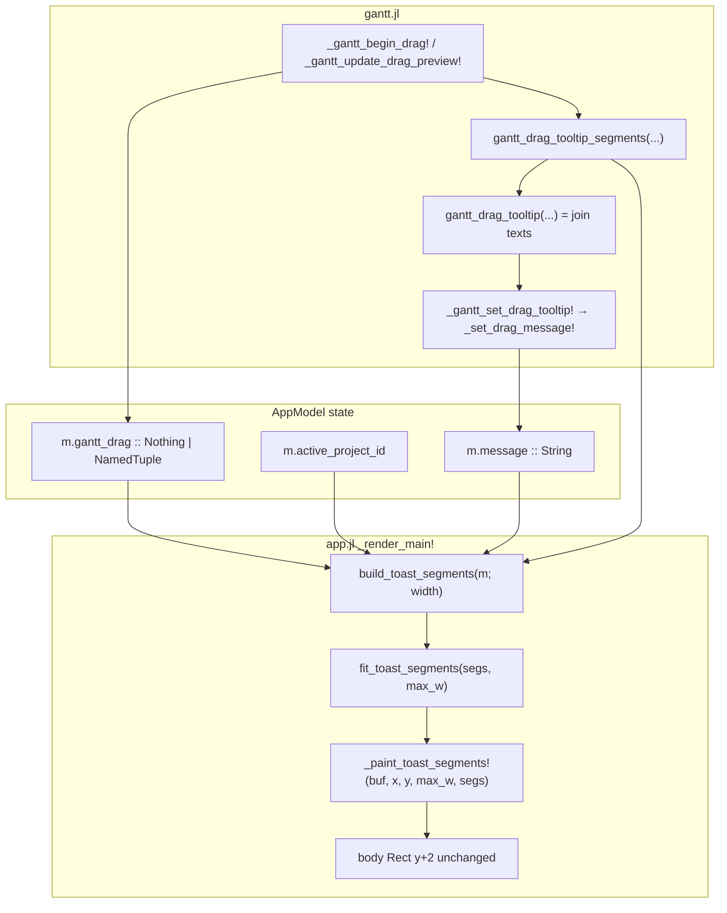
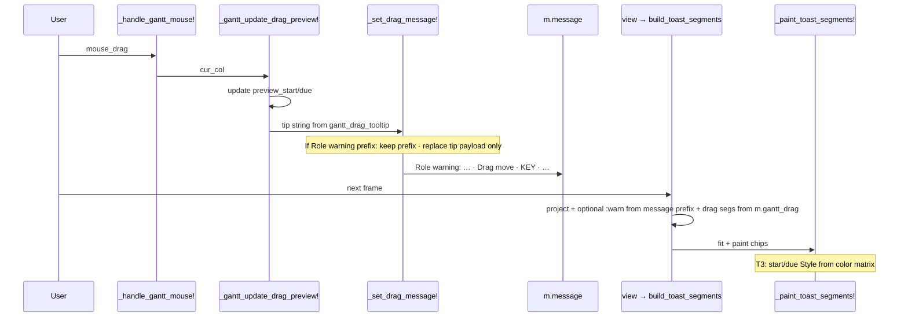
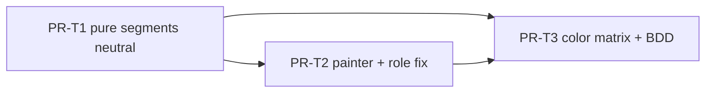

# Design: Gantt Top-Bar Toast Chips + Live Drag Date Colors

| Field | Value |
|-------|-------|
| **Author** | design-doc-writer (Grok) |
| **Date** | 2026-07-15 |
| **Status** | Approved (rev 3) |
| **Audience** | Senior engineers implementing v2 Gantt chrome polish for `kanban2()` |
| **Primary codebase** | `qci-kanban/` (v2 only; v1 `kanban()` frozen) |
| **Primary sources** | `src/ui/app.jl` (`_render_main!` toast, `can!`, `_set_message!`), `src/ui/gantt.jl` (M3 drag + tooltip), `src/ui/theme.jl`, `src/ui/widgets.jl` (multi-span paint), `src/ui/modals.jl` (`_detail_chip!` brackets) |
| **Tests today** | `test/test_gantt.jl` (~L2695 `gantt_drag_tooltip` pure + ~L2797 live message asserts), `test/features/gantt_mouse.jl`, `test/features/phase4_timeline.jl`, `test/features/multi_project.jl` (PROJECT: toast), `test/test_app_shell.jl` |
| **Screenshot** | `qci-kanban/gantt_tool_bar.png` — dense monochrome toast under view tabs |
| **Review** | Design skill loop ee55c1e1 — 3 rounds, 0 open issues (2026-07-15) |

---

## Overview

The Gantt page’s shell toast row (the one-line strip under BOARD / BACKLOG / CALENDAR / GANTT) currently concatenates the active project label and the live drag-reschedule tip into a **single dim-cyan string**:

```text
PROJECT: Plant Maintenance (MNT)  ·  Drag move · MNT-105 · start Jul 22 · due Jul 31 · 10d
```

Mode, issue key, start, due, and duration share one style, so operators cannot scan which date is live or that a reschedule is in progress. The bar-drag shadow already uses `col_primary_hi()` mid-drag on the chart; the toast does not mirror that feedback.

This design upgrades the toast to a **one-line chip strip**: boxed (surface-backed) tokens for PROJECT / drag mode / issue key / start / due / duration, with **semantic colors on start and due that update while dragging** according to drag mode and whether the preview differs from the original dates. Height stays one row so body layout and short-terminal tests remain stable. Flat `m.message` strings stay for non-drag status and for string-based tests; structured segments are built at paint time (and pure-tested) rather than by parsing the flat string.

Also fixes a pre-existing string-channel bug: when `enforce_roles=false` and `can!` sets a Role warning then drag begins, every `_gantt_set_drag_tooltip!` **re-appends** the tip onto the still-prefixed message. Drag updates must **replace** the post-warning payload (see Role-warning algorithm).

---

## Background & Motivation

### Current toast pipeline (verified on disk 2026-07-15)

| Concern | Today | File:line (approx) |
|---------|-------|--------------------|
| Toast row | Under view tabs; body starts at `content_area.y + 2` | `src/ui/app.jl` `_render_main!` ~1125–1146 |
| Project prefix | `PROJECT: $(p.name) ($(p.key))` | `app.jl` ~1127–1130 |
| Composition | `proj_label * "  ·  " * m.message` | `app.jl` ~1132–1138 |
| Paint | Single `set_string!` + one `Style(; fg = col_primary(), dim = true)` | `app.jl` ~1139–1142 |
| Height invariant | Comment: same row so board body height unchanged | `app.jl` ~1125–1126 |
| Message setter | `_set_message!(m, text)` — string only; **appends** when message starts with `Role warning:` | `app.jl` ~476–483 |
| Role warn-only path | `can!` with `enforce_roles=false` sets Role warning and **returns true** | `app.jl` ~467–469 |
| Drag gate | Bar press: `can!(:edit_issue)` then `_gantt_begin_drag!` | `gantt.jl` ~1957–1976 |
| Drag tip string | `gantt_drag_tooltip(mode, preview_start, preview_due; key="")` | `gantt.jl` ~1723–1752 |
| Wire-up | `_gantt_set_drag_tooltip!` → `_set_message!(…)` on begin/update drag | `gantt.jl` ~1754–1761, 1841, 1860 |
| Drag cancel | Esc: `gantt_drag = nothing`; `m.message = "Drag cancelled"` (direct assign, not `_set_message!`) | `app.jl` ~515–518 |
| Drag commit | `_gantt_commit_drag!` → `"Rescheduled $(key)"` via `_set_message!` | `gantt.jl` ~1868–1889 |
| Drag state | NamedTuple: `issue_id`, `mode`, `origin_col`, `orig_start/due`, `preview_start/due` | `app.jl` ~79–81; set in `gantt.jl` ~1830–1859 |
| Chart feedback | Shadow bar uses `col_primary_hi()` when mid-drag | `gantt.jl` paint path |
| Theme rule | Raw `ColorRGB` only in `theme.jl` | `src/ui/theme.jl` |
| Multi-span prior art | MultiSelect: left-to-right multi-`set_string!`; selective `bg = col_surface_hi()` on focused checked bubble only | `widgets.jl` ~149–176 |
| Bracket prior art | `_detail_chip!` paints `"[label]"` with fg, **no bg** (surface_hi reserved for board cards / modal no-bleed) | `modals.jl` ~463–470 |
| Include order | `widgets.jl` → `app.jl` → … → `gantt.jl` (`QciKanban.jl` ~74–80) | runtime name resolution OK |

### Pain points (from screenshot + code)

1. **No visual segmentation** — project and drag tip share one dim style; ` · ` separators are easy to miss.
2. **No live date emphasis** — start/due text do not change color while dragging, even though preview dates update every `mouse_drag`.
3. **Mode not scannable** — “Drag move” vs “Drag start” vs “Drag due” is text-only among identical tokens.
4. **Tests lock the flat string** — `occursin("start", m.message)`, multi_project asserts `PROJECT:` once on the frame and **not** inside `m.message`.
5. **Role-warning + drag string soup** — real path under warn-only roles: each drag update re-appends tip text via `_set_message!`.

### Why now

M3 drag-reschedule is shipped (tooltip + shadow + commit). The remaining UX gap is **status-line readability during drag** — pure presentation on existing state, plus a small string-channel fix for Role-warning composition.

---

## Goals & Non-Goals

### Goals

1. **Readable chip toast**: PROJECT and drag tokens in distinct “boxes” (surface-hi background + brackets) on a **single row**.
2. **Live start/due color feedback** while `m.gantt_drag !== nothing`, driven by **mode × changed-vs-original** (see Color Rules). Colors ship in **PR-T3** (Option A ownership).
3. **Preserve layout**: toast remains one line; `body = Rect(..., content_area.y + 2, …)` unchanged.
4. **Preserve message contracts**: `m.message` remains a flat human-readable string; PROJECT never enters `_set_message!`.
5. **Narrow terminals**: deterministic truncation procedure; never overflow; never crash. At width ≥50 keep mode+key+dates (no boxes); below 40 hard clip.
6. **Theme hygiene**: only `theme.jl` may add colors; views use accessors.
7. **Role-warning + drag**: show **both** (warn chip + drag chips); fix string channel so drag tip **replaces** post-warning payload instead of re-appending.
8. **Testable pure segment builder** + TestBackend `style_at` + BDD.

### Non-Goals

- Multi-line toast or floating overlay near the bar.
- Changing Gantt **title** row (`GANTT — … [day] · N ░sprint…`).
- Replacing all app messages with structured segments.
- New Tachikoma backends / widgets API.
- v1 (`kanban()`) changes.
- Changing drag math, commit, or shadow-bar glyphs (optional follow-up for warn-on-chart).
- i18n of date formats (keep `Dates.format(d, dateformat"u d")`).

---

## Key Decisions

| # | Decision | Rationale |
|---|----------|-----------|
| **K1** | **Structured segments as pure data at paint time**, not parse-on-render of `m.message` | Parsing is brittle. Drag state already has mode + orig + preview. |
| **K2** | **Keep `m.message` as flat string**; drag tip string = join of segment **texts** with `" · "` | Existing `occursin` tests; PROJECT never in message. |
| **K3** | **Generic segment painter in `app.jl`**; **gantt-specific segment builder in `gantt.jl`** | Shell owns layout/clip; Gantt owns mode/date semantics. |
| **K4** | **Shared segment shape** = NamedTuple `(role, text, style, boxed)` defined in **`gantt.jl` for T1** (`toast_seg` helper); app.jl reuses same shape in T2 — no divergent type | T1 independent; assert `seg.style.fg == col_warn()` not full Style equality. |
| **K5** | **Boxes = `bg = col_surface_hi()` + `[` `]` brackets** when width ≥ `TOAST_BOX_MIN_W` | Bracket pattern from `_detail_chip!`; surface_hi on toast is OK (not under modal no-bleed). MultiSelect is prior art for multi-span left-to-right paint + selective bg only. |
| **K6** | **Live colors**: **active** endpoint(s) use `col_primary_hi` when unchanged, `col_warn` when preview ≠ orig; **inactive** edge endpoint stays dim. **`:body` treats both start and due as active** (dual-warn when both shifted is correct UX — “you moved the span”). Duration: `col_ok` if span unchanged, `col_warn` if span changed. | Matches user ask; matrix is source of truth over loose “focused” wording. |
| **K7** | **`gantt_drag_tooltip` = join of segment texts** | Single text source; golden tokens frozen (below). |
| **K8** | **PROJECT boxed on all views in T2** (not Gantt-only) | Consistent chrome; multi_project still sees one `PROJECT:` on frame; low risk. |
| **K9** | **No new theme colors in MVP** | Reuse existing accessors. |
| **K10** | **Include-order safe**: app calls gantt helpers at runtime after full module load | Same pattern as existing gantt field usage. |
| **K11** | **PR color ownership = Option A** | T1: roles + texts + **default/neutral styles only**. T2: painter + PROJECT chrome (paints whatever style is on the segment — neutral until T3). **T3: wires color matrix into segment builder + style_at/BDD**. |
| **K12** | **Role warning + drag: show both** | Extract Role-warning prefix as `:warn` chip; append drag segments from `m.gantt_drag`. Fix `_set_message!` / drag setter so tip **replaces** post-warning payload. |
| **K13** | **Cancel / no-op / commit = non-drag plain path** | Esc → `"Drag cancelled"` plain; commit → `"Rescheduled KEY"` plain; no-op release leaves prior message or empty tip cleared with drag — no chip residue. |
| **K14** | **Separator UX change is intentional** | Today: `proj * "  ·  " * msg`. Chips: two spaces between boxed chips. No test locks `"  · "`. |

---

## Proposed Design

### Architecture



### Sequence (mid-drag mouse_drag)



**Important:** paint **rebuilds** drag segments from `m.gantt_drag` (source of truth). It does **not** re-parse the drag tip from `m.message`. Role-warning **prefix** is the only message slice used while drag is active (see algorithm).

---

## ASCII mockups

#### Wide terminal (≥ ~100 cols) — mid body-move with both dates changed

**Before (today):**
```text
▸ BOARD   BACKLOG   CALENDAR   GANTT
PROJECT: Plant Maintenance (MNT)  ·  Drag move · MNT-105 · start Jul 22 · due Jul 31 · 10d
GANTT — 2026-07-14 → 2026-09-07  [day] · 56  ░sprint █bar KEY ◆pt ┃today
```
(all one dim cyan)

**After (T3 colors):**
```text
▸ BOARD   BACKLOG   CALENDAR   GANTT
[PROJECT: Plant Maintenance (MNT)]  [Drag move]  [MNT-105]  [start Jul 22]  [due Jul 31]  [10d]
GANTT — 2026-07-14 → 2026-09-07  [day] · 56  ░sprint █bar KEY ◆pt ┃today
```

| Chip | Style (body-move, both dates ≠ orig) |
|------|--------|
| PROJECT | fg `col_primary()`, bg `col_surface_hi()`, dim |
| Drag move | fg `col_primary_hi()`, bold, bg surface_hi |
| MNT-105 | fg `col_text()`, bg surface_hi |
| start Jul 22 | fg `col_warn()`, bold, bg surface_hi |
| due Jul 31 | fg `col_warn()`, bold, bg surface_hi |
| 10d | `col_ok()` if span same as orig, else `col_warn()` |

#### Wide — drag **start** edge (only start changing)

```text
[PROJECT: Plant Maintenance (MNT)]  [Drag start]  [MNT-105]  [start Jul 24]  [due Jul 31]  [8d]
```
- start → primary_hi / warn; due → `col_text_dim()`

#### Wide — Role warning + body drag (warn-only roles)

```text
[PROJECT: …]  [Role warning: viewer lacks edit_issue (enforcement off)]  [Drag move]  [MNT-105]  [start Jul 22]  [due Jul 31]  [10d]
```
- `:warn` chip: fg `col_warn()`, bold, boxed when wide
- Drag chips follow as usual; string channel is `Role warning: … · Drag move · …` (single tip, not appended soup)

#### Narrow ~60 cols (`max_w < TOAST_BOX_MIN_W=72`) — **no brackets / no surface bg**

```text
P: MNT  Drag move  MNT-105  start Jul 22  due Jul 31
```
(duration dropped; project compressed; unboxed)

#### Tighter ~50 cols — keep mode + key + dates (contract)

```text
Drag move  MNT-105  s Jul22  d Jul31
```
(project dropped; dates shortened; unboxed)

#### Very narrow ~40 cols — hard clip after soft drops

```text
Move  MNT-105  s Jul22…
```
(mode shortened; last chip `fit_width`; no throw)

#### Non-drag toast (any view) — PROJECT boxed when wide

```text
[PROJECT: Plant Maintenance (MNT)]  Switched to Toast Site
```
Plain message unboxed dim primary.

#### Cancel / commit (non-drag plain)

```text
[PROJECT: Plant Maintenance (MNT)]  Drag cancelled
[PROJECT: Plant Maintenance (MNT)]  Rescheduled MNT-105
```

---

## API / Interface Changes

### Shared segment shape (defined in `gantt.jl` for T1 independence)

```julia
# role ∈ closed set:
#   :project | :warn | :mode | :key | :start | :due | :date | :duration | :plain
# Implement as NamedTuple (no new struct type required).
# toast_seg lives in gantt.jl so T1 pure tests need no app.jl.
# NamedTuples and Tachikoma Style are IMMUTABLE — never assign into fields.
# Always rebuild via toast_seg / with_* helpers / (; seg..., field=…).
toast_seg(role::Symbol, text::AbstractString, style::Style; boxed::Bool = true) =
    (role = role, text = String(text), style = style, boxed = boxed)

with_boxed(seg, b::Bool) = (; seg..., boxed = b)
with_text(seg, t::AbstractString) = (; seg..., text = String(t))

"""Copy Style fields into a new Style, optionally forcing bg (Style is immutable)."""
function style_with(; fg, bg = nothing, bold::Bool = false, dim::Bool = false)
    bg === nothing ? Style(; fg = fg, bold = bold, dim = dim) :
                     Style(; fg = fg, bg = bg, bold = bold, dim = dim)
end

function with_chip_bg(seg)
    st = seg.style
    # Rebuild Style — do not mutate st.bg
    new_st = style_with(; fg = st.fg, bg = col_surface_hi(),
                          bold = st.bold, dim = st.dim)
    (; seg..., style = new_st)
end
```

Assert styles via **`seg.style.fg == col_warn()`** (and bold/dim flags as needed), not full `Style` struct equality.

### Gantt — pure segment builder

```julia
"""
    gantt_drag_tooltip_segments(mode, preview_start, preview_due;
                                key="", orig_start=nothing, orig_due=nothing,
                                boxed=true) -> Vector{<:NamedTuple}

Never includes PROJECT or Role warning (shell owns those).
Never emits :duration unless both preview_start and preview_due are non-nothing.
"""
function gantt_drag_tooltip_segments(mode::Symbol,
                                     preview_start::Union{Nothing,Date},
                                     preview_due::Union{Nothing,Date};
                                     key::AbstractString = "",
                                     orig_start::Union{Nothing,Date} = nothing,
                                     orig_due::Union{Nothing,Date} = nothing,
                                     boxed::Bool = true)
end
```

#### Style phases (Option A — K11)

| PR | Styles on drag segments |
|----|-------------------------|
| **T1** | Neutral only: mode/key/dates use `Style(; fg = col_text())` or dim; **do not call color matrix**. Roles + texts are correct and golden-locked. |
| **T2** | Painter paints `seg.style` as-is (still neutral for drag). PROJECT / plain / warn styles set in `build_toast_segments`. |
| **T3** | Segment builder applies `gantt_drag_date_style` / mode/key/duration matrix; pure + style_at + BDD land here. |

### Gantt — string API (compat) + frozen golden tokens

```julia
function gantt_drag_tooltip(mode::Symbol,
                            preview_start::Union{Nothing,Date},
                            preview_due::Union{Nothing,Date};
                            key::AbstractString = "",
                            orig_start::Union{Nothing,Date} = nothing,
                            orig_due::Union{Nothing,Date} = nothing)
    segs = gantt_drag_tooltip_segments(mode, preview_start, preview_due;
                                       key = key, orig_start = orig_start,
                                       orig_due = orig_due, boxed = false)
    return join((s.text for s in segs), " · ")
end
```

**Frozen golden tokens** (must not change without updating tests in the same PR):

| Case | Exact string shape |
|------|--------------------|
| body both ends + key | `"Drag move · {key} · start {u d} · due {u d} · {N}d"` |
| start edge | zone label `"Drag start"`; same date/duration shape |
| end edge | zone label `"Drag due"` |
| body empty key | `"Drag move · start … · due … · Nd"` (no empty ` ·  · `) |
| body nothing/nothing | `"Drag move"` |
| point with due only | `"Drag date · {key} · {u d}"` (no start/due labels — match today’s point path) |
| point with start only | `"Drag date · {key} · {u d}"` |
| point none | `"Drag date"` |
| partial body start only | `"Drag move · {key} · start {u d}"` (no duration) |
| partial body due only | `"Drag move · {key} · due {u d}"` (no duration) |
| unknown mode | zone label `"Drag"` |

Date format: `Dates.format(d, dateformat"u d")` (e.g. `Jul 10`). Inclusive days: `Dates.value(due - start) + 1` → `"{N}d"`.

### Role-warning string-channel fix (T1 or T2 — prefer **T1** with setter in app.jl called from gantt)

**Bug today:** `_set_message!` always appends when `startswith(m.message, "Role warning:")`, so each mouse_drag grows `m.message`.

**Fix — drag-specific setter** (do not change general `_set_message!` semantics for non-drag success toasts that intentionally append after a warning):

```julia
"""
    _set_drag_message!(m, tip::AbstractString)

Set the live drag tip string. If a Role-warning prefix is present, keep exactly
the warning text (up to first ` · `) and replace everything after with ` · tip`.
Otherwise set message = tip (overwrite).
"""
function _set_drag_message!(m::AppModel, tip::AbstractString)
    if startswith(m.message, "Role warning:")
        # Extract first segment only (warning may already have · old tip).
        warn = _role_warning_prefix(m.message)
        m.message = isempty(tip) ? warn : string(warn, " · ", tip)
    else
        m.message = String(tip)
    end
    m
end

"""Return text from start through end of Role warning, excluding any ` · ` payload."""
function _role_warning_prefix(msg::AbstractString)::String
    # msg starts with "Role warning:"
    idx = findfirst(" · ", msg)
    return idx === nothing ? String(msg) : String(msg[1:prevind(msg, first(idx))])
end
```

```julia
function _gantt_set_drag_tooltip!(m::AppModel)
    drag = m.gantt_drag
    drag === nothing && return m
    iss = Stores.get_issue(m.boardstore, drag.issue_id)
    key = iss === nothing ? "" : iss.key
    tip = gantt_drag_tooltip(drag.mode, drag.preview_start, drag.preview_due;
                             key = key,
                             orig_start = drag.orig_start,
                             orig_due = drag.orig_due)
    _set_drag_message!(m, tip)
    m
end
```

**Placement:** `_role_warning_prefix` / `_set_drag_message!` live in **`app.jl`** (next to `_set_message!`). T1 can either (a) put the fix in T1 if gantt already calls into app helpers, or (b) ship the pure segment work in T1 and land the setter fix in **T2** with the painter — **prefer T2** so T1 stays pure-gantt-only and free of AppModel message side effects. **Locked: string-channel fix lands in PR-T2** with a unit test; pure T1 does not need it.

Esc cancel assigns `m.message = "Drag cancelled"` **directly** (already today) — clears any Role warning. That is acceptable (cancel is explicit).

### Color style helper (implemented in **T3**)

```julia
"""
    gantt_drag_date_style(mode, which; changed) -> Style

which ∈ {:start, :due, :date}
See Color Rules matrix. T1 does not call this; T3 wires it into segment builder.
"""
function gantt_drag_date_style(mode::Symbol, which::Symbol; changed::Bool)::Style
end
```

### Shell — `build_toast_segments` full algorithm

```julia
const TOAST_BOX_MIN_W = 72
const TOAST_KEEP_CORE_W = 50   # at ≥50: keep mode+key+dates after soft drops
const TOAST_HARD_CLIP_W = 40

function build_toast_segments(m::AppModel; width::Int)
    segs = []  # Vector of toast_seg NamedTuples
    boxed = width >= TOAST_BOX_MIN_W

    # 1) PROJECT chip (exact text for multi_project / find_text)
    p = m.active_project_id === nothing ? nothing :
        Stores.get_project(m.boardstore, m.active_project_id)
    if p !== nothing
        proj_text = "PROJECT: $(p.name) ($(p.key))"   # exact shape — do not change
        push!(segs, toast_seg(:project, proj_text,
            Style(; fg = col_primary(), dim = true); boxed = boxed))
    end

    drag = m.gantt_drag
    if drag !== nothing
        # 2a) Optional Role-warning chip (from message prefix only)
        if startswith(m.message, "Role warning:")
            warn_text = _role_warning_prefix(m.message)
            push!(segs, toast_seg(:warn, warn_text,
                Style(; fg = col_warn(), bold = true); boxed = boxed))
        end
        # 2b) Drag segments from state — IGNORE m.message tip payload
        iss = Stores.get_issue(m.boardstore, drag.issue_id)
        key = iss === nothing ? "" : iss.key
        append!(segs, gantt_drag_tooltip_segments(
            drag.mode, drag.preview_start, drag.preview_due;
            key = key,
            orig_start = drag.orig_start,
            orig_due = drag.orig_due,
            boxed = boxed))
        # Note: "Rescheduled" / "Drag cancelled" never appear here because
        # those paths clear gantt_drag first (K13).
    else
        # 3) Non-drag: single plain message if non-empty
        if !isempty(m.message)
            plain_fg = p === nothing ? col_text_muted() : col_primary()
            push!(segs, toast_seg(:plain, m.message,
                Style(; fg = plain_fg, dim = true); boxed = false))
        end
    end

    return fit_toast_segments(segs, width)
end
```

`_render_main!` toast block:

```julia
max_w = content_area.width - 2
segs = build_toast_segments(m; width = max_w)
if !isempty(segs)
    _paint_toast_segments!(buf, content_area.x + 1, content_area.y + 1, max_w, segs)
end
# body Rect(content_area.x + 1, content_area.y + 2, …) UNCHANGED
```

### Painter

```julia
"""
    _paint_toast_segments!(buf, x, y, max_w, segs)

Left-to-right multi-set_string!. Uses textwidth (not length). Never advances y.
Display string for a segment: boxed ? "[" * text * "]" : text

Style (Style is immutable — always construct a fresh Style for paint):
  If seg.boxed:
    paint_style = style_with(; fg=seg.style.fg, bg=col_surface_hi(),
                               bold=seg.style.bold, dim=seg.style.dim)
  Else:
    paint_style = seg.style   # already a complete Style; do not mutate
  Never assign into seg.style.bg or any Style field in place.

Gap between chips:
  - if any segment in the fitted list is boxed → two spaces ("  ")
  - else → " · "  (visual continuity with today's unboxed toast)

Last chip: if remaining width < chip width, paint fit_width(chip, remaining) only
  (hard clip). Stop before painting a chip with remaining < 1.
max_x = x + max_w - 1; never write past max_x.
"""
function _paint_toast_segments!(buf::Buffer, x::Int, y::Int, max_w::Int, segs)::Nothing
end
```

### Truncation — single ordered procedure (`fit_toast_segments`)

**Immutability rule (NamedTuple + Style):** All fit transforms **rebuild** segments.
Never `seg.boxed = false`, never `seg.text = …`, never mutate `Style` fields.
Use `map` / `filter` / `with_boxed` / `with_text` / `(; seg..., …)` only.

**Gap definition for width math:**

```julia
function _toast_gap_str(segs)::String
    any(s -> s.boxed, segs) ? "  " : " · "
end

function segment_display_width(seg)::Int
    t = seg.boxed ? "[" * seg.text * "]" : seg.text
    return textwidth(t)
end

function total_toast_width(segs)::Int
    isempty(segs) && return 0
    g = textwidth(_toast_gap_str(segs))
    return sum(segment_display_width, segs) + g * (length(segs) - 1)  # no trailing gap
end
```

**Procedure (exactly this order):**

```text
(a) Input: full segs from build steps 1–3 (before fit), with boxed already set
    from width >= TOAST_BOX_MIN_W. Treat `segs` as an immutable list of NamedTuples.

(b) If max_w < TOAST_BOX_MIN_W:
      segs = map(s -> with_boxed(s, false), segs)   # rebuild; no field mutation
      (no brackets, no surface bg on paint)

(c) While total_toast_width(segs) > max_w, apply the next transform from the
    CLOSED TABLE below that still applies (one transform per loop iteration).
    Each transform returns a **new** Vector (filter / map with with_text).
    Skip transforms that do not apply (e.g. no :duration chip → skip D1).

(d) If still over max_w: omit lowest-priority chips by ROLE PRIORITY
    (drop from lowest first, one at a time via filter — new vector each time):
      lowest → :duration, :project, :warn, :mode, :due, :start, :date, :key, :plain
    Never drop :key while any of :start/:due/:date/:mode remain if
    max_w >= TOAST_KEEP_CORE_W — prefer dropping :project/:warn/:duration first
    (table already does). At max_w >= 50 the intent is: after soft transforms,
    remaining set still includes :mode + :key + date chips when they existed.

(e) Last resort: keep left-to-right order; if still over, rebuild the rightmost
    remaining chip via with_text(seg, fit_width(seg.text, …)) so
    total_toast_width <= max_w (may empty that chip's text → then drop empty chips
    with filter).
```

#### Closed shorten / drop table (step c)

| Step | Transform | Applies when | Effect (always rebuild, never mutate) |
|------|-----------|--------------|--------|
| D0 | Unbox all | `max_w < TOAST_BOX_MIN_W` | Already done in (b) via `map(with_boxed(…,false))` |
| D1 | Drop duration | any `:duration` | `filter(s -> s.role !== :duration, segs)` |
| D2 | Compress project | any `:project` with text starting `"PROJECT: "` | `map` project segs → `with_text(s, "P: $(key)")` extracted from `(KEY)` suffix; if no parens, `"P: …"` first 8 chars of name |
| D3 | Drop project | any `:project` | `filter` out `:project` |
| D4 | Drop warn | any `:warn` | `filter` out `:warn` (prefer keep drag core over long warning on narrow) |
| D5 | Shorten mode | `:mode` text starts with `"Drag "` | `map` mode → `with_text`: `"Drag move"`→`"Move"`, `"Drag start"`→`"Start"`, `"Drag due"`→`"Due"`, `"Drag date"`→`"Date"`, `"Drag"`→`"Drag"` |
| D6 | Shorten start | `:start` text matches `start …` | `with_text`: `"start Jul 22"` → `"s Jul22"` (drop space in month-day) |
| D7 | Shorten due | `:due` | `with_text`: `"due Jul 31"` → `"d Jul31"` |
| D8 | Shorten date (point) | `:date` | `with_text` compact spaces only if needed |

**Key retention:** `:key` is **never** removed in steps D1–D8. Only step (d) may drop `:key`, and only after mode/dates if width is extremely small (`< TOAST_HARD_CLIP_W` territory). Prefer hard-clipping the rightmost chip before dropping `:key`.

**Minimum terminal contract:**

| `max_w` | Must remain (when drag active with full tip) |
|---------|-----------------------------------------------|
| ≥ 72 | Boxed chips; full PROJECT; full labels; duration if fits |
| 50–71 | Unboxed; mode + key + start/due (possibly shortened); project may be compressed or gone |
| 40–49 | Unboxed; mode (short) + key + as much date as fits; hard clip ok |
| < 40 | No throw; hard clip left-to-right remainder |

---

## Color Rules

### Equality / changed helpers

```julia
# Julia == on Union{Nothing,Date}: nothing == nothing → true; nothing == Date → false
changed_start(preview, orig) = preview != orig
changed_due(preview, orig)   = preview != orig

# :point "changed": compare the single live date against the corresponding orig.
# If mode :point and only orig_start set (due nothing): changed = preview_start != orig_start
#   (preview_due should be nothing per gantt_compute_drag_preview)
# If only orig_due set: changed = preview_due != orig_due
# If both orig set but treated as point (prefer start path): changed = preview_start != orig_start
function point_changed(preview_start, preview_due, orig_start, orig_due)::Bool
    if orig_start !== nothing && orig_due === nothing
        return preview_start != orig_start
    elseif orig_due !== nothing && orig_start === nothing
        return preview_due != orig_due
    elseif orig_start !== nothing
        # both orig set but treated as point — prefer start path (matches compute)
        return preview_start != orig_start
    else
        # both orig nothing: changed if any preview date is set
        return preview_start !== nothing || preview_due !== nothing
    end
end

function span_days(s::Date, d::Date) = Dates.value(d - s) + 1
# span_changed only defined when all four of preview_start, preview_due, orig_start, orig_due non-nothing
# otherwise no :duration segment is emitted at all
```

### Mode × endpoint × changed matrix (T3)

**Product note (body-move):** After any body shift both dates change by the same Δ, so **both** start and due go `col_warn`. That is intentional dual-warn — “you moved the span.” Not “mode chip warns, dates stay primary_hi.”

| Drag `mode` | Chip | Condition | `fg` | bold? |
|-------------|------|-----------|------|-------|
| any | mode | always while dragging | `col_primary_hi()` | yes |
| any | key | always | `col_text()` | no |
| `:body` | start | `!changed_start` | `col_primary_hi()` | yes |
| `:body` | start | `changed_start` | `col_warn()` | yes |
| `:body` | due | `!changed_due` | `col_primary_hi()` | yes |
| `:body` | due | `changed_due` | `col_warn()` | yes |
| `:start` | start | `!changed_start` | `col_primary_hi()` | yes |
| `:start` | start | `changed_start` | `col_warn()` | yes |
| `:start` | due | inactive endpoint | `col_text_dim()` | no |
| `:end` | due | `!changed_due` | `col_primary_hi()` | yes |
| `:end` | due | `changed_due` | `col_warn()` | yes |
| `:end` | start | inactive | `col_text_dim()` | no |
| `:point` | date | `!point_changed` | `col_primary_hi()` | yes |
| `:point` | date | `point_changed` | `col_warn()` | yes |
| any | duration | both ends present, `!span_changed` | `col_ok()` | no |
| any | duration | both ends present, `span_changed` | `col_warn()` | yes |
| — | PROJECT | always | `col_primary()`, dim | no |
| — | warn | Role warning chip | `col_warn()`, bold | yes |
| — | plain | non-drag message | primary dim / muted if no project | no |

#### Pure examples (edge cases)

| Scenario | Segments (roles) | Notes |
|----------|------------------|-------|
| body, preview==orig | mode, key, start, due, duration | start/due → primary_hi (T3); duration ok |
| body, both shifted +2d | same roles | start/due → warn; duration still ok (span same) |
| start edge, start moved in | mode, key, start, due, duration | start warn; due dim; duration warn if days changed |
| point, orig due only, moved | mode, key, date | no duration; point_changed vs orig_due |
| point, orig start only | mode, key, date | no duration |
| body, start set due nothing | mode, key, start | **no duration segment** |
| body, both nothing | mode | (+ key if non-empty) |

**Begin-drag:** preview == orig → active ends primary_hi.  
**After commit:** `gantt_drag === nothing`, plain `"Rescheduled KEY"`.  
**After Esc:** plain `"Drag cancelled"` (direct assign; drag cleared).  
**No-op release** (preview == store dates): drag cleared without message change in today’s code when dates equal — keep that; toast falls back to non-drag plain of whatever `m.message` still holds (may still be last tip string until next status). Optional polish (not required): clear tip to `""` on no-op — **out of scope** unless implementer wants it in T3.

### Chip chrome (boxes)

When `boxed`:

```julia
Style(; fg = <matrix or project/warn>, bg = col_surface_hi(), bold = …, dim = …)
```

Brackets painted with the **same** Style as content (simpler width math).  
When not boxed: matrix `fg` only, no `bg`.

Toast row is **not** under modal no-bleed rules; surface_hi on toast is allowed (unlike card-detail chips which intentionally skip bg).

---

## Data Model Changes

| Item | Change |
|------|--------|
| `AppModel.message` | **Unchanged** type `String` |
| `AppModel.gantt_drag` | **Unchanged** fields |
| Schema / stores | **None** |
| Migration | **None** |

No new model fields (K4). New helpers only.

---

## Alternatives Considered

### A1 — Parse `m.message` on render

**Reject.** Fragile; cannot get orig vs preview without drag state.

### A2 — Replace `m.message` with `Vector{ToastSegment}` on AppModel

**Reject.** Breaks Role-warning string prefix, multi_project, dozens of `occursin` tests.

### A3 — Gantt-only second status line under Gantt title

**Reject.** Steals body row; user asked about shell top bar under tabs.

### A4 — Multi-row box-drawing chips

**Reject.** Violates one-line height invariant.

### A5 — Unstructured multi-paint of one flat string’s character ranges

**Reject as primary design** (becomes segments without roles). Segment-first + multi-`set_string!` is the chosen path.

**Nearby alternative (also reject):** paint-only recolor by scanning `m.message` positions after one string layout (measure widths of known tokens without full segment roles). Still needs orig/preview for the color matrix, still brittle with Role-warning prefixes, and still reimplements truncation without a typed role drop table — strictly weaker than segment-first.

---

## Security & Privacy Considerations

| Threat / concern | Assessment |
|------------------|------------|
| Issue keys / project names | Already on toast today |
| Privilege | Drag still gated by `can!(:edit_issue)`; toast is display-only; Role warning remains visible (K12) |
| Injection | Dates/keys via `fit_width`; no shell escape |
| PII | No new fields |

---

## Observability

| Signal | How |
|--------|-----|
| Dev / agent | TestBackend `find_text` + `style_at` |
| Runtime logs / metrics | N/A for local TUI |

---

## Rollout Plan

1. **PR-T1** — pure segments + string join golden (neutral styles only; **no** `_render_main!` edits).
2. **PR-T2** — painter + PROJECT chip + Role-warning string fix + truncation; drag segments painted with neutral styles; global chrome.
3. **PR-T3** — wire color matrix into segment builder + style_at + BDD.
4. **Rollback** — revert PRs independently; worst case restore single `set_string!` toast.
5. **Feature flag** — not needed.

### Risk register

| Risk | Sev | Mitigation |
|------|-----|------------|
| multi_project `count("PROJECT:") == 1` | Med | PROJECT only in shell segment; never in `_set_message!` |
| Golden token drift | Med | Frozen table in this doc; pure tests lock strings |
| Body height / short-terminal | High | Never second toast row; body y+2 unchanged |
| Narrow overflow | Med | Closed fit procedure; TestBackend(50) + (40) no-throw |
| Role-warning re-append soup | Med | `_set_drag_message!` replace payload (T2) + test |
| Role-warning paint drop | Med | build_toast_segments extracts prefix as `:warn` chip |
| Global PROJECT box surprise | Low | K8 intentional; multi_project re-run on T2 |
| Coverage on pure branches | Med | Unit-test every mode × partial dates |
| style_at flaky bg | Low | Assert `fg` primarily; bg when w≥72 |
| Cancel / commit residue | Low | K13: drag cleared before plain message |

---

## Test Plan

### Pure unit — `test/test_gantt.jl`

1. **`gantt_drag_tooltip_segments` (T1)**  
   - Roles/order/texts match frozen golden tokens.  
   - `:start` / `:end` / `:point` / empty key / partial dates / unknown mode.  
   - **No duration** when either preview end is nothing.  
   - Neutral styles only in T1 (fg is text/dim — not matrix).  
2. **`gantt_drag_tooltip` string** — keep existing `occursin` / exact shape tests.  
3. **`gantt_drag_date_style` + matrix + point_changed (T3)** — table-driven all cells; pure examples in Color Rules.  
4. **point / partial examples** — see table above.

### Pure / shell — `test/test_app_shell.jl` (T2)

1. **`fit_toast_segments` / `total_toast_width` / shorten table** — synthetic segs; assert D1 drops duration; D2 compresses PROJECT; D5 shortens mode; width 60 unboxes; width 50 keeps key; no throw at 40.  
2. Logged-in render: `find_text(tb, "PROJECT:")`; when w≥72, `style_at` bg == `col_surface_hi()` on project chip.  
3. Non-drag messages visible (`Switched to` / `Refreshed`).  
4. **Role-warning + drag (integration):** configure warn-only role (`enforce_roles=false`, role lacking `:edit_issue`); begin body drag; assert `m.message` starts with `Role warning:` and contains **one** tip (no doubled `Drag move`); after second mouse_drag, tip length does not grow unboundedly; render shows warn text and key.

### Integration / mouse — `test/test_gantt.jl` M3 + `features/gantt_mouse.jl`

1. Begin body drag → `m.message` contains key, `start`, `due`, `Nd`.  
2. **T3:** after date change → `style_at` start/due fg warn/primary_hi per matrix.  
3. Start-edge → due dim.  
4. Release → `Rescheduled`; no chip residue required.  
5. Esc → `Drag cancelled` plain; `gantt_drag === nothing`.  
6. No-op release path still green.

### BDD — extend `features/gantt_mouse.jl` (T3)

```text
Given a logged-in user on Gantt with a dated bar
When they body-drag the bar so start/due change
Then the toast shows the issue key and preview dates
And the start/due toast chips use the live/warn colors (style_at)
And PROJECT: still appears once on the frame

Given warn-only role user (optional if fixture exists)
When they drag a bar
Then Role warning remains visible with a single drag tip payload
```

### Regression re-run (test-impact map)

| Area | Tests |
|------|-------|
| Gantt | `test_gantt.jl`, `features/gantt_mouse.jl`, `features/phase4_timeline.jl` |
| Shell toast / PROJECT | `test_app_shell.jl`, `features/multi_project.jl`, `features/project_switcher_export.jl`, `features/seed_config.jl` |
| Theme | `test_theme.jl` |
| Gates | full suite, coverage gate, `record_demo2` |

### Red-first

- T1: red pure segment role/text tests first.  
- T2: red fit_toast_segments + PROJECT chip find_text; Role-warning non-append test red first.  
- T3: red `gantt_drag_date_style` matrix + style_at before wiring colors.

---

## Open Questions

Resolved into Key Decisions this revision:

| Former OQ | Resolution |
|-----------|------------|
| Brackets vs bg-only | **Both** when boxed (K5) |
| Non-Gantt PROJECT boxing | **Yes, all views in T2** (K8) |
| Duration chip | When both ends present; first drop under narrow (D1) |
| Role warning + drag | **Both chips + string fix** (K12); fix in T2 |
| Body-move dual-warn | **Yes** (K6 product note) |
| Min width contract | Table under Truncation |
| Cancel / commit | Plain non-chip (K13) |
| Shadow-bar warn align | **Out of scope** follow-up |

No open product questions remaining for implementation.

---

## References

- `src/ui/app.jl` — `_render_main!` toast ~1125–1146; `_set_message!` ~476–483; `can!` ~452–469; Esc cancel ~515–518; `gantt_drag` ~79–81  
- `src/ui/gantt.jl` — tooltip ~1723–1761; drag begin/update/commit ~1830–1890; bar press `can!` ~1957–1976; title row ~2024–2061  
- `src/ui/theme.jl` — palette accessors  
- `src/ui/widgets.jl` — MultiSelect multi-span paint ~149–176 (selective bg on bubble)  
- `src/ui/modals.jl` — `_detail_chip!` bracket chips ~463–470  
- `src/QciKanban.jl` — include order ~74–80  
- `test/test_gantt.jl` — pure tooltip ~2695+; live message ~2797+  
- `test/features/multi_project.jl` — PROJECT toast once ~153–165  
- `test/features/gantt_mouse.jl` — drag acceptance  
- Parent rules: `qci-kanban-test-map.md`, `tdd-bdd-coverage-gates.md`, `run-the-app-gate.md`  

---

## PR Plan

### PR-T1 — Pure drag tooltip segments + string join compat (neutral styles)

| Field | Value |
|-------|-------|
| **Title** | `feat(gantt): structured drag tooltip segments (pure) with string join compat` |
| **Files** | `src/ui/gantt.jl` (`toast_seg`, `gantt_drag_tooltip_segments` with **neutral styles only**, refactor `gantt_drag_tooltip` to join texts); `test/test_gantt.jl` |
| **Depends on** | None |
| **Does not include** | `_render_main!`, color matrix, `gantt_drag_date_style` application, AppModel message fixes |
| **Description** | Pure segment builder with closed roles and frozen golden tokens. String path joins texts with `" · "`. Styles are neutral placeholders so T2 can paint without shipping live colors. Unit-test every mode × partial dates × empty key. Red-first. Coverage gate green. |

### PR-T2 — Toast painter + PROJECT chip + Role-warning string fix + truncation

| Field | Value |
|-------|-------|
| **Title** | `feat(app): chip-style toast painter, PROJECT box, drag message replace` |
| **Files** | `src/ui/app.jl` (`_role_warning_prefix`, `_set_drag_message!`, `build_toast_segments`, `fit_toast_segments`, `segment_display_width`, `total_toast_width`, `_paint_toast_segments!`, `_render_main!` toast replace); `src/ui/gantt.jl` (`_gantt_set_drag_tooltip!` → `_set_drag_message!`); `test/test_app_shell.jl` (fit + PROJECT + Role-warning non-append); `test/features/multi_project.jl` (reaffirm) |
| **Depends on** | PR-T1 (calls `gantt_drag_tooltip_segments`; no long-lived stub) |
| **Mandatory regression (exact)** | `test/test_app_shell.jl`, `test/features/multi_project.jl`, `test/features/project_switcher_export.jl`, `test/features/seed_config.jl`, plus `TestBackend(50, …)` and `(40, …)` no-throw toast paint; smoke `test/test_gantt.jl` drag message still `occursin` key/start/due |
| **Description** | One-line multi-span toast. PROJECT boxed on **all views** when wide (K8). Drag path: warn chip + drag segs from state. Fix re-append bug. Truncation closed table. Body y+2 unchanged. **No color matrix** — drag chips still neutral styles. No BDD color asserts. |

### PR-T3 — Live start/due colors + style_at + BDD

| Field | Value |
|-------|-------|
| **Title** | `feat(gantt): live toast date colors during drag + acceptance` |
| **Files** | `src/ui/gantt.jl` (`gantt_drag_date_style`, wire matrix into `gantt_drag_tooltip_segments`); `test/test_gantt.jl` (matrix pure + style_at); `test/features/gantt_mouse.jl` (BDD) |
| **Depends on** | PR-T1, PR-T2 |
| **Description** | Apply color matrix. End-to-end body/start/end/point style_at; Esc cancel plain; commit Rescheduled; narrow unboxed still correct fg if cells visible. Full suite + coverage gate + `record_demo2`. |

### PR dependency graph



---

## Implementation checklist (for implementer)

- [ ] T1: red pure segment role/text + golden strings  
- [ ] T1: neutral styles only (no matrix)  
- [ ] T2: `_set_drag_message!` replaces post-warning payload  
- [ ] T2: `build_toast_segments` algorithm as specified  
- [ ] T2: `fit_toast_segments` closed table; tests in `test_app_shell.jl`; rebuild-only (no NamedTuple/Style mutation)  
- [ ] T2: PROJECT once on frame; never in `m.message`  
- [ ] T2: body y+2 unchanged; narrow 50/40 no-throw  
- [ ] T2: regression files listed in PR-T2  
- [ ] T3: color matrix + style_at + BDD  
- [ ] Esc → Drag cancelled plain; commit → Rescheduled plain  
- [ ] Full suite + coverage gate + app gate  
- [ ] No raw `ColorRGB` outside `theme.jl`; no v1 edits  
