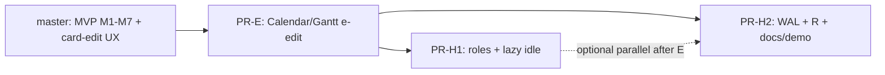
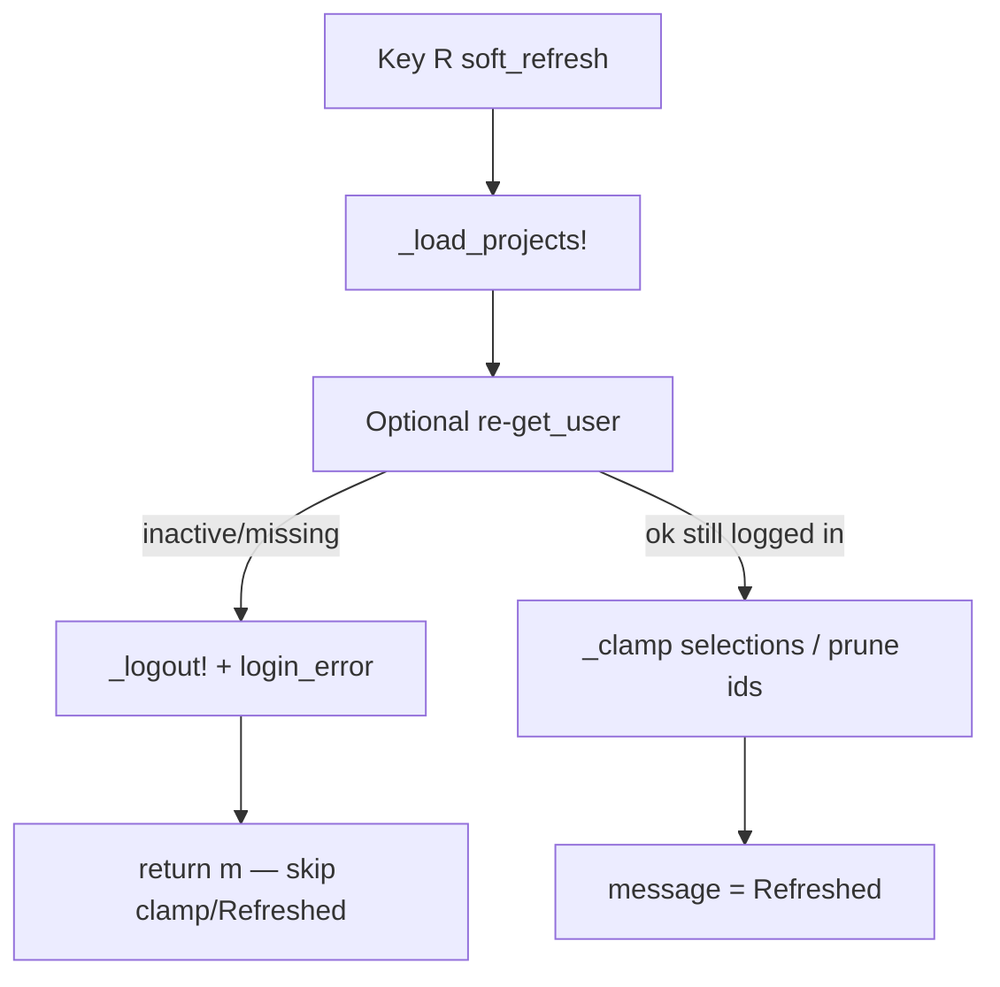
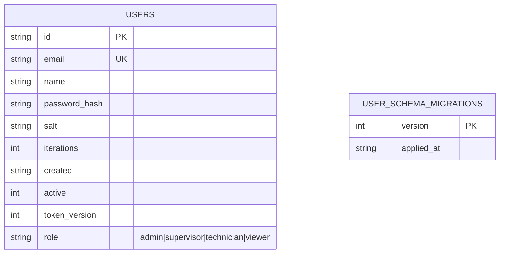
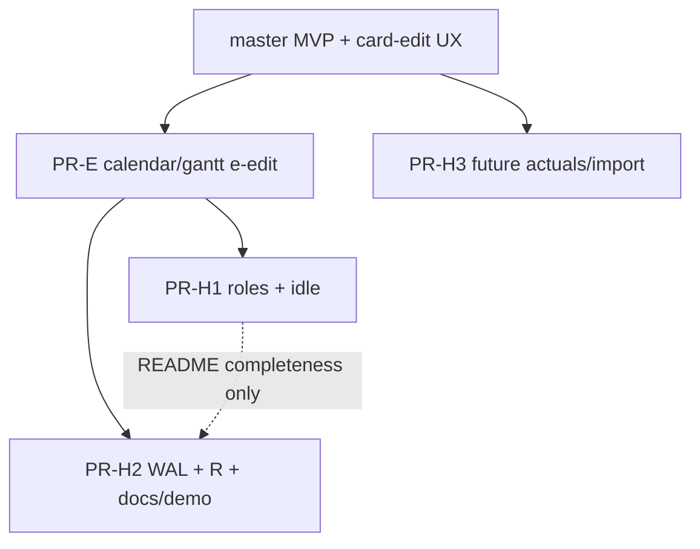

# Design: Calendar/Gantt e-edit + Post-MVP Hardening (PR-H1, PR-H2)

| Field | Value |
|-------|-------|
| **Author** | design-doc-writer (Grok) |
| **Date** | 2026-07-10 |
| **Status** | Approved (open questions resolved 2026-07-10) |
| **Audience** | Senior engineers implementing `qci-kanban` v2 |
| **Primary codebase** | `qci-kanban/` (v2 `kanban2()` only; v1 untouched) |
| **Parent designs** | `qci-kanban/docs/design-manufacturing-ops-mvp.md` (PR-H1/H2 stubs §4.6, §5, PR plan) |
| **Related** | `PHASES.md`, `README.md`, `COVERAGE.md`, `AGENTS.md` |

---

## Overview

Manufacturing MVP PRs **M1–M7** and the recent card-edit UX (field nav, label bubbles, date picker, Ctrl+S / Enter) are on `master`. Three small, independently mergeable follow-ups remain before broader ops hardening (PR-H3 / Phase-6 triage):

1. **Calendar/Gantt `e`-edit** — land remote branch `origin/feat/calendar-gantt-e-edit` so timeline views open the same EDIT CARD modal as board/backlog.
2. **PR-H1** — `users.role` schema, first-user-admin, `can!` permission stubs with `enforce_roles` (default off / warn-only), and **lazy idle logout** for shared shop terminals.
3. **PR-H2** — SQLite `WAL` + `busy_timeout`, global soft-refresh `R`, manufacturing README section, and `record_demo2` ops tour polish.

This document turns those stubs into implementable specs: land strategy, data migrations, API surfaces, sequences, tests, risks, and a merge-ordered PR plan. Scope is deliberately **not** PR-H3 (actuals, asset swimlanes, CSV import) or full Phase-6 REVIEW-FINDINGS triage.

---

## Background & Motivation

### Current product state (verified on disk 2026-07-10)

| Area | On master | Gap |
|------|-----------|-----|
| Multi-project, velocity, WO fields, `P`/`E`, seed_demo | Landed (M1–M7) | — |
| Card-edit UX (field nav, labels, date picker) | `139bcda` + status-bar tip fix | — |
| Board/Backlog `e` → EDIT CARD | Yes (`:edit_card`, `:backlog_edit_card`) | Calendar/Gantt only have `v`/Enter details |
| Calendar/Gantt `e` | **Branch only** (`origin/feat/calendar-gantt-e-edit`, 2 commits ahead) | Not on master |
| User roles | None — `Domain.User` is `id/email/name/active/created` | Any authed user is full admin |
| Idle logout | None — sessions live until JWT TTL or Ctrl-L | Shared kiosk risk |
| SQLite open | `PRAGMA foreign_keys=ON` already set in `_open_db` (parent manufacturing inventory is stale on this point) | No WAL / busy_timeout — **H2 only adds those** |
| Soft refresh | No `R` binding; views re-`list_issues` from store each render, but `projects_cache` and selection can go stale under multi-writer | Multi-seat SQLite |
| `record_demo2` | Software-demo tour (board/swimlane/detail/comment/stats/cal/backlog/gantt) | No project switch, WO fields, or velocity close |

### Pain points these PRs address

- **UX parity:** Operators schedule from Calendar/Gantt but must hop to Board to edit — friction after dates/WO fields became first-class.
- **Shop-floor session hygiene:** Shared terminals need short idle logout without inventing a TickEvent Tachikoma does not provide.
- **Role readiness:** Schema + `can!` hooks land with product Q5/Q6 **locked** (open self-service create; technician create + edit-assigned-only) so hard RBAC is a later `enforce_roles=true` flag flip, not a rewrite.
- **Multi-user SQLite:** WAL + busy_timeout + soft refresh make 1–3 concurrent light users viable without Postgres.

### Branch state: `origin/feat/calendar-gantt-e-edit`

```
9bfa2d3 docs: capture calendar/gantt e-edit in PHASES and README
f6994ec feat(ui): e opens card edit from calendar and gantt
c3048f6 fix(ui): move date picker tip to status bar   ← current master tip
```

**`master` is a strict ancestor** of the remote branch (verified: `git merge-base --is-ancestor master origin/feat/calendar-gantt-e-edit`). Diff is +85/−4 across 10 files; no additional master commits sit on top of the branch base today.

---

## Goals & Non-Goals

### Goals

1. Merge Calendar/Gantt `e` → EDIT CARD with full TestBackend + BDD coverage and docs.
2. Ship **role column + first-user admin + `can!` + warn-only enforcement** using the product-locked Q5/Q6 matrix (open self-service create; technician create + edit assigned only) while keeping `enforce_roles=false` by default.
3. Ship **lazy idle logout** gated by `idle_logout_seconds` (code default `0` = off).
4. Enable **WAL + busy_timeout** on every SQLite open path used by v2.
5. Add **global `R` soft refresh** that reloads project cache and re-clamps selection after multi-writer edits.
6. Document manufacturing install posture and extend `record_demo2` with a short ops tour (project + WO + velocity).
7. Keep each PR independently full-suite green, coverage-gate green, and app-gate clean.

### Non-Goals

- Turning on hard RBAC by default (`enforce_roles` stays `false` in code/maintenance example until plant operators opt in). Product answers for Q5/Q6 define the matrix when they do.
- Background idle timer / `TaskEvent` (future optional).
- JWT embedding of role claims.
- PR-H3 (actual hours, downtime, asset swimlane, CSV import).
- Full REVIEW-FINDINGS Phase-6 backlog (unicode, remote defects, JWT revoke polish) — orthogonal.
- Any v1 (`src/QciKanban.jl` v1 sections, `src/db.jl`) changes.
- Postgres live multi-writer runbook rewrite (FakeExec parity for role column only).

---

## Proposed Design

### Architecture (three PRs on top of MVP)



H1 and H2 are **independent after e-edit** (recommended order H1 then H2 only for review bandwidth; no hard code dep). E-edit first keeps the pure-UX land unblocked and free of auth noise.

---

## Deliverable 1 — Calendar/Gantt `e`-edit

### Intent

Mirror board/backlog: on Calendar, select a day with due issues and press `e`; on Gantt, select a row and press `e`. Opens the existing EDIT CARD modal pre-populated from that view’s selection. No-op when nothing selected.

### Landing strategy (rebase vs cherry-pick)

| Option | When | Recommendation |
|--------|------|----------------|
| **Fast-forward / merge** | Branch still ancestor of master (current) | **Preferred today** — `git merge --ff-only origin/feat/calendar-gantt-e-edit` or GitHub merge of the remote branch |
| **Rebase onto master** | Master gains new commits after `c3048f6` before land | `git rebase master` on the branch tip; resolve, re-run suite |
| **Cherry-pick** | Only if branch history is messy or needs squashing onto a different base | `git cherry-pick f6994ec 9bfa2d3` onto updated master |

**Conflict risk assessment (as of 2026-07-10):**

- Branch **already includes** card-edit UX (`139bcda`) and date-picker tip fix (`c3048f6`).
- `_open_edit_issue!` is a **new** function inserted after `_open_detail_issue!` in `modals.jl`; master’s current `_open_card_edit!` (board cursor + optional `due_prefill`) is unchanged on the branch.
- Keymap adds two `Binding` rows; app.jl adds two `elseif` arms next to existing `:cal_view_card` / `:gantt_view_card`.
- **Likely conflict hotspots if master moves before land:**
  1. `modals.jl` around `_open_detail_issue!` / `_close_modal!` if further edit-form refactors land.
  2. `app.jl` `_do_action!` Phase-4 block if new calendar/gantt actions land.
  3. `test/test_gantt.jl` / `phase4_timeline.jl` if neighboring tests shift line context (usually trivial).
- **Low risk:** `calendar.jl` / `gantt.jl` one-liner helpers; keymap single-line inserts.

**Implementer checklist for land:**

1. Fetch + confirm ancestry; if not clean FF, rebase.
2. **Optional but recommended if CI has not run on the remote tip:** checkout `origin/feat/calendar-gantt-e-edit` and run `julia --project=. test/runtests.jl` once *before* the FF merge (branch is based on current master tip, so risk is low).
3. After merge, smoke: calendar empty day `e` no-op; day with due issue `e` → EDIT CARD; save with Ctrl+S; gantt row `e`.
4. Gates on the merge result: `julia --project=. test/runtests.jl`, coverage gate, app/demo gate.
5. Do **not** re-implement — prefer landing the existing commits unless rebase conflicts force a hand-merge of `_open_edit_issue!`.

### Concrete change set (already on branch — treat as target)

**`src/ui/keymap.jl`**

```julia
Binding(:calendar, 'e', :cal_edit_card,  "e", "Edit", true),
Binding(:gantt,    'e', :gantt_edit_card, "e", "Edit", true),
```

Place next to existing `v`/Enter detail bindings so status hints show `[e] Edit`.

**`src/ui/app.jl` — `_do_action!`**

```julia
elseif act === :cal_edit_card
    _cal_open_edit!(m)
# ...
elseif act === :gantt_edit_card
    _gantt_open_edit!(m)
```

**`src/ui/calendar.jl` / `src/ui/gantt.jl`**

```julia
_cal_open_edit!(m::AppModel)   = _open_edit_issue!(m, _cal_selected_issue(m))
_gantt_open_edit!(m::AppModel) = _open_edit_issue!(m, _gantt_selected_issue(m))
```

Selection helpers already exist:

- `_cal_selected_issue` → first issue among `_cal_day_issues` for `cal_sel_day` (or `nothing`).
- `_gantt_selected_issue` → `gantt_issue_rows[clamp(gantt_sel)]` issue (or `nothing`).

**`src/ui/modals.jl` — new helper**

```julia
function _open_edit_issue!(m::AppModel, iss)
    iss === nothing && return m
    m.card_issue_id = iss.id
    m.edit_form = _build_edit_form(m, iss)
    m.modal = :card_edit
    m.focus = FocusState(edit_editors(m.edit_form); active = true)
    m
end
```

**Contract notes:**

- Does **not** use board `selected_issue(m)` — timeline selection is view-local (same pattern as `_open_detail_issue!`).
- Create path remains `_open_card_edit!(; create=true, due_prefill=…)` via calendar `n` — do not overload `e` for create.
- Modal is the full current edit form (WO fields, date picker, label bubbles) because `_build_edit_form` is shared.
- Esc closes via existing `:close_card`; Ctrl+S / Enter save via existing card_edit bindings.

### Acceptance tests / BDD (already drafted on branch)

| File | Scenario |
|------|----------|
| `test/features/phase4_timeline.jl` | When `e` on a due day → `modal == :card_edit`, `card_issue_id` in due set, `find_text("EDIT CARD")` |
| `test/test_calendar_view.jl` | `e` on empty day → no modal, `edit_form === nothing`; `e` on due day → prefilled due + title, no calendar bleed (`"No issues due"` absent) |
| `test/test_gantt.jl` | After `v`/Enter detail, Esc, then `e` → edit for selected gantt issue; title matches; Esc clears |

**Red-first note:** If re-implementing instead of landing the branch, write these tests first on master (they fail: `e` unbound on calendar/gantt), then implement.

### Docs

- `PHASES.md` Phase 4 acceptance bullet for `e`.
- `README.md` Calendar/Gantt key tables + feature blurbs.

---

## Deliverable 2 — PR-H1: Roles + lazy idle logout

### Role model

**Enum values** (domain constants; store as TEXT):

| Role | Intent | Hard-enforce (future; not this PR’s default) |
|------|--------|-----------------------------------------------|
| `admin` | Users, projects, config, all work | Full |
| `supervisor` | Plan sprints, assign, close windows, edit all WOs | Full work; no user-admin |
| `technician` | Create WOs; edit **assigned** WOs only; comments; status moves on assigned (when those paths are gated) | **Q6 locked** 2026-07-10 |
| `viewer` | Read-only | No mutating actions |

```julia
# domain.jl
const USER_ROLES = ("admin", "supervisor", "technician", "viewer")
valid_role(r::AbstractString)::Bool = r in USER_ROLES
```

**`Domain.User` field addition:**

```julia
struct User
    id::String
    email::String
    name::String
    active::Bool
    created::DateTime
    role::String   # NEW — default "supervisor" in keyword ctor
    # inner ctor validates valid_role(role)
end
User(; id, email, name, active=true, created=now(UTC), role="supervisor") = ...
```

Default for **keyword** construction and **DB column** is `"supervisor"` so existing software-kanban installs stay non-admin multi-user until an admin is intentionally first-created. First user on an empty store is special-cased to `"admin"` (below).

### Users.db migration strategy

Users store currently has **no** migrations table (`init_user_schema!` is create-only at `sqlite_store.jl:59-73`). PR-H1 introduces a minimal users migrator parallel to the board migrator. Prefer table name **`user_schema_migrations`** (not `schema_migrations`) so greps do not confuse board vs users DB files.

| Version | Steps |
|---------|--------|
| **0** | Pre-H1 on-disk: `CREATE TABLE users (... no role ...)` as today; no migrations table |
| **1** | Ensure `user_schema_migrations` exists; `ALTER TABLE users ADD COLUMN role TEXT NOT NULL DEFAULT 'supervisor'` (idempotent: only if version &lt; 1); record version 1 |

**SQLite note:** `ALTER TABLE … ADD COLUMN … DEFAULT 'supervisor'` applies the default to existing rows — no table rebuild. `CREATE TABLE IF NOT EXISTS` alone **never** adds `role` to an already-created table; the ALTER path is mandatory for real `~/.qci-kanban/users.db` upgrades.

#### Users migrator algorithm (implement exactly)

**Call site:** only from `SQLiteUserStore(path)` after `_open_db`, mirroring board:

```julia
function SQLiteUserStore(path::AbstractString = ":memory:")
    db = _open_db(path)
    init_user_schema!(db)          # CREATE base tables + migrate to target
    SQLiteUserStore(db)
end
```

**`init_user_schema!(db)` order (critical):**

1. `CREATE TABLE IF NOT EXISTS users (` … **include** `role TEXT NOT NULL DEFAULT 'supervisor'` so **fresh** DBs are born current).
2. `CREATE TABLE IF NOT EXISTS user_schema_migrations (
       version INTEGER PRIMARY KEY,
       applied_at TEXT NOT NULL
   )`.
3. Call `migrate_user_schema!(db)`.

**Helpers** (users.db-local; do not overload board helpers that hardcode `schema_migrations`):

```julia
const USER_SCHEMA_TARGET = 1

function _user_schema_version(db::SQLite.DB)::Int
    tables = _query(db, "SELECT name FROM sqlite_master WHERE type='table' AND name='user_schema_migrations'")
    isempty(tables.name) && return 0
    r = _query(db, "SELECT COALESCE(MAX(version), 0) AS v FROM user_schema_migrations")
    Int(r.v[1])
end

function _record_user_migration!(db::SQLite.DB, version::Int)
    _exec(db, "INSERT INTO user_schema_migrations (version, applied_at) VALUES (?, ?)",
          [version, _dt_str(Dates.now(UTC))])
end

function migrate_user_schema!(db::SQLite.DB)::Int
    v = _user_schema_version(db)
    if v < 1
        SQLite.transaction(db) do
            # Existing pre-H1 DBs: users table exists without role.
            # Fresh DBs already have role from CREATE above; ALTER still needed
            # only when the column is missing. Detect via pragma/table_info:
            cols = _query(db, "PRAGMA table_info(users)")
            has_role = any(c -> String(c) == "role", cols.name)  # adapt to columntable shape
            if !has_role
                _exec(db, "ALTER TABLE users ADD COLUMN role TEXT NOT NULL DEFAULT 'supervisor'")
            end
            # If CREATE already had role but migrations empty (brand-new DB), still record v1.
            _record_user_migration!(db, 1)
        end
        v = 1
    end
    v < USER_SCHEMA_TARGET && error("user schema migration incomplete: version $v < $USER_SCHEMA_TARGET")
    v
end
```

**Fresh vs upgrade paths:**

| Path | Behavior |
|------|----------|
| New `:memory:` / new file | CREATE includes `role`; migrator records v1 (ALTER skipped if column present) |
| Pre-H1 `users.db` | CREATE is no-op; migrator ALTER adds `role`; all rows default `'supervisor'`; record v1 |
| Already migrated | `_user_schema_version == 1` → no-op |

**Fixture test (required):**

1. Create temp file DB with **pre-H1** DDL only (copy of current CREATE without `role`, no migrations table).
2. Open via `SQLiteUserStore(path)` (runs init + migrate).
3. Assert `PRAGMA table_info` has `role`; existing row `get_user` → `role == "supervisor"`; `_user_schema_version == 1`.
4. Open again (idempotent; still v1).

**First-user admin rule (store only — not UI `can!`):**

```julia
function create_user!(store::SQLiteUserStore; email, name, password,
                      role::Union{AbstractString,Nothing}=nothing)::User
    # if role === nothing:
    #   assigned = isempty(list_users(store)) ? "admin" : "supervisor"
    # else validate + use `role` (for tests / future admin-create UI)
    ...
end
```

- UI create-account path (`_create_submit!`) does **not** pass `role` → first account becomes admin; later self-service creates become supervisor (**Q5 locked: open self-service** — same as today).
- Do **not** allow the create form to pick role in H1 (no UI for privilege escalation).
- Do **not** call `can!` from `_create_submit!` — see account-creation policy below.
- **No migration heuristic** to promote an oldest user to admin (**Q-role-default locked**): existing multi-user DBs all get `role='supervisor'` after ALTER; only empty-store first create is `admin`.

**Remote store:** same column in INSERT/SELECT; `remote_row_to_user` reads `role` with default `"supervisor"` if missing (FakeExec fixtures). **Same `role` kw + first-empty-admin assignment in `RemoteUserStore.create_user!`** (empty store / no prior users → `"admin"`, else default `"supervisor"` unless `role=` is passed) — behavioral parity with `SQLiteUserStore` because the UI calls the shared `Stores.create_user!` interface and FakeExec tests expect both backends to match. No live PG requirement in CI.

### Module placement for `can` / `can!`

| Symbol | File / module | Why |
|--------|---------------|-----|
| `USER_ROLES`, `valid_role`, `can` | `src/domain.jl` (`Domain`) | Pure; depends only on `User`; no I/O; no UI |
| `can!` | `src/ui/app.jl` (or small `src/ui/permissions.jl` included from the UI module that already sees `AppModel`) | Needs `AppModel`, `m.config.enforce_roles`, `m.message` |

**Do not** put `can!` in `Domain` or `Auth` — that creates circular deps (`Domain` must not depend on UI; `Auth` already sits under stores/domain types). Export `can` / `USER_ROLES` / `valid_role` for unit tests; `can!` is internal UI unless tests need it.

### `can` / `can!` API

```julia
# domain.jl — pure
"""
    can(user, action; resource=nothing) -> Bool

Capability check. `action` is a Symbol from a closed set.
Unauthenticated (`user === nothing`) always false.
"""
function can(user::Union{User,Nothing}, action::Symbol; resource=nothing)::Bool
    user === nothing && return false
    !user.active && return false
    # matrix ...
end

# ui/app.jl (or ui/permissions.jl) — UI-facing
"""
    can!(m::AppModel, action; resource=nothing) -> Bool

If allowed → true.
If denied and `enforce_roles` → set m.message, return false (block action).
If denied and not enforce → set warn message (only when a user is present),
return true (action proceeds).
Unauthenticated: always deny when enforcing; when not enforcing return false
for gated actions (do not proceed, do not crash on `.role`).
"""
function can!(m::AppModel, action::Symbol; resource=nothing)::Bool
    u = m.current_user
    if u === nothing
        # Gated actions require a session. Never interpolate u.role.
        if m.config.enforce_roles
            m.message = "Permission denied ($action)"
            return false
        end
        return false   # warn-only still does not allow unauthenticated mutate
    end
    can(u, action; resource=resource) && return true
    if m.config.enforce_roles
        m.message = "Permission denied ($action)"
        return false
    else
        m.message = "Role warning: $(u.role) lacks $action (enforcement off)"
        return true
    end
end
```

**Action symbols to define in H1 (closed set — extend later, do not invent free strings):**

| Action | Roles allowed (**locked** hard matrix) | H1 wiring |
|--------|----------------------------------------|-----------|
| `:view_board` | all | matrix only (nav ungated) |
| `:edit_issue` | admin, supervisor, technician\* | yes — edit open/save |
| `:create_issue` | admin, supervisor, technician† | yes — create open/save |
| `:delete_issue` | admin, supervisor | yes |
| `:manage_sprint` | admin, supervisor | yes |
| `:manage_project` | admin, supervisor | yes |
| `:export_csv` | admin, supervisor, technician | yes |
| `:create_user` | n/a on login form; optional future admin UI only | **not wired** to `_create_submit!` (Q5 = open self-service) |
| `:manage_users` | admin only (future post-login UI) | **matrix only — no admin UI yet** |

\* **Q6 locked (2026-07-10):** Technician + `:edit_issue` — when `resource` is an `Issue`, `can` is true **only if** `iss.assignee_id == user.id` (or resource is missing and caller cannot check — prefer always pass `resource` from edit paths). Admin/supervisor: all issues.  
† **Q6 locked:** Technician **may create** work orders (`:create_issue` true).  

**H1 behavior:** implement this matrix inside pure `can(...)` **now**. With `enforce_roles=false` (default), `can!` still **allows** the action but sets a role-warning message when `can` would deny (e.g. technician editing an unassigned card). When a plant later sets `enforce_roles=true`, the same matrix becomes hard deny without a code change to role rules.

### Account creation policy (Q5 resolved; not `can!` on login)

`_create_submit!` runs **pre-login** (`m.current_user === nothing`; context `[:login_create]`). Wiring `can!(m, :create_user)` is **incorrect**: `can(nothing, …)` is false, and warn-only would null-deref `current_user.role`.

| Stage | Policy (**Q5 locked 2026-07-10**) |
|-------|--------|
| First user (`user_count == 0` / empty store) | Always allowed; store assigns `admin` |
| Subsequent self-service create | **Always open** (same as today) — anyone may create an account; store assigns `supervisor`. **Not** gated by `enforce_roles` |
| Admin-only create | **Out of product scope** unless product revisits Q5; do not implement hide-create or count+flag gate in H1 |
| Future admin “invite user” / role-change UI | Optional later; then `can!(m, :manage_users)` from a **post-login** surface |

Keep `:create_user` / `:manage_users` in the pure `can` matrix only for tests and optional future admin UI — **not** as a gate on the public create-account form.

### Where to call `can!` in H1 (post-login mutate paths only)

| Call site | Action |
|-----------|--------|
| `_open_card_edit!` / `_open_edit_issue!` / `_save_edit!` | `:edit_issue` / `:create_issue` |
| `_request_delete_one!` / bulk delete | `:delete_issue` |
| `_start_sprint!` / `_do_close_sprint!` / new sprint | `:manage_sprint` |
| `_submit_project_create!` | `:manage_project` |
| `_export_csv!` | `:export_csv` |

Do **not** gate navigation (`B`/`K`/`C`/`G`), help, logout, soft refresh, or **`_create_submit!`**.

#### Explicit H1 non-goals / deferred gates

These mutating paths stay **ungated** in H1 (call-site wiring deferred). When later gated under `enforce_roles`, apply **Q6**: technician needs assignee match for issue-scoped mutates (status move/rank on that card); comments remain allowed for technician on assigned issues.

| Path | Why deferred in H1 |
|------|----------------|
| Status move (`</>`, bulk move) | Not in H1 call-site subset; when gated, technician only on assigned issues |
| Rank up/down | Same class of board mutate |
| Assign me / bulk assign | Separate capability; technician may keep “assign me” when wiring expands |
| Comments (`_submit_comment!`) | Technician should keep comments (prefer assigned-only when gated) |
| Label filter / search mutations | Read-side UX; not privilege-sensitive for H1 |
| Calendar `n` create | Covered when create goes through `_open_card_edit!`/`_save_edit!` (`:create_issue`); if `n` bypasses, add `can!` at save only |

Document in code comments near `can!` call sites: “H1 subset; full Q6 matrix for edit/create; other mutates deferred.”

With `enforce_roles=false` (default), every **wired** gated path still **runs** for logged-in users but may flash a role warning when the matrix would deny (e.g. tech editing unassigned WO) — useful without blocking pilots.

### Config knobs (H1)

| Field | Type | Code default | `maintenance.toml.example` | ENV |
|-------|------|--------------|----------------------------|-----|
| `idle_logout_seconds` | Int | `0` (off) | `900` | `QCI_IDLE_LOGOUT` |
| `enforce_roles` | Bool | `false` | `false` | `QCI_ENFORCE_ROLES` |
| `token_ttl_seconds` | Int | `604800` (unchanged) | `28800` | `QCI_TOKEN_TTL` (exists) |

Plant profile documents shorter TTL + idle; code defaults stay software-friendly.

### JWT / session / role restore

**Do not embed `role` in JWT claims.** Existing secure path already rebuilds `User` from DB:

- `login!` → `authenticate` → full `User` from store.
- `restore(sess, token, userstore)` → `get_user` + `token_version` check → `sess.current_user = user`.

**H1 requirements:**

1. All user-row mappers (`authenticate`, `get_user`, `list_users`, remote equivalents) SELECT `role` and construct `User` with it.
2. After `_complete_login!` / restore, `m.current_user.role` is authoritative.
3. Document: changing a user’s role in DB requires **re-login** (or future soft refresh that re-`get_user`s) to take effect on a hot session. Optional cheap improvement in H1: on idle check path or soft refresh (H2), re-fetch current user — **optional**, not required for H1 merge.

### Lazy idle logout sequence

Tachikoma only delivers `KeyEvent` into `update!` — no frame tick. Idle is **lazy** (checked on the next key after quiet period).

```mermaid
sequenceDiagram
  participant U as Operator
  participant UI as update!
  participant S as Session/Auth
  participant FS as session.jwt

  U->>UI: KeyEvent (any)
  UI->>UI: idle check (before focus router)
  alt logged in AND idle_logout_seconds > 0 AND now - last_input_at > threshold
    UI->>S: logout!(session, userstore) via _logout!
    S->>FS: rm token file; bump token_version
    UI->>UI: clear current_user, projects, modal, focus → login
    Note over UI: _logout! clears login_error AND message — must set AFTER
    UI->>UI: login_error = "Session expired (idle)"  (mandatory; visible on SIGN IN)
    UI-->>U: return (key NOT applied as board action)
  else not expired
    UI->>UI: last_input_at = now()
    UI->>UI: route_to_focus! / lookup_action / _do_action!
  end
```

**AppModel field (positional struct — not `@kwdef`):**

`AppModel` is a plain `mutable struct` with a single long positional constructor at `app.jl` (~132–147). Adding a field without updating that call is an immediate method error.

```julia
# Append as the LAST field (after project_key_input) to minimize reorder churn:
last_input_at::DateTime
```

Constructor requirements:

1. Pass `Dates.now(UTC)` in the positional `AppModel(...)` call even when not logged in (gate screen still constructs the model).
2. Set `m.last_input_at = Dates.now(UTC)` in `_complete_login!` and after successful create/session establish (covers restore path, which already goes through `_complete_login!`).
3. Do **not** leave the field uninitialized on the login-only path.

**`update!` rewrite (order is critical):**

```julia
function update!(m::AppModel, evt::KeyEvent)
    m.tick += 1
    if _idle_expired!(m)   # may logout + return true if expired
        return m           # swallow this key
    end
    m.last_input_at = Dates.now(UTC)
    disp = route_to_focus!(m.focus, evt)
    disp === :consumed && return m
    act = lookup_action(context_stack(m), evt)
    act === nothing && return m
    _do_action!(m, act)
    m
end
```

**`_idle_expired!(m)` rules:**

1. If `m.current_user === nothing` → false (login screen; no idle).
2. If `m.config.idle_logout_seconds <= 0` → false.
3. If `Dates.now(UTC) - m.last_input_at > Second(m.config.idle_logout_seconds)`:
   - Call existing `_logout!(m)` (clears session file, bumps `token_version`, resets auth focus, **and clears both `login_error` and `message`** — see `app.jl` `_logout!`).
   - **Mandatory (after `_logout!`):** set  
     `m.login_error = "Session expired (idle)"`.  
     Login chrome (`_render_login!` / `_render_create!`) only surfaces `m.login_error` via `_render_error!`. `m.message` is toast under main tabs in `_render_main!` and is **not** shown when `current_user === nothing`. Status bar never displays `m.message`. Relying on `m.message` alone makes the expiry invisible.
   - Optionally also set `m.message` for symmetry (harmless; not user-visible on login).
   - Return `true`.
4. Else return `false`.

**Keys exempt from counting as activity?**  
**None for H1.** Every KeyEvent that reaches `update!` after a non-expired check updates `last_input_at`, including keys later consumed by focus editors (typing in password/edit forms is activity). The expired branch runs **before** focus routing, so the wake-up key that triggers logout is **not** applied (e.g. accidental `d` after idle does not delete a card).

**Optional exempt list (do not implement unless product asks):** pure modifiers if Tachikoma ever emits them alone — currently N/A.

**Login / create resets:** `_complete_login!` and successful create set `last_input_at = now()`.

**Tests inject time:** prefer an injectable clock or set `m.last_input_at` directly in tests rather than `sleep` — e.g. set `last_input_at = now() - Second(1000)` with `idle_logout_seconds = 900`, then send `'j'`, assert login screen and no board mutation.

### Idle logout UI return state

Must match normal `_logout!` outcomes **plus** the idle-specific error:

- `current_user === nothing`
- `auth_stage = :signin` (logout leaves users intact → sign-in, not first-run create)
- session token file deleted
- `token_version` bumped (other seats with same user invalidated — acceptable; document)
- modal cleared, project selection cleared
- **`login_error == "Session expired (idle)"`** (set after `_logout!`)
- TestBackend: `find_text` SIGN IN chrome **and** the idle string; no board column headers bleed

### Acceptance tests / BDD sketches (H1)

**Store / domain**

- Fresh store: first `create_user!` → `role == "admin"`; second → `"supervisor"`.
- `User(; role="nope")` throws.
- Migrator: on-disk fixture without `role` column → open store → column exists, existing rows `"supervisor"`.
- Remote FakeExec: INSERT includes role; row mapper reads role.

**`can` / `can!`**

- `viewer` + `:delete_issue` → `can` false; with `enforce_roles=false`, `can!` true + warning message; with `true`, `can!` false + denied message, delete not called.
- `admin` all true.

**Idle (TestBackend)**

```
Given logged-in AppModel with idle_logout_seconds = 60
And last_input_at = now() - 120s
When update!(m, KeyEvent('j'))
Then current_user === nothing
And board selection / issues unchanged (no nav side effect)
And m.login_error == "Session expired (idle)"
And TestBackend find_text shows that string on SIGN IN (not only m.message)
And session token file absent
```

```
Given idle_logout_seconds = 0
And last_input_at very old
When KeyEvent('j')
Then still logged in and nav applied
```

```
Given idle on, not expired
When typing in card edit TextArea
Then last_input_at advances and session remains
```

**BDD file:** `test/features/roles_idle.jl` (new). Unit coverage in `test/test_auth.jl`, `test/test_stores.jl` (or user-store section).

---

## Deliverable 3 — PR-H2: WAL / busy_timeout + soft refresh `R` + docs/demo

### SQLite PRAGMAs

**Site:** `src/store/sqlite_store.jl` `_open_db` (single chokepoint for both user and board stores).

```julia
function _open_db(path::AbstractString)::SQLite.DB
    if path != ":memory:"
        dir = dirname(path)
        isempty(dir) || isdir(dir) || mkpath(dir)
    end
    db = SQLite.DB(path)
    DBInterface.execute(db, "PRAGMA foreign_keys = ON")  # already on master; keep
    # PR-H2: multi-reader / short-writer friendliness for shared plant DBs.
    DBInterface.execute(db, "PRAGMA journal_mode = WAL")
    DBInterface.execute(db, "PRAGMA busy_timeout = 5000")  # ms
    db
end
```

**Notes:**

- **`foreign_keys=ON` is already on master** (`sqlite_store.jl:48-49`). Parent manufacturing design inventory still claims it is missing — ignore that claim; H2 does **not** re-litigate FK. H2 **only** adds WAL + busy_timeout.
- `:memory:` accepts these PRAGMAs (WAL may no-op or be ignored depending on SQLite build; still execute for path uniformity). Tests should not require WAL files.
- `busy_timeout = 5000` (5s) matches manufacturing design intent for brief lock waits; document if plant needs higher.
- Do **not** enable WAL on network-mounted SQLite (document “local disk only; use Postgres remote for multi-host”).
- Remote/Postgres path: no-op (not SQLite).

**Tests:** open file-backed temp DB; `PRAGMA journal_mode` query returns `wal` (case-insensitive); concurrent write smoke optional/light.

### Soft refresh `R` semantics

**Binding:**

```julia
Binding(:global, 'R', :soft_refresh, "R", "Refresh", true),
```

Uppercase only — free today; lowercase `r` unused on board (v1 had reload; v2 does not). Help/status generate from keymap automatically.

**Handler `_soft_refresh!(m::AppModel)`:**

1. If not logged in → no-op (or ignore via context — global only post-login via context_stack); `return m`.
2. Re-fetch projects: `_load_projects!(m)` (preserves `active_project_id` if still present; falls back per existing logic).
3. **Optional (recommended in H2):** re-load `current_user` from store by id so role/active changes apply without full re-login.  
   **If user missing/inactive:** call `_logout!`, then set `m.login_error = "Account no longer active"` (same visibility rule as idle — login chrome uses `login_error`, not `message`), then **`return m` immediately**. Do **not** run steps 4–6 after logout: `projects_cache` is empty, selection clamps are wasted work, and `m.message = "Refreshed"` would be invisible on login chrome and confuses control flow.
4. **Still logged in — preserve selection best-effort (use existing helpers — do not invent a parallel clamp API):**
   - **Board:** call existing `_clamp_selection!(m)` (`board.jl`) so `sel_lane` / `sel_col` / `sel_idx` stay in range for the current `board_grid`.
   - **Prune `selected_ids`:** keep ids that still exist in the store under the active project —  
     `filter!(id -> Stores.get_issue(m.boardstore, id) !== nothing, m.selected_ids)`  
     (or rebuild as a set from scoped `list_issues`).  
     **Do not** use `_visible_ids(m)` for this prune: that helper is filter/search-aware (bulk-ops safety). Soft refresh should drop **deleted** cards, not cards hidden only by a temporary filter.
   - **Backlog:** clamp `backlog_sel` to `1:max(1, length(backlog list))` (same pattern as backlog nav bounds).
   - **Calendar:** keep year/month/day; clamp day to days-in-month if needed.
   - **Gantt:** `m.gantt_sel = clamp(m.gantt_sel, 1, max(1, length(gantt_issue_rows(m))))` — `gantt_issue_rows` already exists (`gantt.jl`).
5. **Modal policy (Q-refresh-modal locked 2026-07-10):** **preserve** open modal if the issue still exists (`card_issue_id` present and `get_issue` non-nothing); if the issue was deleted / missing, `_close_modal!`. Do not unconditionally close all modals on `R`.
6. `m.message = "Refreshed"` (visible under main tabs when still logged in).

**What refresh is *not*:**

- Not a process restart; not re-seed; not logout.
- Not a full `AppModel` reconstruct (keeps JWT session, filters, WIP limits, search text).
- Lists themselves are already live from SQLite on each render (`list_issues` in board/calendar/gantt) — the valuable work is **projects_cache**, **user revalidation**, **selection pruning**, and **multi-writer visibility** when WAL readers see committed writers (SQLite read-your-writes is already true for same connection; cross-process needs new read — store queries already re-read; cache was the stale part).



### Manufacturing README + `record_demo2` ops tour

**README section (new, after Configuration or Features):**

- Plant install: copy `config/maintenance.toml.example`, set paths, `seed_demo=false`, `token_ttl_seconds=28800`, `idle_logout_seconds=900` (once H1 lands — README can mention idle in H2 if H1 merged first; if H2 merges alone, document upcoming knobs carefully or depend on H1).
- **PR order note:** If H2 merges before H1, README documents WAL + `R` + seed_demo/export/velocity tour only; idle/roles paragraphs land with H1 or a tiny docs follow-up. Prefer **H1 before H2** so the manufacturing section is complete.
- Shared kiosk: Ctrl-L between users; per-seat `QCI_SESSION_TOKEN_PATH`; no SQLite on NFS.
- Keys: `P` project, `E` export, `R` refresh, WO fields on edit form.
- Backup: `cp -a ~/.qci-kanban ~/.qci-kanban.bak-…` before upgrades.

**`record_demo2` polish** (`src/ui/app.jl`):

Extend the scripted tour (still `:memory:`, `seed=true` for visible cards) to include ops-relevant beats **without** breaking precompile/coverage:

Suggested sequence (insert after board settles; keep total frames reasonable):

1. Existing: create account → board → swimlanes → detail + comment → stats.
2. **NEW:** open edit on a card (`e`) — brief pause showing WO/date fields if present on seeded issues (seed_demo may lack asset_tag — optional: one `update_issue!` in setup is **discouraged** if pure KeyEvent tour is required; prefer navigating to calendar `n` create with due date, or accept seed titles only).
3. **NEW:** `P` project switcher open + Esc (shows multi-project UI).
4. Calendar → Gantt (existing) with **`e` edit** if e-edit PR already merged (nice cross-PR demo).
5. Backlog → start sprint (existing) → optional close path is heavy; prefer **velocity sparkline already visible after start** or document “close sprint” as manual.
6. **NEW:** `R` soft refresh flash message.
7. Board.

Keep script KeyEvent-driven; no direct field mutation. Update docstring. `precompile.jl` tour mirror if it duplicates keys — keep in sync.

**`maintenance.toml.example` (H2 or H1):**

```toml
seed_demo = false
seed_ops_labels = true
token_ttl_seconds = 28800
idle_logout_seconds = 900      # H1
enforce_roles = false          # H1
velocity_unit = "points"       # already used by ops
```

### Acceptance tests / BDD sketches (H2)

- `_open_db` temp file: journal_mode wal; busy_timeout 5000.
- Soft refresh: create second project in store behind the model (direct `Stores.create_project!`), press `R`, `projects_cache` length increases; message `"Refreshed"`.
- Soft refresh prunes deleted issue from `selected_ids`.
- Soft refresh with open edit on deleted id closes modal.
- Keymap: `'R'` → `:soft_refresh` in global context; `'r'` unbound (or no-op).
- Docs: smoke that `record_demo2` completes without error (existing style).

**BDD file:** `test/features/ops_refresh.jl` or fold into `multi_project.jl` / shell tests.

---

## API / Interface Changes

### Config (`AppConfig`)

| Field | PR | Default | Notes |
|-------|-----|---------|-------|
| `idle_logout_seconds::Int` | H1 | `0` | ENV `QCI_IDLE_LOGOUT` |
| `enforce_roles::Bool` | H1 | `false` | ENV `QCI_ENFORCE_ROLES` |

`load_config` TOML + ENV wiring mirrors existing `_as_int` / `_as_bool` patterns in `src/config.jl`.

### Domain / store

| Symbol | PR | Change |
|--------|-----|--------|
| `USER_ROLES`, `valid_role`, `can` | H1 | new in `domain.jl` |
| `User.role` | H1 | new field |
| `create_user!(…; role=nothing)` | H1 | first-user admin on **both** `SQLiteUserStore` and `RemoteUserStore` |
| `can!` | H1 | new in `ui/app.jl` (or `ui/permissions.jl`) |
| `init_user_schema!` + `migrate_user_schema!` | H1 | users migrator v1 + `user_schema_migrations` |
| `AppModel.last_input_at` | H1 | last positional field + ctor/`_complete_login!` |
| `_open_db` PRAGMAs | H2 | WAL + busy_timeout |
| `Binding(:global,'R',:soft_refresh,…)` | H2 | new |
| `_soft_refresh!` | H2 | new |
| `_open_edit_issue!` | E | new (branch) |
| `:cal_edit_card` / `:gantt_edit_card` | E | new actions |

### Interface stability

- `AbstractUserStore` create/list/get signatures stay keyword-compatible; adding optional `role` kw is non-breaking.
- Domain `User` keyword ctor default `role="supervisor"` limits test churn; **all user SELECT/INSERT mappers and FakeExec fixtures must include `role`** (the real breakage surface — not keyword call sites).

---

## Data Model Changes

### Users ER (H1)



Board schema **unchanged** in these three PRs (`BOARD_SCHEMA_TARGET` remains 7). Users DB gains `user_schema_migrations` + `users.role` via migrator v1 (see Users migrator algorithm).

### Migration rollback

Forward-only. Rollback = restore `~/.qci-kanban` backup. Document in README (H2).

---

## Alternatives Considered

### 1. Calendar/Gantt edit via board selection sync

**Alt:** On calendar `e`, set board cursor to that issue then call `_open_card_edit!`.  
**Rejected:** Couples views; board may be filtered so issue is invisible; calendar already uses `_open_detail_issue!(m, iss)` pattern — extend symmetrically with `_open_edit_issue!`.

### 2. True background idle timer

**Alt:** `Timer` / Tachikoma `TaskQueue` periodic event to logout without a key.  
**Rejected for H1:** Outside current Elm `update!(KeyEvent)` model; more flaky under TestBackend; lazy idle matches manufacturing design §4.6 and is testable by manipulating `last_input_at`. Revisit if kiosk requires logout while unattended with no key.

### 3. Embed role in JWT

**Alt:** Put `role` claim in token; skip DB on restore.  
**Rejected:** Role changes would not revoke until TTL; conflicts with existing `token_version` security model; design explicitly says DB-sourced user row.

### 4. Hard RBAC in H1

**Alt:** Ship `enforce_roles=true` by default with full technician matrix.  
**Rejected:** Product wants plant-opt-in enforcement. Q5/Q6 are now **locked** (open self-service; tech create + edit-assigned), and that matrix lives in `can` under warn-only H1 — flip `enforce_roles=true` later without inventing new policy.

### 5. Soft refresh = full AppModel rebuild

**Alt:** Re-run `AppModel` constructor from same paths.  
**Rejected:** Loses UI state (filters, modal, selection), re-triggers seed logic risks, heavier; targeted cache reload is enough.

### 6. Combine H1+H2 into one PR

**Alt:** Single hardening mega-PR.  
**Rejected:** Violates independently reviewable DAG; auth/schema risk differs from ops polish.

---

## Security & Privacy Considerations

| Threat | Mitigation |
|--------|------------|
| Shared kiosk leaves supervisor session open | Lazy idle + short TTL in maintenance.toml; document Ctrl-L |
| Privilege escalation via create-account role picker | No role UI in H1; server assigns admin only when store empty |
| `enforce_roles=false` gives false sense of security | README + warning messages; default documented as warn-only |
| Idle logout bumps `token_version` → other devices logged out | **Accepted product choice (Q-idle-bump locked):** reuse `_logout!` bump; document for multi-seat plants |
| Session file last-writer-wins | Existing; document `QCI_SESSION_TOKEN_PATH` per seat |
| WAL on networked filesystem corruption | README: local disk only |
| Soft refresh re-fetch user races deactivate | Inactive → logout |

Password policy remains UI ≥4 chars (unchanged); plant docs recommend ≥8.

---

## Observability

- **Messages:** role warnings/denials and `"Refreshed"` use `m.message` (main-shell toast under tabs). Idle expiry and other post-logout notices **must** use `m.login_error` (login chrome). Status bar does not display `m.message`.
- **Logging:** reuse `@warn` for I/O failures (last_project write pattern); optional `@info` on idle logout is noisy for kiosks — prefer silent UI message only.
- **Metrics:** none (single-process TUI).
- **Coverage gate:** all new branches in gated v2 files need tests or justified `COV_EXCL_*` (prefer tests).

---

## Rollout Plan

| Stage | Action |
|-------|--------|
| 1 | Land PR-E (fast-forward / merge branch); run full suite + coverage + app gate |
| 2 | Land PR-H1 behind defaults (`enforce_roles=false`, `idle_logout_seconds=0`) — open self-service create unchanged; warn-only `can!` using locked Q6 matrix |
| 3 | Land PR-H2 — WAL on next open; `R` available; docs/demo |
| 4 | Plant install: deploy `maintenance.toml.example` values (idle 900, TTL 8h, seed off) |
| 5 | Optional later: plant sets `enforce_roles=true` — hard deny uses already-locked Q5/Q6 matrix (no further product answers required) |

**Feature flags:** config/ENV only (no compile-time flags).

**Rollback:**

- PR-E: revert merge (no schema).
- PR-H1: revert code; role column is harmless default if left in DB; idle off by default.
- PR-H2: revert code; WAL databases remain readable under delete journal mode after reopen without WAL pragma (SQLite compatible); document `PRAGMA journal_mode=DELETE` if ever needed.

---

## Risks & Mitigations

| Risk | Severity | Mitigation |
|------|----------|------------|
| Master moves; e-edit conflicts in `modals.jl` | Med | Rebase early; land E first while still FF |
| User SELECT/INSERT mappers + FakeExec omit `role` | Med | Update all sqlite/remote row mappers and fixtures; domain keyword default limits pure-domain test churn |
| First-user admin race (two creates empty store) | Low | SQLite single writer; accept rare dual-admin under multi-process race or document |
| Idle swallows intentional key after long pause | Low | `login_error` explains expiry; user re-auths |
| `can!` warn spam on every action for viewers | Med | Only message when matrix denies; rate-limit optional later |
| WAL + antivirus/network FS | Med | README local-disk requirement |
| Soft refresh selection clamp bugs | Low | Reuse `_clamp_selection!` / `gantt_issue_rows`; targeted tests |
| Demo tour flaky timing | Low | Existing EventScript pacing; keep additions minimal |
| Coverage misses new `_idle_expired!` branches | Med | Explicit unit tests both sides of threshold |
| Pre-H1 users.db not ALTERed (CREATE-only mistake) | High | Mandatory migrator algorithm + file fixture test |

---

## Open Questions

**All product questions below are Resolved (2026-07-10).** No remaining blockers for implementing the three PRs. Hard `enforce_roles` remains an optional plant config flag (code default `false`).

| # | Question | Status | Decision (2026-07-10) |
|---|----------|--------|------------------------|
| **Q5** | Who may create accounts after first user? | **Resolved** | **Open self-service** — anyone can create accounts after the first user (same as today). Not gated by `enforce_roles`. First user still store-side `admin`; subsequent creates `supervisor`. |
| **Q6** | Technician permissions? | **Resolved** | Technician may **create WOs** and may **edit assigned WOs only** (`:edit_issue` requires `assignee_id == user.id`). Capture this in pure `can` now; H1 ships warn-only (`enforce_roles=false`); hard deny when plant enables the flag. |
| Q-idle-bump | Idle logout bump `token_version`? | **Resolved** | **Yes** — reuse existing `_logout!` (file clear + `token_version` bump; invalidates other seats). |
| Q-role-default | Promote oldest user to admin on migrate? | **Resolved** | **No heuristic** — existing multi-user DBs all become `supervisor` after migration; only empty-store first create is `admin`. |
| Q-refresh-modal | Soft refresh modal behavior? | **Resolved** | **Preserve** open modal if issue still exists; **close** if deleted/missing. |

Unblocked work: all three PRs ship with defaults; enabling `enforce_roles=true` later uses the locked matrix above without further product input.

---

## Key Decisions

| # | Decision | Rationale |
|---|----------|-----------|
| 1 | **Land e-edit via FF/merge of existing remote branch; rebase only if master advances** | Branch already based on card-edit UX tip; smallest risk |
| 2 | **`_open_edit_issue!(m, iss)` parallel to `_open_detail_issue!`** | Timeline selection ≠ board cursor; proven pattern |
| 3 | **Roles: four string enums; DB default supervisor; first create → admin only on empty store; no migrate heuristic** | Q-role-default locked 2026-07-10 |
| 4 | **`enforce_roles` default false (warn-only `can!`); matrix implements locked Q6** | Plant opt-in hard deny; policy already known |
| 5 | **JWT never carries role; restore/login load User from DB** | Preserves token_version security model; role admin via DB |
| 6 | **Lazy idle on KeyEvent only; expire before dispatch; no exempt keys** | Accurate to Tachikoma model; prevents idle wake key from mutating board |
| 7 | **Idle uses existing `_logout!` (including `token_version` bump) then sets `login_error`** | Q-idle-bump locked; login chrome only renders `login_error` |
| 8 | **Users migrator v1 via `init_user_schema!` → `migrate_user_schema!` in `SQLiteUserStore` ctor; ALTER ADD role** | CREATE IF NOT EXISTS never upgrades old files; file fixture required |
| 9 | **WAL + busy_timeout 5s in `_open_db` only (FK already on master)** | Single chokepoint; do not re-scope H2 to FK |
| 10 | **Soft refresh `R`: projects reload + clamps + store prune; preserve modal if issue exists else close** | Q-refresh-modal locked; reuse board/gantt helpers |
| 11 | **PR order: E → H1 → H2 soft preference; H1∥H2 after E** | UX first; README completeness prefers H1 then H2 but H2 may merge first with scoped docs |
| 12 | **v1 untouched; v2-only** | Project law |
| 13 | **No `can!` on pre-login `_create_submit!`; open self-service create forever (Q5)** | Public create form stays open; not admin-only |
| 14 | **`can` in Domain; `can!` in UI; unauthenticated always fails gated actions safely** | Avoid circular deps and null `.role` |
| 15 | **Technician hard matrix: create yes; edit only if assignee_id == user.id (Q6)** | Plant floor recommendation; warn-only until `enforce_roles` |

---

## Testing strategy (all PRs)

- Red-first for behavioral changes; BDD in `test/features/` for user-facing flows.
- Drive UI exclusively via `update!(m, KeyEvent(...))`; re-render TestBackend after every update before assertions; no-bleed on modals.
- Full suite: `julia --project=. test/runtests.jl` from `qci-kanban/`.
- Coverage: `julia --project=. test/coverage_gate.jl` → `GATE PASSED`.
- App gate: zero users first screen; create account; no pre-seeded users.
- Map: consult `qci-kanban/.claude/rules/qci-kanban-test-map.md` when running targeted tests.

| PR | Primary tests |
|----|----------------|
| E | `test_calendar_view.jl`, `test_gantt.jl`, `features/phase4_timeline.jl` |
| H1 | `test_auth.jl`, store user tests, `features/roles_idle.jl`, create-user role tests |
| H2 | store open pragma test, soft refresh UI test, `record_demo2` smoke, README review |

---

## References

- `qci-kanban/docs/design-manufacturing-ops-mvp.md` — §2.4 roles, §4.6 idle, §5 config/keys, PR-H1/H2 stubs, Open Q5–Q6
- `origin/feat/calendar-gantt-e-edit` — `f6994ec`, `9bfa2d3`
- `qci-kanban/src/ui/{app,keymap,modals,calendar,gantt}.jl`
- `qci-kanban/src/auth/session.jl`, `src/domain.jl`, `src/config.jl`
- `qci-kanban/src/store/sqlite_store.jl` (`_open_db`, `init_user_schema!`, `create_user!`)
- `qci-kanban/src/store/remote_store.jl` (`RemoteUserStore`, `remote_row_to_user`)
- `qci-kanban/config/maintenance.toml.example`
- `qci-kanban/PHASES.md`, `README.md`, `COVERAGE.md`
- Workflow: repo `AGENTS.md`, `qci-kanban/.claude/rules/tdd-bdd-coverage-gates.md`

---

## Future (out of scope — pointers only)

- **PR-H3:** actual/downtime hours, asset swimlane, CSV import.
- **Phase-6 REVIEW-FINDINGS:** unicode, remote store defects, JWT revoke UX — orthogonal hardening.
- **Hard RBAC:** plant sets `enforce_roles=true` (matrix already locked); optional admin UI to set roles; idle always bumps token (Q-idle-bump).
- **Background idle:** TaskEvent / timer if unattended logout required without keypress.

---

## PR Plan

Recommended merge order. Each PR is independently reviewable and must leave full suite + coverage + app gate green.

### PR-E — Calendar/Gantt `e` opens EDIT CARD

| | |
|--|--|
| **Title** | `feat(ui): e opens card edit from calendar and gantt` |
| **Dependencies** | None (on current master). **Land first.** |
| **Files / components** | `src/ui/keymap.jl`, `src/ui/app.jl`, `src/ui/calendar.jl`, `src/ui/gantt.jl`, `src/ui/modals.jl` (`_open_edit_issue!`), `test/features/phase4_timeline.jl`, `test/test_calendar_view.jl`, `test/test_gantt.jl`, `PHASES.md`, `README.md` |
| **Description** | Merge/rebase `origin/feat/calendar-gantt-e-edit` (commits `f6994ec` + `9bfa2d3`). Calendar/Gantt `e` mirrors board/backlog edit using view-local selection. Prefer fast-forward while master remains ancestor; rebase if master advances. No schema. Optional: run full suite on the remote tip before FF if CI has not. |
| **Gates** | Full suite (pre-merge optional on branch tip; required on merge result), coverage, app/demo smoke |

### PR-H1 — Roles schema + `can!` + lazy idle logout

| | |
|--|--|
| **Title** | `feat(auth): user.role schema, can! hooks, lazy idle logout` |
| **Dependencies** | Prefer after PR-E (no hard code dep; ordering for clean review). MVP already on master. **Product Q5/Q6 locked 2026-07-10** (open self-service; tech create + edit-assigned); hard enforce still optional via `enforce_roles` flag (default false / warn-only). |
| **Files / components** | `src/domain.jl` (`User.role`, `USER_ROLES`, `valid_role`, `can` with locked Q6 matrix), `src/store/sqlite_store.jl` (`init_user_schema!`, `migrate_user_schema!`, `user_schema_migrations`, create/get/list/auth mappers), `src/store/remote_store.jl` + `remote_row_to_user` (first-empty-admin parity), `src/config.jl`, `src/ui/app.jl` (`last_input_at` field+ctor, `update!` idle via `_logout!`+bump+`login_error`, `can!`, post-login call sites; **not** `_create_submit!`), optional `src/ui/permissions.jl`, mutate paths in modals/board/backlog for the H1 subset, `config/maintenance.toml.example`, `test/test_auth.jl`, store migration fixture, `test/features/roles_idle.jl` |
| **Description** | Add `role` column (default supervisor; no promote-oldest heuristic) via users migrator v1; first empty-store user admin; JWT still DB-sourced; pure `can` encodes Q6 technician rules; `can!` warn-only by default; open self-service account create (Q5); lazy idle with `_logout!` token bump + post-logout `login_error`; wire `can!` only on post-login H1 mutate subset. |
| **Gates** | Full suite, coverage, app gate (first user still createable); migration fixture |

### PR-H2 — WAL/busy_timeout + soft refresh + manufacturing docs/demo

| | |
|--|--|
| **Title** | `chore(ops): WAL, refresh R, manufacturing README, record_demo2 ops tour` |
| **Dependencies** | Prefer after PR-E (demo can show `e` on gantt). Prefer after PR-H1 so README documents idle/roles knobs completely. **No hard code dep on H1** if README scopes carefully. Q-refresh-modal locked: preserve modal if issue exists. |
| **Files / components** | `src/store/sqlite_store.jl` (`_open_db`), `src/ui/keymap.jl`, `src/ui/app.jl` (`_soft_refresh!` with early-return on inactive logout, `_do_action!`, `record_demo2`, maybe `precompile.jl`), `README.md`, `config/maintenance.toml.example`, tests for pragma + refresh |
| **Description** | Enable WAL + busy_timeout=5000 on SQLite open; global `R` soft refresh (projects_cache, selection clamp, store prune, preserve modal if issue exists else close, optional user revalidation with early return after logout); manufacturing install section; extend headless demo tour with project switcher + refresh (+ e-edit if present). |
| **Gates** | Full suite, coverage, `record_demo2` success, app gate |

### Dependency DAG



**H1 and H2 have no hard code dependency after PR-E.** The dashed edge is documentation preference only: H2 may merge before H1 if the manufacturing README omits idle/roles keys (or marks them “pending H1”). Prefer H1→H2 when both are ready so `maintenance.toml.example` and the ops section are complete in one pass.

**Why e-edit first?** Smallest pure-UX delta, already implemented remotely, unblocks timeline edit parity and improves H2 demo script options with zero auth risk.

---

*End of design document.*
