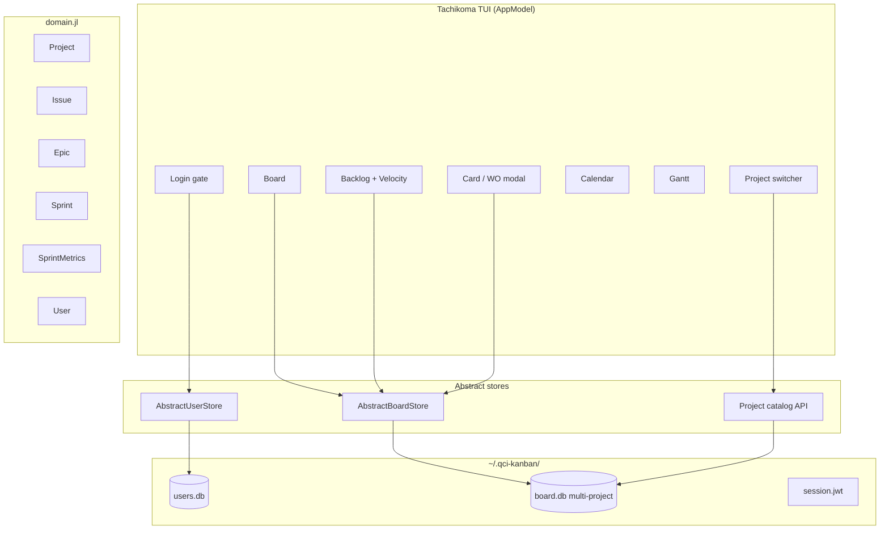
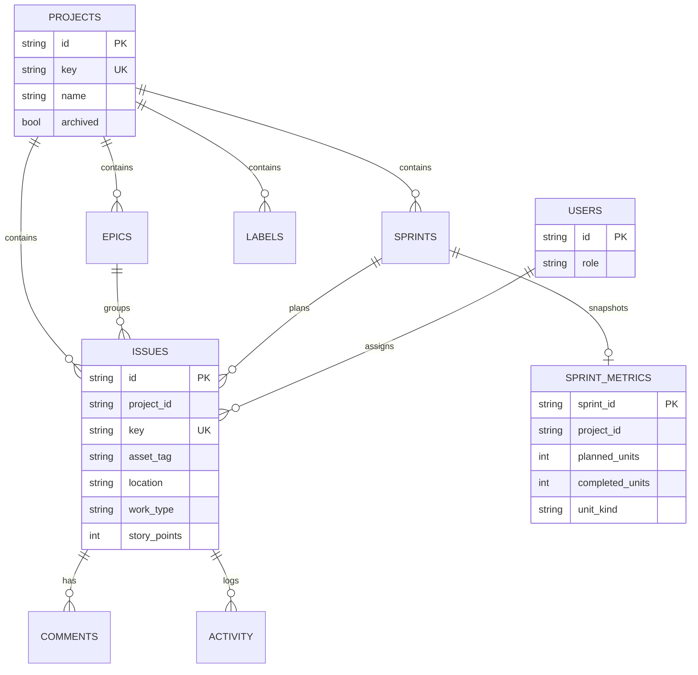
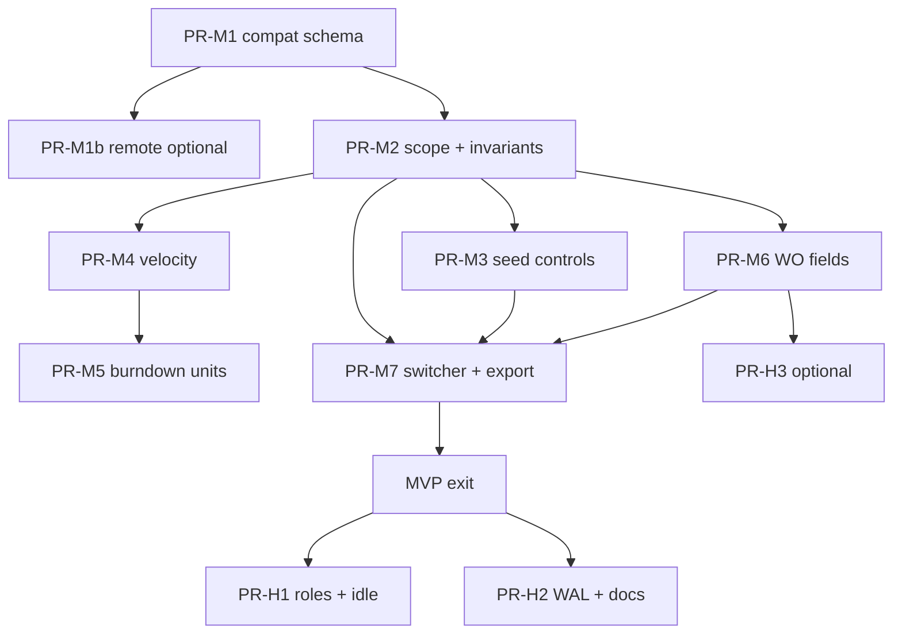

# QCI Kanban → Manufacturing & Equipment Maintenance Ops

**Product pivot, gap analysis, and implementation plan**

| Field | Value |
|-------|-------|
| **Author** | design-doc-writer (orchestrated) |
| **Date** | 2026-07-09 |
| **Status** | Draft (rev 3 — residual polish Issues 20–24) |
| **Audience** | Senior engineers + product owner |
| **Primary codebase** | `qci-kanban/` (v2 `kanban2()` only) |
| **Related docs** | `qci-kanban/DESIGN.md`, `PHASES.md`, `README.md`, `COVERAGE.md` |
| **Review** | `/tmp/grok-design-review-e46c6b63.md` |

---

## Overview

QCI Kanban v2 is a mature Jira-inspired TUI (board, backlog/sprints, calendar, Gantt, JWT auth, SQLite/Postgres stores, 100% coverage gate on gated v2 files). It was designed as a **software sprint board**. The product owner’s real context is **manufacturing and equipment maintenance**: planning windows, work orders, asset systems, labor capacity, and multi-site/multi-line portfolios.

This document:

1. Inventories what v2 already provides and what is reusable for shop-floor ops.
2. Analyzes gaps for real operational use (multi-project, velocity/throughput, work-order fields, roles, shared machines, reporting, etc.).
3. Defines a **slim MVP-for-real-use** a maintenance supervisor can run daily (multi-project + velocity + WO fields + empty seed; roles/idle/WAL as post-MVP hardening).
4. Specifies a concrete **extend-v2** design (not a rewrite): multi-project data model with **store-level invariants**, velocity persistence + charts, optional manufacturing fields, **SQLite-real migration**, and a PR-sliced rollout where **each PR stays full-suite green**.

**Core thesis:** Keep the Elm/Tachikoma shell, domain/store contracts, and TestBackend discipline. Re-map and extend software-kanban primitives (Project / Epic / Issue / Sprint / points) to plant / asset-system / work-order / planning-window / capacity — without forking into a full CMMS unless later justified.

---

## Background & Motivation

### Why this change

A single shared `board.db` of software-demo issues is insufficient for ops:

- Maintenance runs **multiple concurrent work packages** (lines, sites, capital overhauls).
- Supervisors need **velocity / throughput** over closed planning windows to staff the next week — not only an in-window burndown sparkline.
- Work orders need **asset, location, PM vs CM, downtime, actual hours** to be useful on the floor.
- Shared shop terminals need **session hygiene, multi-user identity, and empty production seed** (no demo board pollution).

### Current product state (high level)

| Layer | Maturity | Notes |
|-------|----------|-------|
| Domain types | High | `User`, `Issue`, `Epic`, `Sprint`, `Comment`, `Label`, `ActivityEvent` in `src/domain.jl` |
| Board CRUD + ranking | High | Dense positions **per status (global)**, sprint state machine, activity log |
| Auth | High | PBKDF2 + HS256 JWT, token versioning, 0600 session file; UI min password length 4 |
| UI views | High | Board/swimlanes/WIP/filters, backlog, calendar, Gantt polish |
| Charts | Medium | Stats strip + **issue-count** burndown; no historical velocity |
| Multi-project | **None** | One `board.db` path in `AppConfig` |
| Roles/RBAC | **None** | Any logged-in user can do everything |
| Manufacturing fields | **None** | No asset/location/work-type/downtime |
| Notifications | Infra only | Null default; SMTP gated off |
| Postgres remote | Adapter exists | Pure SQL paths tested via `FakeExec`; live PG excluded from coverage |
| Production readiness | Partial | `AppModel(; seed=true)` seeds demo when board empty; no import/export/backup UX |

v1 (`kanban()`, `src/db.jl`) is **legacy — do not modify**. All pivot work targets v2.

---

## Goals & Non-Goals

### Goals

1. **Multi-project** workspace: isolate issues/epics/sprints per project with **store-enforced** scope; switch projects without restart; migrate existing single-board data.
2. **Velocity tracking**: define, persist, and display capacity/throughput metrics across closed planning windows.
3. **Ops-usable work orders**: optional manufacturing fields on issues without breaking software-kanban flows.
4. **MVP daily driver** for a maintenance supervisor (plan week → assign → execute → close window → see velocity).
5. **Production posture**: empty board option, TestBackend + coverage gates retained; shop-floor session controls in post-MVP hardening.
6. **Terminology layer**: display-side manufacturing labels without forking domain type names (unless product owner later demands full rename).

### Non-Goals (this design)

- Full CMMS (parts inventory, BOMs, work instructions, regulatory e-sign, IoT telemetry).
- Mobile/web clients (TUI remains primary).
- Multi-tenant SaaS isolation.
- Replacing JWT auth or rewriting Tachikoma UI framework.
- Changing v1 code paths.
- Building a real-time collaborative multi-cursor TUI (soft refresh is enough for MVP).
- Full RBAC matrix in MVP (roles land post-MVP; see §3).

---

## Domain mapping (software → manufacturing)

Keep internal type names (`Issue`, `Sprint`, …) for code stability. Surface **display aliases** via a terminology pack (config or theme strings).

| Software concept | Manufacturing / maintenance alias | Notes |
|------------------|-----------------------------------|--------|
| Project | Site / line / asset program / portfolio | New entity (see multi-project) |
| Epic | Asset system / major overhaul / capital project | Existing; optional `asset_tag` later |
| Issue | Work order / PM task / CM task / production job | Core unit of work |
| Sprint | Planning window (week / shift block) | Existing state machine; **one active per project** |
| Story points | Estimated labor hours (whole units in MVP) | Semantic reinterpretation; Int remains |
| Status columns | Work-order lifecycle | Keep five columns; labels map PM/CM |
| Board WIP | Concurrent jobs limit per stage | Soft-enforced; **in-memory global today** |
| Gantt / calendar | Outage windows, PM due dates, downtime schedule | Already date-driven; must scope lists |
| Assignee | Technician / craft | User id only (cross-db) |
| Labels | Work type tags (PM, CM, Safety, …) | Existing; seed ops labels |
| Burndown | Remaining work in window | Extend to points units |
| Velocity | Closed-window throughput | **Missing today** |

Default statuses stay: `Backlog`, `To Do`, `In Progress`, `Review`, `Done` — map display as  
`Backlog / Planned / In Work / Verify / Closed` via terminology pack (optional UI string map; values in DB unchanged for migration simplicity).

---

## 1. Current-state inventory

### 1.1 Workspace layout

```
~/.qci-kanban/
  users.db          # global users (PBKDF2, token_version)
  board.db          # single board: issues, epics, sprints, labels, …
  session.jwt       # last login token (0600); one file per machine path
  jwt.secret        # HS256 secret (0600)
```

Configured in `src/config.jl` (`AppConfig.users_db_path`, `board_db_path`, JWT/SMTP/Postgres). ENV overrides: `QCI_USERS_DB`, `QCI_BOARD_DB`, etc.

### 1.2 Domain model (v2)

From `src/domain.jl`:

- **User** — `id`, `email`, `name`, `active`, `created` (no roles).
- **Issue** — `key` (`QCI-NNN`), `title`, `description`, `status`, `priority`, `story_points::Union{Int,Nothing}`, `epic_id`, `sprint_id`, `assignee_id`, `reporter_id`, `start_date`, `due_date`, `position`, `labels`, timestamps.
- **Epic** — `key` (`EPIC-NNN`), `name`, `color`.
- **Sprint** — `name`, `goal`, `start_date`, `end_date`, `state ∈ {future, active, closed}`; transitions only `future→active→closed`.
- **Comment / Label / ActivityEvent / NotificationEvent** — present and used.

**Missing:** `Project`, sprint metric snapshots, work-order fields, roles, schema version table.

### 1.3 Store contracts and invariants (today)

`AbstractUserStore` / `AbstractBoardStore` in `src/store/interface.jl`:

- User: create/auth/get/list/deactivate + token version bump.
- Board: full CRUD for issues/epics/sprints/labels/comments; `rank_issue!`, `move_issue!`, `issues_for_sprint`, `backlog_issues`, outbox, `seed_demo!`.

SQLite impl (`sqlite_store.jl`): separate handles; no FK from board → users; **dense positions 0..n-1 per status only** (`_status_count`, `_reindex_status!`, `move_issue!` all `WHERE status = ?`); index `idx_issues_status_pos ON issues(status, position)`; **single active sprint is global per DB** (`active_sprint` / `start_sprint!` check any `state='active'`); `key_seq` for monotonic keys with **hardcoded** `QCI-` / `EPIC-` and fixed `substr` offsets.

Postgres impl (`remote_store.jl`): same contract via injectable `exec`; same global invariants; not multi-project aware.

`_open_db` does **not** set `PRAGMA journal_mode=WAL`, `busy_timeout`, or `foreign_keys=ON`.

### 1.4 Sprint close behavior (critical for velocity)

On close (`ui/backlog.jl` `_do_close_sprint!`):

1. Non-`Done` issues: `sprint_id = nothing` (roll to backlog).
2. Sprint state → `:closed` via `Stores.close_sprint!`.
3. **No snapshot** of completed points/count/hours is written.

Done issues retain `sprint_id` after close, so historical membership is reconstructable *if* they remain Done and sprint_id is never cleared — but:

- Burndown uses **issue count**, not `story_points` (`gfx/charts.jl` `burndown_series`).
- There is **no velocity series** across closed sprints.
- Reconstructing historical remaining is fragile if issues are later reopened or reassigned.

### 1.5 Seed trigger (accuracy note)

`seed_demo!` **no-ops if any issues exist** (`isempty(list_issues(store)) || return`). It is **not** auto-run on DB open. Seeding is invoked by **`AppModel(; seed=true)`** (default) in `ui/app.jl`; `kanban2()` always constructs with that default, so every real launch seeds software-demo issues when the board is empty. Tests and `record_demo2` rely on `seed=true`.

Password: UI rejects create-account when `length(pw) < 4` (`_create_submit!`); store has no min length. JWT token TTL default is **7 days** (`config.jl`).

### 1.6 UI surface

| View | File | Ops reuse |
|------|------|-----------|
| Board + swimlanes/WIP/filters/bulk | `ui/board.jl` | Daily execution board |
| Card detail/edit/comments | `ui/modals.jl` | Work-order detail |
| Backlog + sprint lifecycle + burndown footer | `ui/backlog.jl`, `gfx/charts.jl` | Weekly planning |
| Calendar | `ui/calendar.jl` | PM due dates (lists unscoped today) |
| Gantt | `ui/gantt.jl` | Outage / schedule bars (lists unscoped today) |
| Stats strip | `gfx/charts.jl` | Column load + WIP gauge |
| Auth gate | `ui/app.jl` | Multi-user login; `update!` is **KeyEvent-only** |
| Keymap/focus | `ui/keymap.jl`, `ui/focus.jl` | Stable TUI contract |

WIP limits live on **`AppModel.wip_limits`** (in-memory defaults `"In Progress"=>3`, `"Review"=>2`), not in the DB.

### 1.7 Quality gates (must preserve)

- Full suite: `julia --project=. test/runtests.jl`
- Coverage gate: `julia --project=. test/coverage_gate.jl` (100% on gated v2 files)
- App gate: first-run zero users + create account (`kanban2` / `record_demo2`)
- TestBackend: re-render after every `update!`; no-bleed on modals
- v1 untouched
- **Each PR independently full-suite green** (compat layers required when store signatures evolve)

### 1.8 Maturity scorecard (for manufacturing ops)

| Capability | Score (0–5) | Reuse notes |
|------------|-------------|-------------|
| Single-board work tracking | 5 | Production-quality TUI |
| Auth / session | 4 | Strong crypto; shop-floor idle logout missing |
| Planning windows (sprints) | 4 | Lifecycle solid; **global** single-active; metrics weak |
| Scheduling (Gantt/calendar) | 4 | Ready for outage/PM visualization; unscoped lists |
| Multi-project | 0 | Blocker; ranking/active-sprint/keys all global |
| Velocity / capacity history | 1 | Only live burndown (count units) |
| Work-order / asset fields | 0 | Labels only as workaround |
| Roles / permissions | 0 | Single privilege level |
| Shared-machine safety | 2 | JWT + file perms; TTL 7d; one session.jwt |
| Import/export/backup | 0 | Manual file copy only |
| Empty production seed | 2 | AppModel seeds demo when empty + seed=true |
| Multi-user concurrency | 2 | SQLite default; no WAL/busy_timeout; no refresh |

---

## 2. Gap analysis for real operational use

### 2.1 Multi-project / multi-site

| Need | Today | Gap |
|------|-------|-----|
| Isolate work by site/line/program | One `board.db` | All work mixed |
| Switch context quickly | N/A | Need project switcher + remembered last project |
| Per-project key prefixes | Hardcoded `QCI-` / `EPIC-` + fixed substr | Need variable-length `{PROJECT_KEY}-NNN` generator |
| Per-project **single active sprint** | Global `active_sprint` | Must scope start/active check to `project_id` |
| Per-project **dense ranking** | Positions per status only | Must reindex `(project_id, status)` |
| Per-project sprints/WIP | Global lists; WIP in-memory | Scope queries; per-project WIP deferred |
| Calendar/Gantt isolation | Unscoped `list_issues` | Same filter work as board |
| Cross-entity integrity | None | Epic/sprint/label must share issue’s project |
| Multi-site reporting | None | Later phase (cross-project rollup) |
| Users shared across projects | Global `users.db` | **Keep** — good |

#### Hidden coupling checklist (must all be re-scoped for multi-project)

| Coupling | Today | Required after multi-project |
|----------|-------|------------------------------|
| `active_sprint` / `start_sprint!` | Global | `project_id` filter + one-active-per-project |
| `_status_count` / `_reindex_status!` / `move_issue!` / `rank_issue!` | `WHERE status=?` | `WHERE project_id=? AND status=?` |
| Index | `(status, position)` | `(project_id, status, position)` |
| Issue/epic key MAX seed | `substr` for `QCI-`/`EPIC-` only | Variable-length prefix + `key_seq` |
| `list_issues` / `backlog_issues` / `list_sprints` / `list_epics` / `list_labels` | Whole DB | Require or default-scope `project_id` |
| `seed_demo!` | Seeds into unscoped board | Seed into a project (Default or explicit) |
| `burndown_series` helpers / `_burndown_sprint` | Global active sprint | Active sprint **for current project** |
| Board filters / column_counts | All issues | Active project only |
| Calendar / Gantt issue lists | All issues | Active project only |
| Cross-project FK on epic_id/sprint_id | Allowed | **Reject** at store |

### 2.2 Velocity / throughput

| Need | Today | Gap |
|------|-------|-----|
| Definition of velocity | Implicit issue-count burndown | Need explicit, documented metric |
| Historical series | None | Persist on sprint close |
| Points vs hours vs count | `story_points` optional Int; burndown ignores them | Align display with hours; keep Int units in MVP |
| Capacity planning | None | Planned vs completed per window (at close) |
| Charts | Sparkline remaining only | Velocity spark across last N windows |
| Forecast next window | None | Optional post-MVP |

### 2.3 Work-order fields

| Field | Today | Priority for MVP |
|-------|-------|------------------|
| Asset / equipment ID | — | **P0** |
| Location / area | — | **P0** |
| Work type (PM / CM / Improvement / Safety) | Labels only | **P0** (enum + seed labels) |
| Estimated hours | `story_points` Int (misnamed) | **P0** (display rename; whole-hour units) |
| Actual hours | — | **P1** post-MVP |
| Downtime hours | — | **P1** post-MVP |
| Failure code | — | **P2** |
| Parts used | — | Non-goal |

### 2.4 Roles & permissions

| Role (proposed) | Capabilities |
|-----------------|--------------|
| `admin` | Users, projects, config, all work |
| `supervisor` | Plan sprints, assign, close windows, edit all WOs in project |
| `technician` | Update assigned WOs, comments, status moves; limited create |
| `viewer` | Read-only |

**Today:** every authenticated user is effectively admin. Gap is both data (`role` or membership) and UI enforcement. **MVP defers enforcement** to post-MVP (PR-H1); daily driver does not require least-privilege for single-crew pilots.

Open product questions (#5–#6) block a full capability matrix; do not implement hard RBAC until answered.

### 2.5 Reporting

| Report | Today | Gap |
|--------|-------|-----|
| Board column counts | Stats strip | OK (must scope) |
| Active window burndown | Backlog footer | Upgrade units |
| Closed-window velocity | — | **Missing** |
| Overdue / due-soon | Filter `u` | OK |
| Downtime summary | — | Needs field + rollup |
| Export CSV | — | **P1** (MVP-nice; cutover often needs **import** more) |
| Import CSV | — | **P1** after export for spreadsheet cutover |

### 2.6 Offline / shared DB / concurrency

| Concern | Today | Gap |
|---------|-------|-----|
| Local SQLite single writer | Default | Fine for 1–3 concurrent light users if WAL + busy_timeout (post-MVP hardening) |
| Network share of SQLite | Possible but risky | Document “don’t”; prefer Postgres remote for multi-terminal |
| Live refresh | Model holds store; no poll | Soft refresh key post-MVP |
| Postgres multi-user | Adapter present | Multi-project schema + ops runbook |

### 2.7 Seed vs empty production

`AppModel(; seed=true)` (default) calls `seed_demo!`, which inserts software-themed demo content when the board has zero issues. Production must:

- Gate seed via config `seed_demo` / env `QCI_SEED_DEMO` (and pass `seed=cfg.seed_demo` from `kanban2`),
- Keep tests/`record_demo2` on explicit `seed=true`,
- Optional `seed_ops_template!(store, project_id)` — **labels only** (PM, CM, Safety, Critical), no fake issues/sprints; invoked by **app layer after** each successful `create_project!` when `seed_ops_labels=true` (store create stays pure).

First-run **users** contract remains: zero users → create account.

### 2.8 Terminology

Software jargon (Sprint, Story Points, Epic, Review) confuses crafts. Gap: terminology pack, not schema fork. Dual-label first to avoid mass TestBackend string churn.

### 2.9 Import / export / backup

No CSV/JSON import, no guided backup. Gap for cutover from spreadsheets and disaster recovery. MVP ships **export** of active project issues; **import** is P1 post-MVP (often higher value than idle logout for real cutover). Backup: document `cp -a ~/.qci-kanban ~/.qci-kanban.bak-$(date +%Y%m%d)` pre-migration.

### 2.10 Onboarding

No in-app “ops getting started.” Gap: short help section + empty-state copy (“Create project → planning window → work orders”).

### 2.11 Severity-ranked gap list

| Sev | Gap | Blocks daily use? | MVP? |
|-----|-----|-------------------|------|
| Critical | Multi-project isolation (lists + **active sprint** + **positions** + **keys** + **FK integrity**) | Yes | Yes |
| Critical | Production empty seed / no demo pollution | Yes | Yes (early PR) |
| High | Velocity persistence + view | Yes for planning | Yes |
| High | Asset + location + work type on WO | Yes for floor usefulness | Yes |
| High | Forgotten rank/active-sprint scope → cross-project corruption | Yes if multi-project ships incomplete | Yes (foundation) |
| Medium | Shop-floor session (lazy idle logout, shorter TTL via template) | Shared PCs | Post-MVP |
| Medium | Roles (supervisor vs tech) | Soft-block multi-crew | Post-MVP |
| Medium | Points/hours burndown units | Planning accuracy | Yes (with velocity) |
| Medium | CSV export | Reporting | MVP-nice |
| Medium | CSV import | Spreadsheet cutover | Post-MVP P1 |
| Low | Per-project WIP in DB | Nice | Deferred |
| Low | Downtime actuals, failure codes | Valuable later | Post-MVP |
| Low | Cross-project portfolio dashboard | After multi-project | Later |
| Low | Postgres production runbook | When >1 concurrent site terminal | Later |
| Low | Fractional hours (`est_hours` Float) | Some plants | Open Q3 / later |

---

## 3. MVP-for-real-use definition

**Persona:** Maintenance supervisor at a small plant (1–3 lines), 5–15 technicians, shared office terminal + personal SSH/TUI sessions.

**Daily loop (must work end-to-end in TUI):**

1. Log in (create account only once; **no demo users, no demo issues** when seed off).
2. Select or create **project** (e.g. “Line A — Packaging”).
3. Open **Backlog / planning window**: create or start this week’s window (**per project**, independent of other projects’ active windows).
4. Create/edit **work orders** with title, asset, location, work type, est. hours (`story_points`), due date, assignee.
5. Run execution on **Board** (move columns, WIP, filters Mine/High/Due soon) — ranking only affects this project.
6. Use **Calendar/Gantt** for outage-adjacent scheduling when needed (scoped lists).
7. **Close** planning window → metrics snapshot → incomplete rolls back.
8. See **velocity strip** (last N closed windows: completed units/count).
9. Log out (`Ctrl-L`) so next person is not acting as them. *(Lazy idle logout is post-MVP hardening.)*

**MVP acceptance criteria (BDD-style):**

- Given a fresh install with `seed_demo=false`, when supervisor creates account and project, then board is empty of demo software issues.
- Given two projects with work orders, switching project never shows the other project’s issues/sprints/epics; ranking/moves in A never change B’s positions.
- Given two projects, both may have an active planning window simultaneously.
- Given a planning window with est. units, closing it persists `sprint_metrics` and shows them on a velocity chart.
- Given a work order, supervisor can set asset tag, location, and work type and see them on card detail.
- Cross-project `epic_id` / `sprint_id` on create/update is rejected by the store.
- Full suite green + coverage gate + app gate on every PR.

**Explicitly out of MVP (post-MVP hardening track):**

- Full RBAC matrix / `can!` enforcement (PR-H1)
- Idle logout (lazy or true timer) (PR-H1)
- WAL / busy_timeout / soft refresh / manufacturing demo tour polish (PR-H2)
- CSV import, fractional hours column, asset swimlane, per-project WIP persistence
- SMTP notifications, multi-site rollup, mobile

**MVP PR exit:** foundation through velocity + WO fields + seed/export (**PR-M1…PR-M7** below). Hardening PRs (**PR-H1…PR-H2**) follow but do **not** gate “first real daily use” for a single-crew pilot.

---

## 4. Proposed Design

### 4.1 Architecture (extend v2)



**Principle:** One `board.db` becomes multi-project via `projects` table + `project_id` FKs. Global users stay in `users.db`. Active project is session UI state (`AppModel.active_project_id`). **Isolation is enforced in the store**, not only in the UI.

**Optional pattern (not MVP):** `ScopedBoardStore(inner, project_id)` wrapper that injects scope on every call — reduces forgotten filters. MVP may start with explicit `project_id` kwargs + centralized UI helper `scope(m) = m.active_project_id`; revisit wrapper if audit finds leaks.

### 4.2 Multi-project data model

#### Decision: single board database + `project_id` (not multi-file DBs)

| Option | Pros | Cons |
|--------|------|------|
| **A. Single DB + `project_id` FK** | One migration; Postgres-aligned; atomic cross-project later; simple backup | All projects in one file; must filter every query |
| B. One SQLite file per project | Strong isolation; trivial “archive project” | Multi-file switcher; remote adapter awkward; cross-project reports hard |
| C. Multiple processes / configs | Zero code | Terrible UX |

**Choose A.**

#### Domain types

```julia
struct Project
    id::String
    key::String          # immutable after create; see validation
    name::String
    description::String
    color::String
    archived::Bool
    created::DateTime
end

struct SprintMetrics
    sprint_id::String
    project_id::String
    planned_units::Int       # sum of story_points (0 for missing) at close, all in-sprint issues
    completed_units::Int     # sum of story_points on Done issues at close
    completed_count::Int     # count of Done issues at close
    incomplete_count::Int    # count of non-Done at close (before rollback)
    unit_kind::Symbol        # :points (display as hours when terms say so) | :count
    closed_at::DateTime
end
```

`Issue` / `Epic` / `Sprint` / `Label` gain `project_id::String` (required on new rows after migration; see §4.8 for SQLite nullability).

`comments`, `activity`, `outbox` stay issue-scoped (no `project_id` column); reporting joins through issues.

#### Project key validation

- Regex: `^[A-Z][A-Z0-9]{1,7}$` (2–8 chars, starts with letter).
- Examples: `QCI`, `LA`, `MAINT`, `CAPEX`, `LINE2`.
- **Immutable after create** — renaming a key while issues exist would break display keys; force create-new + archive-old if rename needed.
- Reserved: none beyond empty/invalid; `QCI` allowed (Default migration).

#### Issue / epic key generation (variable-length prefixes)

**Problem today:** `_generate_issue_key` uses `substr(key, 5)` assuming prefix `QCI` (3 chars + `-`). Arbitrary project keys break this. Epic path uses `substr(key, 6)` for fixed `EPIC-`.

**Frozen formats (one scheme only — no alternatives):**

| Entity | Format | Example | `key_seq` prefix |
|--------|--------|---------|------------------|
| Issue | `{PROJECT_KEY}-{n}` | `LA-101`, `QCI-100` | `project_key` (e.g. `LA`) |
| Epic | `{PROJECT_KEY}-E-{n}` | `LA-E-101`, `QCI-E-5` | `"$(project_key)#EPIC"` (e.g. `LA#EPIC`) |

Why `{PROJECT_KEY}-E-{n}` (not `{PROJECT_KEY}E-{n}` or bare `EPIC-{n}`):

- Project keys match `^[A-Z][A-Z0-9]{1,7}$` and **cannot contain `-`**, so the token `-E-` is a reserved separator that issue keys never use (issue format is exactly one hyphen: `KEY-digits`).
- Collisions like project `LA` epic `LAE-101` vs project `LAE` issue `LAE-101` are impossible.
- Bare `EPIC-{n}` under global UNIQUE on `epics.key` cannot multi-project (two projects cannot both own `EPIC-100`). Composite `(project_id, key)` UNIQUE is **out of MVP** (Key Decision #5).

**Algorithm (issue keys) — seed MAX then bump (match existing `_next_seq!`):**

```julia
function generate_issue_key(db, project_key::AbstractString)::String
    # 1. Compute existing_max from rows for this prefix (parse AFTER first '-'):
    #    SELECT key FROM issues WHERE key LIKE project_key || '-%'
    #    Keep only keys matching r"^{project_key}-(\d+)$" (reject accidental multi-hyphen).
    #    existing_max = maximum of captured ints, or nothing if none.
    # 2. Call existing Stores helper (SoT algorithm in sqlite_store.jl):
    n = _next_seq!(db, project_key, existing_max)
    #    _next_seq! seeds key_seq from existing_max on first use, THEN increments.
    #    Never bump-then-seed — that collides on first post-migrate create.
    return "$(project_key)-$(n)"
end
```

**Algorithm (epic keys):**

```julia
function generate_epic_key(db, project_key::AbstractString)::String
    # existing_max from epics WHERE key LIKE project_key || '-E-%'
    # Parse numeric tail after the literal suffix "-E-" (or after last '-').
    n = _next_seq!(db, "$(project_key)#EPIC", existing_max)
    return "$(project_key)-E-$(n)"
end
```

- Always advance `key_seq` so deleted numbers are never recycled (existing C10 intent).
- Default project `QCI` continues issue keys as `QCI-{n}` (preserves pre-migration keys). Existing `EPIC-{n}` rows stay as historical strings; **new** epics use `QCI-E-{n}` after multi-project lands (no forced rewrite of old epic keys unless a later data migration is added — not MVP).

#### Key uniqueness decision

**Today:** `issues.key` and `epics.key` are **globally UNIQUE** (each table separately).

**After multi-project:** keep **global unique keys within each table** (simpler migration). Do **not** switch to composite `(project_id, key)` uniqueness in MVP — avoids table rebuild. Project keys are unique; issue keys `{KEY}-{n}` and epic keys `{KEY}-E-{n}` therefore stay unique within their tables. Cross-table string equality is avoided by the frozen `-E-` separator (search/display can disambiguate entity type by format).

#### Per-project single-active sprint (invariant)

**Today:** at most one `state='active'` sprint **in the entire DB**.

**Required:**

```julia
active_sprint(store; project_id::AbstractString) -> Union{Sprint,Nothing}
# SQL: WHERE state='active' AND project_id=? LIMIT 1

start_sprint!(store, id)  # load sprint; check active_sprint(store; project_id=s.project_id) === nothing
```

- Transactional check-and-set retained (existing pattern).
- SQLite cannot express partial unique indexes portably in older versions; enforce in transaction like today, with `project_id` in the SELECT guard.
- Postgres remote: same transactional check; optional partial unique index `UNIQUE (project_id) WHERE state = 'active'` when on PG.
- UI message: “A planning window is already active **in this project**.”
- Acceptance: Project A active + Project B can start independently.

#### Dense ranking scoped by `(project_id, status)`

**Today:** `_status_count(db, status)`, `_reindex_status!(store, status)`, `move_issue!` / `rank_issue!` operate on all issues with that status.

**Required:**

```julia
_status_count(db, project_id, status) =
    COUNT(*) FROM issues WHERE project_id=? AND status=?

_reindex_status!(store, project_id, status)  # dense 0..n-1 within project+status

move_issue!(store, id; status, position)  # load issue; use iss.project_id for sibling queries
```

- Index: drop/replace with `CREATE INDEX idx_issues_proj_status_pos ON issues(project_id, status, position)`.
- Isolation test: rank up in project A; assert project B positions unchanged.

#### Cross-entity integrity (store write guards — mandatory)

On `create_issue!` / `update_issue!`:

1. `project_id` required (after compat period) and must reference a non-archived project (or allow archived read-only — see archive).
2. If `epic_id` set: `get_epic` must exist and `epic.project_id == issue.project_id`.
3. If `sprint_id` set: `get_sprint` must exist and `sprint.project_id == issue.project_id`.
4. If labels set: every label’s `project_id` must match.
5. `move_issue!` / `rank_issue!` / `delete_issue!`: operate by id (load row); optional `project_id=` kwarg when provided must match row or throw (UI always passes scope to catch stale selection).
6. `get_issue` by id may return any project (detail by deep link); **list_*** APIs always filter by `project_id`. After project switch, UI clears `selected_ids`, `sel_*`, `card_issue_id`, `backlog_sel`, `gantt_sel`.

Property tests: random cross-project FK combinations → all throw `ArgumentError`.

#### Store API evolution (compat-first)

**Phase A (PR-M1, independently green):**

- Add `projects` + migrations + Default project.
- Columns `project_id` nullable then backfilled (never left null for real rows).
- Methods accept **optional** `project_id`; creates default to Default project if omitted.
- Lists without `project_id` return **all** projects (compat with existing UI/tests).
- New methods: `create_project!`, `list_projects`, `get_project`, `archive_project!`.
- Key generator: if issue has/gets project_id, use that project’s key; Default=`QCI` preserves old keys.
- Internal ranking still global until Phase B — **document temporary debt**; only one project exists after migration so behavior matches today.

**Phase B (PR-M2, independently green):**

- UI always passes `active_project_id`.
- Lists **require** `project_id` (or use Scoped helper).
- Ranking / active sprint / seed / charts scoped.
- Creates **require** `project_id`.
- Compat no-arg list paths removed or throw in test builds.

See Appendix A for full method delta table.

#### AppModel / UI state delta

```julia
# Additions to AppModel
active_project_id::Union{String,Nothing}
projects_cache::Vector{Project}
# modal additions: :project_switch | :project_create
# last_input_at::DateTime   # post-MVP idle only
```

**`last_project` file:** path `joinpath(dirname(cfg.session_token_path), "last_project")` (default `~/.qci-kanban/last_project`); contents = project id string + newline; write 0600 atomic (reuse `_atomic_write_0600`); on restore if id missing/archived → first non-archived project or create-project modal.

#### Project switcher UX

- Header shows `PROJECT: Line A (LA)` after login.
- Key **`P` (uppercase only)** on **`:global`** context (under board/backlog/calendar/gantt stack — same as `B`/`K`/`C`/`G`). Case-sensitive; lowercase `p` remains board `filter_sprint`. Help row: `P  Switch project`.
- Modal: j/k navigate, Enter select, `n` new project (focus-routed name/key fields, copy `new_sprint` pattern).
- Zero projects after login → forced create-project modal (blocks board).
- On switch: clear selection state; reload caches.

#### Archive semantics

- `archive_project!(store, id)` sets `archived=1`.
- Archived projects: hidden from default `list_projects`; not selectable as active.
- **Block writes** to archived project (create/update issue, start sprint) with clear error.
- If active sprint exists in project being archived: **reject archive** until sprint closed (simplest).
- Data retained for history; no cascade delete in MVP.

```mermaid
sequenceDiagram
  participant U as User
  participant App as AppModel
  participant BS as BoardStore
  U->>App: login success
  App->>BS: list_projects(include_archived=false)
  alt no projects
    App->>U: Create Project modal
    U->>App: key+name
    App->>BS: create_project!   (pure; no config)
    App->>BS: seed_ops_template!(project_id) if cfg.seed_ops_labels
  else projects exist
    App->>App: restore last_project or first
  end
  App->>U: Board scoped to active_project_id
  U->>App: key P / select other
  App->>App: clear selection; set active_project_id
```

### 4.3 Velocity design

#### Definition (MVP)

**Velocity** = completed **estimated units** in a **closed planning window**, where:

- Unit = sum of `story_points::Int` on issues (missing → 0). Manufacturing display calls these **hours** (whole hours only in MVP; fractional hours need `est_hours::Float64` later — Open Q3).
- `completed_units` = sum of points on issues with `status == "Done"` still in the sprint **at close time, before rollback**.
- `planned_units` = sum of points on **all** issues still in the sprint at close (Done + incomplete). **Intentional:** planned-at-close (commitment drift included), not planned-at-start. Document in UI as “Committed (at close)”.
- `completed_count` / `incomplete_count` always stored for count-based charts.
- Each metrics row stores `unit_kind = :points` for the **sum fields** (`planned_units` / `completed_units`). That tag describes the sum column, not which chart series to draw.
- **Velocity footer / spark (MVP):** always use dual storage on every row. When `config.velocity_unit == :points`, plot chronological `completed_units`; when `velocity_unit == :count`, plot chronological `completed_count`. **Do not** filter rows by `unit_kind` for series selection in MVP — `unit_kind` never blocks count display. (No silent conversion between kinds; both numbers are already on the row.)

#### Capture path (single owner)

**Only** the app-layer close path records metrics — not a silent hook inside `Stores.close_sprint!` (keeps store free of UI policy; testable via `_do_close_sprint!` / confirm modal).

```julia
function _do_close_sprint!(m, sprint_id)
    issues = Stores.issues_for_sprint(m.boardstore, sprint_id)
    done = filter(i -> i.status == "Done", issues)
    incomplete = filter(i -> i.status != "Done", issues)
    planned = sum_units(issues)       # Int
    completed = sum_units(done)
    sp = Stores.get_sprint(m.boardstore, sprint_id)
    Stores.record_sprint_metrics!(m.boardstore, SprintMetrics(
        sprint_id = sprint_id,
        project_id = sp.project_id,
        planned_units = planned,
        completed_units = completed,
        completed_count = length(done),
        incomplete_count = length(incomplete),
        unit_kind = :points,
        closed_at = Dates.now(UTC),
    ))
    # then existing: roll incomplete sprint_id=nothing; close_sprint!
end

sum_units(issues)::Int = sum(i -> something(i.story_points, 0), issues; init = 0)
```

#### Burndown upgrade (pure function contract)

```julia
# unit = :count (default, current behavior) | :points
function burndown_series(issues, start_date, end_date; today=today(), unit=:count)
    # days, ideal as today
    # remaining[k]:
    #   :count  → count of issues not (status==Done AND Date(updated) ≤ days[k])
    #             [same as current: done = count status Done with Date(updated)≤d;
    #              remaining = total - done]
    #   :points → sum of story_points (0 if nothing) over issues that are NOT
    #             (status==Done AND Date(updated) ≤ days[k]);
    #             ideal line from total_points → 0
    # total = unit==:count ? length(issues) : sum_units(issues)
end
```

**Worked example (`:points`):**

| Issue | points | status | updated |
|-------|--------|--------|---------|
| A | 5 | Done | day 2 |
| B | 3 | In Progress | day 1 |
| C | nothing→0 | Done | day 3 |

Window day1–day4: total_points=8. Remaining after day2: B only → 3 (C not yet Done). After day3: B only → 3.

Default manufacturing profile uses `:points` for burndown once PR-M5 lands; `:count` remains default until then for test stability.

#### Velocity view

- Pure `velocity_series(metrics; unit=:points|:count) -> Vector{Float64}`: chronological `completed_units` if `unit == :points`, else `completed_count`. Default `unit` from `config.velocity_unit`.
- Backlog footer: active sprint → burndown; else velocity spark of last ≤8 closed windows for **active project** (series chosen per previous bullet).
- One-line avg when data exists: `VEL avg=12 (n=4)` (same unit as spark).

### 4.4 Work-order (Issue) field extensions

| Column | Type | UI |
|--------|------|-----|
| `asset_tag` | TEXT nullable | EditForm TextInput |
| `location` | TEXT nullable | EditForm TextInput |
| `work_type` | TEXT nullable | DropDown: `PM`, `CM`, `Improvement`, `Safety`, `Other` |
| `actual_hours` | REAL nullable | Post-MVP |
| `downtime_hours` | REAL nullable | Post-MVP |

**EditForm field order** (extend existing tab cycle in `modals.jl`):  
title → description → priority → **est. hours (story_points)** → **work_type** → **asset_tag** → **location** → epic → sprint → labels → assignee → start_date → due_date.

Card render: asset chip when set; detail modal shows `ASSET / LOCATION / TYPE / EST HRS` block.

Swimlane `:asset` deferred post-MVP.

**Ops labels template** (`seed_ops_template!(store, project_id)`): create labels `PM`, `CM`, `Safety`, `Critical` with colors red/orange/yellow/violet — **no issues**.

**Call site (frozen):** store `create_project!` is **pure** (no `AppConfig` dependency). After a successful create, the **UI/app layer** (project-create modal submit, or a thin non-store helper `create_project_with_defaults!(store, cfg; key, name, …)` living in `ui/app.jl` or `store` helpers without circular config) calls `seed_ops_template!(store, project.id)` when `cfg.seed_ops_labels == true`. Sequence diagram below matches this (App → create, then App → seed template).

### 4.5 Terminology pack

Dual-label first (help text: `Planning window (Sprint)`). Full chrome rename in a dedicated later PR. `terms_profile = :software | :maintenance` optional; tests pin strings that remain code-stable (`BACKLOG` headers can stay).

### 4.6 Roles & shop-floor security

#### Code defaults vs maintenance template (single rule)

**Code defaults remain software-friendly:**

| Knob | Code default | `config/maintenance.toml.example` |
|------|--------------|-------------------------------------|
| `token_ttl_seconds` | `604800` (7d) — **unchanged** | `28800` (8h) |
| `idle_logout_seconds` | `0` (disabled) | `900` |
| `seed_demo` | `true` until PR-M3 flips `kanban2` path — see PR plan | `false` |
| Password | UI ≥4 chars (today) | Document recommend ≥8; optional later enforce |

Plant install: copy example TOML and pass `config_path`. Do **not** surprise-break software users by changing compiled defaults for TTL/idle.

#### Roles (post-MVP PR-H1)

- Add `users.role TEXT NOT NULL DEFAULT 'supervisor'`.
- First user created on empty store → `admin`.
- Subsequent create-account policy: **blocked on Open Q5** — until answered, PR-H1 implements schema + `can!` stubs with **warn-only** (message, still allow) or ships behind config `enforce_roles=false`.
- **JWT does not embed role.** Restore continues to rebuild `User` from DB via `get_user` + `token_version` check (existing secure path). Role changes take effect on next request without re-issue if loaded from DB each restore; while session hot, reload role from DB on sensitive actions or on each `update!` batch — simplest: `current_user` refreshed from `get_user` after login/restore only; admin role change requires re-login (document).

#### Idle logout (post-MVP; event-model accurate)

v2 implements **only** `update!(m::AppModel, evt::KeyEvent)`. The render loop does **not** call `update!` each frame. There is no idle TickEvent by default.

**Chosen approach: lazy idle (keys only)**

1. `AppModel.last_input_at::DateTime` updated at the **start** of every `update!` after the idle check — including keys consumed by the focus router (check/update before dispatch, so typing in editors counts as activity).
2. At start of `update!`: if `idle_logout_seconds > 0` and `now - last_input_at > threshold` and user logged in → `logout!`, clear user, message `Session expired (idle)`, return (do not apply the key as a board action).
3. Optional later: `update!(m, ::MouseEvent)` if mouse handlers are added.
4. **Not** true background timeout without input unless a future PR adds `TaskQueue` periodic `TaskEvent`.

**BDD wording:** “Given idle timeout N, when the user sends any key after ≥N seconds without keys, then the app is on the login screen and the key does not mutate board state.”

#### Shared session file

One `session.jwt` per configured path; concurrent TUI sessions **last-writer-wins** on token file. Prefer distinct `QCI_SESSION_TOKEN_PATH` per seat if two sessions must coexist. Document logout between users on shared kiosks.

### 4.7 Production seed & onboarding

```julia
# AppConfig
seed_demo::Bool = true          # keep true in code for test/demo ergonomics until PR-M3
seed_ops_labels::Bool = true

# kanban2() after PR-M3:
#   m = AppModel(; …, seed = cfg.seed_demo)
# maintenance.toml.example sets seed_demo = false
# ENV QCI_SEED_DEMO=0|1 overrides
```

- Tests/`record_demo2` keep explicit `seed=true`.
- Empty-state board: “No work orders — press [n] to create”.
- Help `?` adds Ops quickstart blurb.

### 4.8 Migration path (SQLite-real)

SQLite **cannot** `ALTER COLUMN … SET NOT NULL`. Current `init_board_schema!` is `CREATE TABLE IF NOT EXISTS` only — **existing** `board.db` files never gain columns from CREATE alone. Migrations must `ALTER` / rebuild.

#### Versioned steps (transaction per version; record in `schema_migrations`)

| Version | Steps |
|---------|--------|
| **1** | `CREATE TABLE schema_migrations (version INTEGER PRIMARY KEY, applied_at TEXT NOT NULL)` |
| **2** | `CREATE TABLE projects (…)` + `CREATE TABLE sprint_metrics (…)` |
| **3** | `ALTER TABLE issues ADD COLUMN project_id TEXT` (nullable); same for `epics`, `sprints`, `labels` |
| **4** | Insert Default project `key='QCI'`, `name='Default'`; `UPDATE … SET project_id=? WHERE project_id IS NULL` for all four tables |
| **5** | Create index `idx_issues_proj_status_pos ON issues(project_id, status, position)`; leave `project_id` **nullable at DB level** but **app/store reject NULL on write** (avoids table rebuild). Document: full NOT NULL + FK requires rebuild migration later if desired |
| **6** | Best-effort `sprint_metrics` backfill for closed sprints (algorithm below). **Owned by PR-M4** — not PR-M1. PR-M1 creates empty `sprint_metrics` in v2 and stops at v5; PR-M4 applies v6 when velocity lands so historical closed sprints get approximate rows. |

**Optional later rebuild (not MVP)** if NOT NULL + FK desired:

```sql
-- pattern: CREATE TABLE issues_new (... project_id TEXT NOT NULL, ...);
-- INSERT INTO issues_new SELECT ... FROM issues;
-- DROP issues; ALTER TABLE issues_new RENAME TO issues; recreate indexes
```

**PRAGMA:** enable `foreign_keys=ON` on open (new). WAL/busy_timeout in post-MVP hardening PR (PR-H2) so MVP migration PR stays smaller — **or** enable foreign_keys with migration PR since it is one line and safe.

**Pre-migration backup (document in README):**

```bash
cp -a ~/.qci-kanban ~/.qci-kanban.bak-$(date +%Y%m%d%H%M%S)
```

**Post-release migrations:** forward-only; rollback = restore backup directory. No reverse SQL after a release ships.

**Metrics backfill algorithm (approximate, version 6) — PR-M4 only:**

For each sprint with `state='closed'` that has no `sprint_metrics` row yet:

- `issues` = current rows with `sprint_id = sprint.id` (Done only remain after historical closes that rolled incomplete — **incomplete historical membership is lost**).
- `planned_units = completed_units = sum_units(issues)`; `incomplete_count = 0`; `completed_count = length(issues)`; `unit_kind = :points`; `project_id` from the sprint row.
- Skip if a metrics row already exists (idempotent re-run).
- Document: “backfill undercounts planned work; live snapshots after upgrade are authoritative.”

**Ownership:** PR-M1 migrator implements **v1–v5 only** (empty `sprint_metrics` table is fine). PR-M4 registers and runs **v6** as part of store open / migrator advance when velocity code ships. Do not invent a second ad-hoc backfill path outside `schema_migrations`.

**Tests:** fixture file DB created with **pre-v1 schema** (clone of current CREATE without project_id) → run migrator through v5 → assert Default project, all rows backfilled, create_issue with new project works. Not only `:memory:` fresh init. PR-M4 adds a fixture with a closed sprint + Done issues → after v6, one approximate `sprint_metrics` row exists.

**Remote/Postgres:** parallel numbered migrations in remote path; can use real `NOT NULL` more easily. **SQLite path must not block on remote parity** — remote can trail one PR if FakeExec surface is large (split PR-M1-remote).

### 4.9 Export (MVP-nice)

- Key **`E` (uppercase)** in **`:backlog`** context only (lowercase `e` stays edit). Help: `E  Export CSV`.
- Pure `issues_to_csv(issues) -> String`; write under `homedir()` with mode 0600.
- Import deferred P1.

### 4.10 Testing strategy

- Red-first; BDD in `test/features/`:
  - `test/features/multi_project.jl` — isolation, dual active sprints, cross-FK reject
  - `test/features/velocity.jl` — close → metrics → footer text
  - `test/features/work_order_fields.jl` — asset/location/type on detail
  - `test/features/seed_config.jl` — seed_demo false → empty board
- Property: ranking isolation; cross-project FK rejection.
- Pure: `sum_units`, `burndown_series(; unit=)`, `velocity_series`, `issues_to_csv`, key parse after `-`.
- Migration fixture on-disk.
- Coverage 100% gated files; app gate with seed off for production path tests.

---

## 5. API / Interface Changes

### 5.1 Config (`AppConfig`)

| Field | Type | Code default | maintenance.toml.example |
|-------|------|--------------|---------------------------|
| `seed_demo` | Bool | `true` (tests/demo) | `false` |
| `seed_ops_labels` | Bool | `true` | `true` |
| `velocity_unit` | Symbol | `:count` until burndown PR, then prefer `:points` via example | `:points` |
| `idle_logout_seconds` | Int | `0` (off) | `900` |
| `token_ttl_seconds` | Int | `604800` (7d) | `28800` (8h) |
| `terms_profile` | Symbol | `:software` | `:maintenance` |
| `enforce_roles` | Bool | `false` | `false` until product answers |

ENV: `QCI_SEED_DEMO`, `QCI_IDLE_LOGOUT`, `QCI_VELOCITY_UNIT`, `QCI_SESSION_TOKEN_PATH`.

### 5.2 Store signatures (target after PR-M2)

See **Appendix A**. Snapshot:

```julia
create_issue!(store; project_id, title, asset_tag=nothing, location=nothing,
              work_type=nothing, ...) -> Issue
list_issues(store; project_id, status=nothing) -> Vector{Issue}
active_sprint(store; project_id) -> Union{Sprint,Nothing}
start_sprint!(store, id)  # scopes by sprint.project_id
backlog_issues(store; project_id)
record_sprint_metrics!(store, m::SprintMetrics)
list_sprint_metrics(store; project_id, limit=8)
```

### 5.3 UI keys (case-sensitive)

| Key | Context | Action | Notes |
|-----|---------|--------|-------|
| `P` | `:global` (all main views) | Project switcher | Uppercase only; `p` = board filter sprint |
| `E` | `:backlog` | Export CSV | Uppercase only; `e` = edit |
| `R` | `:global` post-MVP | Soft refresh | Free today; ship in PR-H2 |

Focus router: printable keys in editors never hit these shortcuts (existing contract).

---

## 6. Data Model Changes (summary)



Indexes: `idx_issues_proj_status_pos (project_id, status, position)`; existing `key` unique; `projects.key` unique.

---

## 7. Alternatives Considered

### 7.1 Multi-project storage

| Alternative | Trade-off | Verdict |
|-------------|-----------|---------|
| **Single DB + project_id** | Filter discipline required | **Selected** |
| Directory of board DBs | Isolation vs ops complexity | Reject for MVP |
| Postgres schemas per project | Strong isolation remote | Overkill |
| **`ScopedBoardStore(inner, project_id)`** | Centralizes filters; extra type | **Recommend post-MVP** if leaks appear; MVP uses explicit kwargs + UI `scope(m)` helper |

### 7.2 Velocity metric

| Alternative | Trade-off | Verdict |
|-------------|-----------|---------|
| **Snapshot table at close** | Durable; simple | **Selected** |
| Reconstruct from activity log | No new table; incomplete activity kinds today | Reject |
| Issue count only | Weak for capacity | Secondary (`completed_count`) |
| **Reinterpret `story_points` as whole hours** | Zero migration of column type | **MVP** |
| New `est_hours::Float64` column | Fractional hours; dual fields | Better fidelity; higher cost — Open Q3 |
| Actual hours only | Often unfilled | Post-MVP field |

### 7.3 Full CMMS product fork

| Alternative | Trade-off | Verdict |
|-------------|-----------|---------|
| **Extend kanban primitives** | 80% value | **Selected** |
| Greenfield CMMS | Years | Reject |

### 7.4 Roles model

| Alternative | Trade-off | Verdict |
|-------------|-----------|---------|
| Global `User.role` | Simple | Post-MVP |
| Per-project membership | Correct multi-site | Later |
| No roles in first daily driver | Faster real use | **MVP** |

---

## 8. Security & Privacy Considerations

| Threat | Mitigation |
|--------|------------|
| Shared terminal acts as previous user | Ctrl-L; maintenance TTL template; lazy idle post-MVP |
| Concurrent sessions fight over `session.jwt` | Last-writer-wins; use per-seat `QCI_SESSION_TOKEN_PATH` |
| Session file steal | 0600 + no symlink read (existing) |
| Cross-project data mutation | **Store FK/project asserts (mandatory)** — not “eventually” |
| Demo data leakage into prod | `seed_demo=false` in maintenance config; early PR |
| Export CSV PII | 0600 home file; document |
| SQL injection | Parameterized queries (existing) |
| JWT secret weak | Min length 32 (existing) |
| SQLite on network share | Docs forbid; push Postgres |

**Privacy:** asset/location may be sensitive. Local-only default; remote Postgres under plant IT. No telemetry.

---

## 9. Observability

| Signal | Approach |
|--------|----------|
| Activity log | Existing per-issue; add kinds as needed |
| App messages | `m.message` toasts |
| Structured logs | Optional `@info` on project switch / sprint close metrics |
| Product metrics | `sprint_metrics` table |
| Alerting | Out of scope |

---

## 10. Rollout Plan

### Phase 0 — Alignment (product)

Confirm Open Questions that block post-MVP roles; defaults for seed/terms.

### Phase 1 — Multi-project foundation (compat then scope)

PR-M1 → PR-M2 (see PR plan).

### Phase 2 — Production seed early

PR-M3 (seed config) **before** velocity so intermediate builds are plant-safe.

### Phase 3 — Velocity + burndown units

PR-M4 → PR-M5.

### Phase 4 — WO fields + export

PR-M6 → PR-M7.

### Phase 5 — Post-MVP hardening

PR-H1 roles + lazy idle; PR-H2 WAL/refresh/docs/demo.

### Rollback

Git revert per PR. DB: restore pre-migration backup directory. Migrations forward-only after release.

### Risks

| Risk | Sev | Mitigation |
|------|-----|------------|
| Forgotten `project_id` filter / rank / active-sprint scope | **High** | Hidden coupling checklist; property tests; store guards |
| Cross-project epic/sprint attach | **High** | Store asserts mandatory |
| PR1 signature break reds suite | **High** | Compat-first PR-M1 |
| Mass test string churn from terminology | Med | Dual labels |
| Metrics wrong if second close path | Med | Single `_do_close_sprint!` owner |
| SQLite on network share | High | Docs forbid |
| Scope creep into CMMS | High | Non-goals in review |
| MVP bloat (roles/idle) | Med | Slim MVP exit at PR-M7 |

---

## 11. Open Questions (product owner)

1. **Default profile:** Fresh install → maintenance terminology + seed off via example TOML only, or change code defaults?
2. **Project ≈ site or ≈ work package?**
3. **Velocity units:** Whole-hour `story_points` (MVP) vs new fractional `est_hours` soon?
4. **Statuses:** Keep five DB values; rename display only?
5. **Who may create accounts** after first user — open self-service or admin-only? **(blocks hard RBAC)**
6. **Technician permissions:** Create WOs or only update assigned? **(blocks hard RBAC)**
7. **Multi-site portfolio view** in first real use, or per-project only?
8. **Existing demo `board.db`:** migrate in place vs start clean?
9. **Asset hierarchy:** flat `asset_tag` enough?
10. **Compliance:** audit export requirements?

---

## 12. References

- `qci-kanban/DESIGN.md`, `PHASES.md`, `README.md`, `COVERAGE.md`
- `qci-kanban/src/domain.jl`, `store/{interface,sqlite_store,remote_store}.jl`
- `qci-kanban/src/gfx/charts.jl`, `ui/backlog.jl`, `ui/app.jl`, `ui/keymap.jl`, `config.jl`
- Parent: `AGENTS.md`, `.grok/docs/tachikoma-ui-testing.md`

---

## Key Decisions

| # | Decision | Rationale |
|---|----------|-----------|
| 1 | **Extend v2 only; leave v1 untouched** | Stores, auth, tests, coverage gate already exist |
| 2 | **Multi-project via single `board.db` + `project_id`** | Matches Postgres adapter and one `board_db_path` |
| 3 | **Global users; projects only in board store** | Preserves separate user-store design |
| 4 | **Issue keys `{PROJECT_KEY}-{n}`; epic keys `{PROJECT_KEY}-E-{n}`** — seed MAX then `_next_seq!`; never fixed substr | Supports variable prefixes; `-E-` avoids issue/epic token collision; Default `QCI` keeps old issue keys |
| 5 | **Keys remain globally UNIQUE per table; project key immutable; no composite UNIQUE in MVP** | Avoids table rebuild; formats encode disambiguation |
| 6 | **Single-active sprint is per-project** | Independent planning windows per line/site |
| 7 | **Dense ranks scoped by `(project_id, status)`** | Prevents cross-project position corruption |
| 8 | **Store-enforced project integrity on epic/sprint/label** | UI filters alone are not isolation |
| 9 | **Velocity = Int unit snapshot at close in app layer only** | Durable; one code path; planned = at-close commitment |
| 10 | **Reuse Int `story_points` as whole est. hours in MVP** | Avoid Float column until product requires fractions |
| 11 | **Burndown unit mode separate from velocity series** | Two different questions (in-window vs history) |
| 12 | **SQLite: nullable project_id + app NOT NULL; no fake ALTER NOT NULL** | SQLite limitation; rebuild optional later |
| 13 | **PR-M1 compat (optional project_id) so suite stays green** | Independently mergeable foundation |
| 14 | **MVP exit = multi-project + velocity + WO + seed/export; roles/idle/WAL post-MVP** | Slim daily driver; severity alignment |
| 15 | **Code defaults software-friendly; maintenance.toml.example for plants** | No surprise TTL/idle/seed breaks |
| 16 | **Lazy idle logout (check on KeyEvent) if/when shipped** | Matches Tachikoma KeyEvent-only `update!` |
| 17 | **Dual-label terminology first** | Avoid TestBackend thrash |
| 18 | **No full CMMS** | Scope control |

---

## Appendix A — Store API delta

| Method | Today | After PR-M1 (compat) | After PR-M2 (scoped) |
|--------|-------|----------------------|----------------------|
| `create_project!` | — | add | same |
| `list_projects` | — | add | same |
| `get_project` / `archive_project!` | — | add | same |
| `create_issue!` | no project | `project_id=default` optional | `project_id` required |
| `list_issues` | all | all if no kw; filter if kw | `project_id` required |
| `backlog_issues` | all null sprint | optional filter | require project |
| `issues_for_sprint` | by sprint id | unchanged (sprint implies project) | validate sprint.project |
| `create_epic!` / `list_epics` | global | optional project | required |
| `create_sprint!` / `list_sprints` | global | optional project | required |
| `active_sprint` | global one | optional project kw | **require project_id** |
| `start_sprint!` | global active check | per-project check if sprint has project_id | per-project only |
| `close_sprint!` | state only | unchanged | unchanged (metrics in app) |
| `move_issue!` / `rank_issue!` | per status | still global ranks* | per (project_id,status) |
| `create_label!` / `list_labels` | global | optional project | required |
| `seed_demo!` | unscoped | seeds Default project | seeds given/Default project |
| `record_sprint_metrics!` | — | add empty/no-op ok | used by close |
| `list_sprint_metrics` | — | add | filter project |

\*PR-M1 may implement per-project ranks early if cheap; must be done by PR-M2.

---

## Appendix B — UI / record_demo2 notes

- **Project create modal:** mirror `new_sprint` (`sprint_name_input` / focus Tab / Enter) with `project_key_input` + `project_name_input`.
- **EditForm:** insert work_type dropdown + asset/location inputs per §4.4 order.
- **`record_demo2`:** after PR-M2+, script should: create account → ensure project (Default or create) → board tour → start/close sprint for velocity frame optional; keep `:memory:` + `seed=true` for deterministic demo content **or** seed ops template + scripted WO create. Update when multi-project lands so demo does not assume single unscoped board forever.

---

## PR Plan

Each PR: red-first tests, **full suite green**, coverage gate if `src/` changes, app gate. Independently reviewable.

### PR-M1 — Schema migrations + Project entity (compat; SQLite first)

- **Title:** `feat(store): migrations, projects table, optional project_id, Default backfill`
- **Files:** `src/domain.jl`, `src/store/sqlite_store.jl`, `src/store/interface.jl`, `test/test_stores.jl`, `test/test_domain.jl`, migration fixture; **remote_store.jl optional follow-up PR-M1b** if surface too large
- **Deps:** none
- **Changes:** `schema_migrations` **v1–5 only** (no metrics backfill); `Project` type; project CRUD; nullable `project_id` + backfill Default/`QCI`; creates default to Default when `project_id` omitted; lists remain unfiltered without kw; issue key generator uses `_next_seq!(db, project_key, existing_max)` with parse-after-first-`-`; new epics use `{KEY}-E-{n}` with `key_seq` prefix `"$(key)#EPIC"`; **do not** require UI changes; full suite green. Document ranking still global until M2 (safe: only Default project has data after migrate). Empty `sprint_metrics` table from v2 is OK until PR-M4.
- **Acceptance:** open pre-migration fixture DB → all rows have project_id; migrator version ≤5; existing tests pass unchanged.

### PR-M1b — Remote store project parity (optional split)

- **Title:** `feat(remote): project_id + project APIs on FakeExec path`
- **Deps:** PR-M1
- **Changes:** mirror SQL/builders for projects and project_id columns; no live PG required.

### PR-M2 — Scope UI + store filters + active sprint + positions + integrity

- **Title:** `feat(multi-project): scope lists/ranks/active-sprint; store FK guards; active project in AppModel`
- **Files:** `src/store/*`, `src/ui/app.jl`, `board.jl`, `backlog.jl`, `calendar.jl`, `gantt.jl`, `modals.jl`, `gfx/charts.jl`, features `multi_project.jl`, tests
- **Deps:** PR-M1
- **Changes:** `active_project_id`; all list/create pass scope; `active_sprint(; project_id)`; rank/reindex `(project_id,status)`; index swap; cross-project epic/sprint/label reject; clear selection on switch; minimal project select if >1 (or auto Default); dual-active-sprint test; ranking isolation test.
- **Independently green:** update all in-repo call sites + tests in this PR.

### PR-M3 — Production seed controls (early)

- **Title:** `feat(ops): seed_demo config + kanban2 respects flag + ops labels on project create`
- **Files:** `src/config.jl`, `src/ui/app.jl`, `src/store/sqlite_store.jl`, `config/maintenance.toml.example`, tests `seed_config.jl`, README note
- **Deps:** PR-M1 (ops labels need project_id); ideally after PR-M2 for project create hook
- **Changes:** `seed_demo` / `QCI_SEED_DEMO`; `kanban2` passes `seed=cfg.seed_demo`; pure store `create_project!` + **app-layer** call to `seed_ops_template!` when `cfg.seed_ops_labels` after create (not inside store create); empty-state copy; app gate with seed off.
- **Why early:** Critical “no demo pollution” unblocked before velocity polish.

### PR-M4 — Sprint metrics snapshot + velocity UI + migration v6

- **Title:** `feat(velocity): sprint_metrics on close; velocity sparkline; migration v6 backfill`
- **Files:** `src/domain.jl`, `src/store/*` (incl. migrator v6), `src/ui/backlog.jl`, `src/gfx/charts.jl`, `test/test_gfx.jl`, `test/features/velocity.jl`
- **Deps:** PR-M2 (project_id on sprints + scoped close path)
- **Changes:** `SprintMetrics`; `_do_close_sprint!` snapshots before rollback with `project_id` (`unit_kind=:points`, always fills both units and counts); **apply schema migration v6** (best-effort historical backfill per §4.8, idempotent); `velocity_series(metrics; unit=)` plots `completed_units` or `completed_count` from config (ignore `unit_kind` for series pick); backlog footer; pure unit tests; BDD close→chart. **No** metrics inside `close_sprint!` store method.

### PR-M5 — Burndown units (`:count` | `:points`)

- **Title:** `feat(charts): burndown_series unit mode + velocity_unit config`
- **Files:** `src/gfx/charts.jl`, `src/config.jl`, backlog render, tests with worked example
- **Deps:** PR-M4
- **Changes:** implement §4.3 burndown contract; config wiring.

### PR-M6 — Work-order fields

- **Title:** `feat(domain): asset_tag, location, work_type + EditForm fields`
- **Files:** `src/domain.jl`, `src/store/*`, `src/ui/modals.jl`, `src/ui/board.jl`, features `work_order_fields.jl`
- **Deps:** PR-M1; integrate with scoped epic/sprint lists from PR-M2 (merge after M2)
- **Changes:** columns + validators; form order §4.4; card chips; search includes asset_tag.

### PR-M7 — CSV export + project switcher polish

- **Title:** `feat(ui): project switcher (P), create-project modal, CSV export (E)`
- **Files:** `src/ui/modals.jl`, `keymap.jl`, `app.jl`, `backlog.jl`, help, tests
- **Deps:** PR-M2; export can land with M3+
- **Changes:** Full switcher if not complete in M2; `last_project` file; uppercase `P`/`E` bindings documented; `issues_to_csv`.
- **MVP EXIT** after M7 + gates green.

### PR-H1 — Roles + lazy idle logout (post-MVP)

- **Title:** `feat(auth): user.role schema, can! hooks, lazy idle logout`
- **Files:** users schema, `session.jl`, `app.jl`, keymap handlers, maintenance.toml.example, tests
- **Deps:** MVP done; **product answers Q5–Q6** before hard enforce
- **Changes:** role column; first user admin; `can!` with `enforce_roles` flag; lazy idle per §4.6; JWT still DB-sourced role on restore.

### PR-H2 — WAL/busy_timeout + soft refresh + docs/demo

- **Title:** `chore(ops): WAL, refresh R, manufacturing README, record_demo2 ops tour`
- **Files:** `sqlite_store.jl` `_open_db`, keymap, `app.jl`, README, demo script
- **Deps:** PR-M7 preferred
- **Changes:** PRAGMAs; `R` refresh; README manufacturing section; demo tour with project + WO + velocity.

### PR-H3 (optional) — actual/downtime hours, asset swimlane, CSV import

- **Deps:** PR-M6
- **Changes:** P1 fields; import path for spreadsheet cutover.

### PR dependency DAG



**Suggested merge order:** M1 → (M1b) → M2 → M3 → M4 → M5 → M6 → M7 → **MVP** → H1 → H2 → (H3).

**MVP-for-real-use exit:** PR-M1…PR-M7 merged, gates green, supervisor walkthrough on clean machine with `maintenance.toml.example` succeeds.

---

*End of design document (rev 3).*
