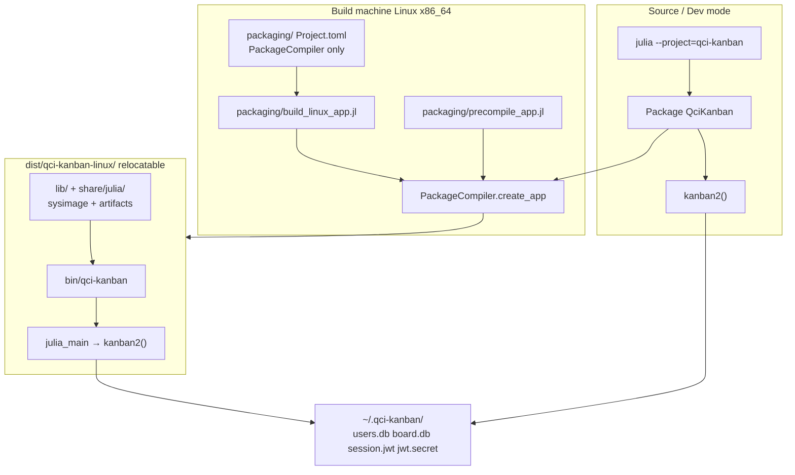

# PackageCompiler Linux App Bundle for QCI Kanban

| Field | Value |
|-------|--------|
| **Status** | Accepted (open questions resolved) |
| **Date** | 2026-07-11 |
| **Author** | (TBD) |
| **Scope** | `qci-kanban/` (self-contained sub-project) |
| **Audience** | Maintainers shipping a relocatable Linux binary while keeping the source-run path |

---

## Overview

QCI Kanban is developed and tested as a normal Julia package (`QciKanban`) under `qci-kanban/`. Product entry for the current app is **`kanban2()`** (`src/ui/app.jl:1160–1168`), which opens the v2 TUI against default DBs under `~/.qci-kanban/`. Non-technical users should not need a Julia install; technical users and CI must keep the existing workflow:

```bash
cd qci-kanban
julia --project=. -e 'using QciKanban; QciKanban.kanban2()'
julia --project=. test/runtests.jl
```

This design proposes a **dual-run** layout: source mode stays unchanged; a **PackageCompiler.jl `create_app`** pipeline (Linux x86_64 first) produces a relocatable directory with `bin/qci-kanban` that launches the same v2 product. Packaging tooling lives under `qci-kanban/packaging/` and is **never** required for `Pkg.test()`, `kanban2()`, or day-to-day development.

**Out of scope for this design:** JuliaC/`--trim`, AppBundler, Snap/AppImage as primary, macOS/Windows, StaticCompiler, changing v1 `kanban()`, and a full nontechnical installer as the primary distribution story.

---

## Background & Motivation

### Current state (verified on disk)

| Fact | Location / detail |
|------|-------------------|
| Package | `Project.toml` name `QciKanban`, Julia compat `1.10`, developed on **Julia 1.12.4** |
| v2 entry | `kanban2()` in `src/ui/app.jl:1160–1168`; defaults `joinpath(homedir(), ".qci-kanban", "users.db")` / `board.db`; `Config.load_config` → `AppModel(...; seed=cfg.seed_demo)` → `app(m)` |
| v1 entry | `kanban()` in `src/QciKanban.jl:1567` — **legacy; not the binary entry** |
| Module layout | Single package; `app.jl` included at `QciKanban.jl:75` so `julia_main` defined there becomes `QciKanban.julia_main` (**export not required** for PackageCompiler) |
| Login gate string | `_render_first_run!` (`src/ui/app.jl:961`): **`"No users — press [c] to create account"`** (full string asserted in `test/test_app_shell.jl`) |
| `AppModel` injectables | `token_path` / `secret` injectable so tests never touch `~/.qci-kanban` (`app.jl:105–129`); if `secret === nothing`, ctor calls `Config.ensure_jwt_secret!(cfg)` which **creates/reads** `~/.qci-kanban/jwt.secret` (`config.jl:188–197`) |
| Dev precompile | `src/precompile.jl` — PrecompileTools `@compile_workload` (included `QciKanban.jl:1623`); uses `token_path=tempname(), secret="precompile-secret", restore=false` — **not** PackageCompiler app precompile |
| Branding | Optional monorepo `branding/qci-canvas-logos.jl` via `try include(...); catch` at `QciKanban.jl:121–125` — baked at compile time on the build machine if present; silent text-art fallback otherwise; **not** a runtime relocatable path dependency after `create_app` |
| Native / artifact deps | `SQLite` / `LibPQ` (ordinary non-lazy `*_jll` artifacts in Manifest), `SMTPClient`, `Tachikoma` |
| Config defaults | `src/config.jl:37–41` — `~/.qci-kanban/{users,board}.db`, `jwt.secret`, `session.jwt` |
| Existing scripts | Only `scripts/seed_playground.jl` shipped; parent gitignores `qci-kanban/scripts/*` except that file |
| Gitignore (verified) | Parent `.gitignore` pattern `dist/` matches **any** `dist/` tree including `qci-kanban/dist/...` (`git check-ignore`); same for `build/`. Parent `qci-kanban/scripts/*` does **not** ignore `packaging/`. Local `qci-kanban/.gitignore` is narrow |
| Manifest | Present locally after instantiate; **gitignored** monorepo-wide (`Manifest.toml`) |
| Coverage dep | `Coverage` listed in **both** product `[deps]` and `[extras]`/`[targets].test` (`Project.toml`) — will enter the app closure until PR4 hygiene |

### Pain points

1. **Distribution gap** — Running the app requires Julia + `Pkg.instantiate` + knowing `--project=.`. That blocks handoff to non-Julia users.
2. **TTFX vs ship** — `src/precompile.jl` already improves *source* startup via pkgimages, but does not produce a relocatable binary or eliminate the Julia install.
3. **Repo organization uncertainty** — Where to put `julia_main`, build scripts, and PackageCompiler so they do not pollute the default project or break tests.

### Why PackageCompiler (not JuliaC)

Product direction for this slice is explicitly **PackageCompiler.jl `create_app`**: mature relocatable app bundles, artifact packaging, known size/time tradeoffs, no trim/experimental compiler pipeline. JuliaC remains a future option outside this design.

---

## Goals & Non-Goals

### Goals

1. **Dual run modes** on Linux x86_64 without forking the product codebase:
   - **Source:** `julia --project=. -e 'using QciKanban; QciKanban.kanban2()'` unchanged.
   - **Compiled:** `dist/qci-kanban-linux/bin/qci-kanban` → same v2 UX (`kanban2` semantics).
2. **Minimal disruption** — Prefer adding a thin entrypoint and packaging tree over a second product package or rewiring modules.
3. **Shared user data** — Binary and source interactive launches use the same default paths under `~/.qci-kanban/`.
4. **Isolated build tooling** — PackageCompiler is **not** a runtime or test dependency of `QciKanban`.
5. **Smoke-testable binary** — Permanent headless `--smoke` CLI that never touches home data dirs and asserts the full first-run gate string.
6. **Documented expectations** — Bundle size (hundreds of MB), build time, disk headroom, and machine identity (build machine = target machine for Stage 1).
7. **Internal Stage 1 distribution** — Ship via `dist/` / private tarball only; no public GitHub Release until polishing.

### Non-Goals

| Explicitly out | Notes |
|----------------|--------|
| JuliaC / `--trim` | Different toolchain; revisit later |
| macOS / Windows | Linux-first only |
| Cross-compilation | Build on the same glibc/arch as targets |
| AppBundler / Snap / AppImage as primary | May wrap the `dist/` tree later |
| Installer-as-primary | Optional tarball + README is enough for the try-out |
| Changing v1 `kanban()` | Do not use as distributed entry |
| Replacing source-run in CI/dev | Source remains canonical for tests and development |
| Guaranteeing identical TTFX across all terminals | Precompile execution covers common paths; exotic terminal graphics paths may still JIT |
| Committing product or packaging `Manifest.toml` for Stage 1 | Instantiate on the build machine; both Manifests stay local/gitignored |
| Public GitHub Release for Stage 1 | Internal `dist/` / private tarball only until polishing |

---

## Proposed Design

### High-level architecture



### Dual-run modes (core)

| Mode | Command | Requires PackageCompiler? | Requires Julia install? | Data dir |
|------|---------|---------------------------|-------------------------|----------|
| Source | `julia --project=. -e 'using QciKanban; QciKanban.kanban2()'` | No | Yes | `~/.qci-kanban/` |
| Tests | `julia --project=. test/runtests.jl` | No | Yes | `:memory:` / temp (tests) |
| Demo record | `QciKanban.record_demo2(...)` | No | Yes | isolated `:memory:` + temp token + injected secret |
| Compiled interactive | `./dist/qci-kanban-linux/bin/qci-kanban` | Only at **build** time | No (runtime) | `~/.qci-kanban/` (same defaults via `kanban2`) |
| Compiled smoke | `./dist/.../bin/qci-kanban --smoke` | Only at build time | No | **None under home** — `:memory:` + `tempname()` + injected secret |

**Running the binary:** launch `bin/qci-kanban` **without** setting `JULIA_PROJECT`, `JULIA_LOAD_PATH`, or wrapping with `julia --project=.` from a source checkout. PackageCompiler embeds the app project under the bundle (`share/julia/`); overriding project env vars from a developer tree can shadow the sysimage’s intended load path. Standard Julia flags after `--julia-args` (e.g. `-t4`) remain supported by PackageCompiler.

### Entry-point layout recommendation: **(A) `julia_main` in `QciKanban`**

PackageCompiler requires the **app package** (the directory passed to `create_app`) to define a zero-arg entry returning `Cint`:

```julia
function julia_main()::Cint
    ...
end
```

#### Options

| Option | Description | Pros | Cons |
|--------|-------------|------|------|
| **(A) Main package** | Add `julia_main` in `QciKanban` (`src/ui/app.jl`) | Minimal structure; one `Project.toml`; create_app points at `qci-kanban/`; matches “the package *is* the app” | Slight library/app mixing; entry is unused in pure library use |
| **(B) Thin app package** | e.g. `QciKanbanApp/` path-depends on `QciKanban`, only holds `julia_main` | Cleaner separation | Second package, nested Manifest resolution, more monorepo noise for a try-out |
| **(C) Other** | Sysimage-only, no `create_app`; shell wrappers | Smaller change for dev TTFX only | Does **not** remove Julia install requirement |

#### Recommendation: **(A)**

Rationale:

1. **Minimal disruption** — `QciKanban` is already a single-package app + library; tests and README already treat it as the product.
2. **PackageCompiler model** — `create_app(package_dir, dest)` expects *one* package tree with Project/Manifest and `julia_main`. Pointing at `qci-kanban/` is the natural fit.
3. **Cost of (A) is tiny** — thin ARG dispatch + smoke helper (covered by tests) plus a one-line handoff to existing `kanban2()`.
4. **(B) can be revisited** if a second binary product appears (e.g. a headless worker); not needed for Linux try-out.

### Coverage exclusion split (mandatory)

The existing live-entry region (`src/ui/app.jl:1147–1169`, documented in `COVERAGE.md`) is justified **only** for code that hands off to Tachikoma’s interactive `app(m)` and never returns under TestBackend — currently `kanban2`.

| Symbol | Coverage policy | Justification |
|--------|-----------------|---------------|
| `kanban2` | Stay inside existing `# COV_EXCL_START` … `# COV_EXCL_STOP` | Live terminal loop; already excluded |
| Interactive branch of `julia_main` that only calls `kanban2()` | **COV_EXCL** (narrow): either keep that call inside the existing block via a tiny wrapper, or mark only that branch with `# COV_EXCL_LINE` | Same as `kanban2` — not reachable under headless tests without hanging |
| `_compiled_app_smoke` | **Covered** — no `COV_EXCL` | Headless TestBackend; PR1 tests must execute it |
| Help printer / ARG parsing that does not call `app(m)` | **Covered** | Pure dispatch; unit-testable |
| `julia_main` try/catch shell | Prefer **covered** by calling help/smoke branches from tests; interactive path exercised only via `kanban2` exclusion | Do **not** wrap the whole of `julia_main` in `COV_EXCL` |

**PR1 must** add a real `COVERAGE.md` row for any *new* exclusion (if any), with justification matching `tdd-bdd-coverage-gates.md`. Preferred shape: **zero new exclusions** beyond the existing `kanban2` block — implement `julia_main` so the only untestable statement is the `kanban2()` call, which already lives in the excluded region (e.g. dispatch outside, then call `kanban2` which is excluded).

Recommended file layout in `src/ui/app.jl`:

```text
# --- NEW, covered by tests ---
function _compiled_app_smoke()::Cint ... end
function _print_app_help() ... end
function julia_main()::Cint
    try
        # help / smoke branches (covered)
        ...
        return _julia_main_interactive()  # thin handoff
    catch
        ...
    end
end

# --- EXISTING COV_EXCL live-entry block ---
function kanban2(...) ... app(m) end
function _julia_main_interactive()::Cint  # optional name; inside COV_EXCL
    kanban2()
    return 0
end
```

### Concrete `julia_main` + smoke contract

#### `julia_main` (PackageCompiler entry)

```julia
"""
    julia_main()::Cint

PackageCompiler app entry for `bin/qci-kanban` (v2 only).
  --help / -h   print usage on stderr, return 0
  --smoke       headless login-gate smoke, return 0/1
  (default)    kanban2() interactive
"""
function julia_main()::Cint
    try
        if any(a -> a in ("--help", "-h"), ARGS)
            _print_app_help()
            return 0
        end
        if "--smoke" in ARGS || get(ENV, "QCI_SMOKE", "") == "1"
            return _compiled_app_smoke()
        end
        return _julia_main_interactive()  # COV_EXCL: calls kanban2() → app(m)
    catch
        Base.invokelatest(Base.display_error, Base.catch_stack())
        return 1
    end
end
```

#### `_compiled_app_smoke` — mandatory isolation kwargs

`AppModel` defaults are **not** home-safe when only DBs are overridden. Constructor (`app.jl:128–129`):

```julia
tok = token_path === nothing ? cfg.session_token_path : String(token_path)
sec = secret !== nothing ? String(secret) : Config.ensure_jwt_secret!(cfg)
```

If `secret` is omitted, `ensure_jwt_secret!` creates or reads `~/.qci-kanban/jwt.secret` (`config.jl:188–197`). Mirror `record_demo2` / `src/precompile.jl`:

```julia
"""
    _compiled_app_smoke()::Cint

Internal, unexported, name-stable for tests. Headless first-run gate check.
Must never read or write under ~/.qci-kanban/ (or the process home data dir).
"""
function _compiled_app_smoke()::Cint
    # MANDATORY kwargs — all four isolation fields required (not optional):
    #   user_db / board_db  → :memory: (no real SQLite files under home)
    #   token_path          → tempname() (not cfg.session_token_path)
    #   secret              → non-nothing string (skip ensure_jwt_secret!)
    #   restore=false       → no session restore from disk
    #   seed=false          → skip demo board seed (faster; users are never seeded anyway)
    m = AppModel(;
        user_db = ":memory:",
        board_db = ":memory:",
        token_path = tempname(),
        secret = "smoke-secret",
        restore = false,
        seed = false,
    )
    tb = Tachikoma.TestBackend(80, 24)
    Tachikoma.reset!(tb.buf)
    Tachikoma.view(m, Tachikoma.Frame(
        tb.buf,
        Tachikoma.Rect(1, 1, tb.width, tb.height),
        Tachikoma.GraphicsRegion[],
        Tachikoma.PixelSnapshot[],
    ))
    # Full production gate string (src/ui/app.jl:961) — not a substring guess
    gate = "No users — press [c] to create account"
    if Tachikoma.find_text(tb, gate) === nothing
        println(stderr, "qci-kanban --smoke: missing gate text: ", gate)
        return 1
    end
    return 0
end
```

**Acceptance criteria for smoke:**

1. Exit code `0` when gate text is present; `1` on missing text or any exception (via `julia_main` catch).
2. After `--smoke`, **no new files** under `~/.qci-kanban/` attributable to the run (optional stronger test: run under isolated `HOME=mktempdir()` and assert the temp home has no `.qci-kanban` tree, or that pre-existing home trees are byte-identical).
3. `secret=` and `token_path=` are **mandatory** in the implementation — code review rejects smoke that only sets DBs + `restore=false`.

#### PR1 tests (source Julia — no PackageCompiler)

- Call **`_compiled_app_smoke()` directly** (or `QciKanban._compiled_app_smoke` if needed). **Do not** mutate global `ARGS` to exercise smoke — that is racy / order-dependent in a multi-test process.
- Optionally test help via `_print_app_help` or by extracting ARG parsing into a pure `function _dispatch_app_args(args::Vector{String})::Symbol` tested with a local vector.
- Assert return `0` and, if testing render separately, the full gate string via TestBackend + `find_text`.
- Prefer placing tests in `test/test_app_shell.jl` (login-gate / shell impact map) or a small dedicated section wired through `test/runtests.jl`.

Interactive launch **does** use real defaults via `kanban2()` so source and binary share user data when desired.

### Repo layout

```text
qci-kanban/
  Project.toml                 # QciKanban product — NO PackageCompiler dep
  Manifest.toml                # required on build machine after Pkg.instantiate; gitignored
  src/
    ui/app.jl                  # julia_main + _compiled_app_smoke (covered);
                               # kanban2 stays in existing COV_EXCL live-entry block
    precompile.jl              # unchanged PrecompileTools workload
  packaging/                   # NEW — build-only tree (not a product package)
    Project.toml               # deps: PackageCompiler only
    Manifest.toml              # local-only; gitignored under packaging/
    build_linux_app.jl         # create_app driver + Manifest fail-fast
    precompile_app.jl          # precompile_execution_file for create_app
    smoke_bundle.jl            # post-build: run bin/qci-kanban --smoke
  dist/                        # output root (gitignored by parent `dist/` + local)
    qci-kanban-linux/          # create_app destination
      bin/qci-kanban
      bin/julia                # sysimage-bound helper (PackageCompiler)
      lib/ …
      share/julia/ …
  scripts/
    seed_playground.jl         # unchanged
  README.md                    # + “Running from source” vs “Building Linux binary”
  COVERAGE.md                  # PR1: update if any new COV_EXCL (prefer none)
```

#### Why `packaging/` not `scripts/`

Parent monorepo `.gitignore` contains:

```gitignore
qci-kanban/scripts/*
!qci-kanban/scripts/seed_playground.jl
```

**Verified:** that rule does **not** ignore `qci-kanban/packaging/`. A dedicated `packaging/` directory stays self-contained, avoids fragile ignore exceptions, and makes build-only intent obvious.

#### PackageCompiler dependency strategy

| Approach | Use? | Why |
|----------|------|-----|
| Add PackageCompiler to main `[deps]` | **No** | Would pull into every `Pkg.instantiate` / inflate app closure |
| Main `[extras]` / test target | **No** | Tests must not require PC |
| **`packaging/Project.toml` only** | **Yes** | `julia --project=packaging` for builds; product project untouched |

`packaging/Project.toml` sketch:

```toml
[deps]
PackageCompiler = "9b87118b-4619-50d2-8e1e-99f35a4d4d9d"

[compat]
PackageCompiler = "2"
julia = "1.10"
```

The build script runs under `--project=packaging` (PackageCompiler only), then calls `create_app` with **`package_dir =` absolute path to `qci-kanban/`** (the product package), **not** `packaging/`. Product deps resolve from `ROOT`’s Project + Manifest.

#### `.gitignore` updates

**`qci-kanban/.gitignore`** (local clarity; parent already covers nested `dist/`):

```gitignore
# PackageCompiler output (parent also ignores dist/ monorepo-wide)
dist/
packaging/Manifest.toml
```

**Verified fact:** parent pattern `dist/` matches `qci-kanban/dist/...`. Local `dist/` is redundant but useful when someone opens only the sub-project. Do **not** ignore `packaging/*.jl` or `packaging/Project.toml`.

#### Manifest / reproducibility (fail-fast)

PackageCompiler apps docs require a package with a project **and manifest** file. Product `Manifest.toml` remains gitignored (repo policy); Stage 1 does **not** commit it.

**Build steps (README + script):**

```bash
# Step 0 — product resolve (creates Manifest.toml if missing)
julia --project=. -e 'using Pkg; Pkg.instantiate()'

# Step 1 — packaging tool
julia --project=packaging -e 'using Pkg; Pkg.instantiate()'

# Step 2 — create_app (fails fast if product Manifest missing)
julia --project=packaging packaging/build_linux_app.jl
```

**Hard gate in `packaging/build_linux_app.jl`** (before `create_app`):

```julia
const ROOT = abspath(dirname(@__DIR__))
const OUT  = joinpath(ROOT, "dist", "qci-kanban-linux")
const MANIFEST = joinpath(ROOT, "Manifest.toml")

@info "QCI Kanban PackageCompiler build" ROOT OUT julia = string(VERSION)

if !isfile(MANIFEST)
    error("""
    Missing product Manifest.toml at $MANIFEST.
    PackageCompiler create_app requires a resolved project + manifest.
    From qci-kanban/ run:
      julia --project=. -e 'using Pkg; Pkg.instantiate()'
    then re-run this script.
    """)
end

# Optional: log project_hash line from Manifest for build records
```

Same-machine try-out first; multi-machine bit-identical reproducibility is a later concern (see Key Decisions). Product and packaging Manifests stay **uncommitted** in Stage 1; instantiate on the build machine for both projects.

### `create_app` parameters (recommended)

Driver: `packaging/build_linux_app.jl`

```julia
using PackageCompiler

const ROOT = abspath(dirname(@__DIR__))  # qci-kanban/
const OUT  = joinpath(ROOT, "dist", "qci-kanban-linux")
const PRE  = joinpath(@__DIR__, "precompile_app.jl")
const MANIFEST = joinpath(ROOT, "Manifest.toml")

const CPU_TARGET = get(ENV, "QCI_CPU_TARGET", "native")

@info "QCI Kanban PackageCompiler build" ROOT OUT cpu_target = CPU_TARGET julia = string(VERSION)

isfile(MANIFEST) || error("Missing product Manifest.toml at $MANIFEST — run: julia --project=. -e 'using Pkg; Pkg.instantiate()'")
isfile(PRE) || error("Missing precompile execution file: $PRE")

create_app(ROOT, OUT;
    executables = ["qci-kanban" => "julia_main"],
    precompile_execution_file = PRE,
    incremental = false,                 # PackageCompiler default for apps
    filter_stdlibs = false,              # reliability first (see tradeoff)
    force = true,
    include_lazy_artifacts = true,       # conservative; see artifact section
    include_transitive_dependencies = true,
    include_preferences = true,          # Stage 1: review bundle prefs for secrets
    cpu_target = CPU_TARGET,
)

@info "create_app finished" OUT
```

| Parameter | Value | Rationale |
|-----------|--------|-----------|
| `package_dir` | absolute `qci-kanban/` | Product package with `julia_main` |
| `compiled_app` | `dist/qci-kanban-linux/` | Clear Linux target path |
| `executables` | `["qci-kanban" => "julia_main"]` | Friendly binary name; not `QciKanban` |
| `incremental` | `false` | App default; smaller specialized sysimage |
| `filter_stdlibs` | `false` for first green (PR3) | PC docs: accidental stdlib use breaks filtered images. **Do not experiment in PR3**; optional env-gated try only in **PR4** after measured baseline |
| `precompile_execution_file` | `packaging/precompile_app.jl` | Trace realistic headless paths into the app sysimage |
| `include_lazy_artifacts` | `true` | **PC default is `false`.** Product `SQLite_jll` / `LibPQ_jll` use **ordinary (non-lazy)** artifacts and are bundled regardless. Set `true` as belt-and-suspenders for any *transitive* lazy artifacts in the graph; revisit if size becomes painful |
| `include_transitive_dependencies` | `true` | Safer full closure in sysimage |
| `include_preferences` | `true` initially | PC default; **Stage 1 must audit** `share/julia/LocalPreferences.toml` for secrets (see Security) |
| `cpu_target` | `native` (env-overridable) | Try-out on build machine; broader target when redistributing |
| `force` | `true` | Idempotent rebuilds into same `dist/` path |

#### Precompile execution file vs `src/precompile.jl`

| File | Purpose | When it runs |
|------|---------|----------------|
| `src/precompile.jl` | PrecompileTools workload for **pkgimage** / `Pkg.precompile` | Every normal package precompile |
| `packaging/precompile_app.jl` | PackageCompiler **trace** file for app sysimage | Only during `create_app` |

Do **not** pass `src/precompile.jl` as `precompile_execution_file` — it is structured for `@compile_workload`, not free-standing execution under the PC tracer.

**Hard rules for `packaging/precompile_app.jl`:**

1. **Forbidden:** calling `kanban2()`, `kanban()`, or Tachikoma `app(m)` (would require a live TTY / hang the build).
2. **Required for v1:** literally copy the **v2** block from `src/precompile.jl` (AppModel + TestBackend tour + key sequence), adapted to a free-standing script (`using QciKanban` / `using Tachikoma as needed`). **Skip the v1 `KanbanModel` pass** — binary only ships v2.
3. **Isolation kwargs** on `AppModel` must match smoke/demo safety: `user_db/board_db = ":memory:"`, `token_path = tempname()`, `secret = "precompile-app-secret"` (or same as precompile.jl), `restore = false`.
4. **Tour sync (v1):** header comment in both files:

   ```julia
   # Keep in sync with packaging/precompile_app.jl v2 tour (and vice versa).
   # TODO: extract shared _v2_headless_tour! later (small follow-up PR).
   ```

5. **Later improvement (optional PR):** extract `function _v2_headless_tour!(m, render!)` used by both PrecompileTools and `precompile_app.jl` — not required for first green bundle.

### Artifact / native dependency handling

PackageCompiler bundles the artifact system so native libs resolve on another machine of the same platform class.

**Build checklist:**

1. `Pkg.instantiate()` on the product project so artifacts download before `create_app`.
2. `include_lazy_artifacts=true` for transitive lazy artifacts (SQLite/LibPQ jlls themselves are non-lazy — still bundled when the flag is false).
3. After first build, inspect `dist/qci-kanban-linux/` for artifact trees and confirm sqlite/libpq-related libs are present.
4. Run `./bin/qci-kanban --smoke` (and optional interactive launch).

**Known risk (medium):** Any dependency that embeds absolute build-machine paths outside artifacts can break relocatability. Mitigation: container or second-host smoke before promising redistribution (PR5).

**Coverage in product `[deps]`:** will enter the app closure. Deferred to PR4: remove from `[deps]` **only**, keep in `[extras]` + `test` target (dual listing is intentional hygiene debt), then re-run `coverage_gate.jl` + full suite.

### Size, time, and machine resources

| Metric | Expected range | Notes |
|--------|----------------|--------|
| Output directory size | **~200–600+ MB** | Sysimage + Julia runtime libs + artifacts |
| First `create_app` wall time | **~10–40 minutes** | Machine-dependent; non-incremental |
| Free disk on build machine | **≥ 5–10 GB headroom** | Instantiated deps + artifacts + `dist/` + temp objects |
| Build RAM | Multi-GB practical minimum | Same class of machine that builds large Julia sysimages |
| Runtime RSS | Tens–hundreds of MB | TUI + SQLite |

Document in README so “why is the tarball huge?” is answered up front.

### Binary smoke test

**Layer 1 — in-process entry flag (uses app sysimage):**

```bash
./dist/qci-kanban-linux/bin/qci-kanban --smoke
# exit 0 required; must not create ~/.qci-kanban/* if absent
```

**Layer 2 — `packaging/smoke_bundle.jl` (or shell) after build:**

```bash
BUNDLE=dist/qci-kanban-linux
test -x "$BUNDLE/bin/qci-kanban"
"$BUNDLE/bin/qci-kanban" --smoke
```

**Layer 3 — source gates (PR1 and any `src/` change):**

```bash
julia --project=. test/runtests.jl
julia --project=. test/coverage_gate.jl    # must print GATE PASSED
# run-the-app: record_demo2 or live kanban2 login-gate check
julia --project=. -e 'using QciKanban; QciKanban.record_demo2("verify.tach")'
# delete throwaway verify.tach after
```

### README structure (product docs)

1. **Running from source** — existing `kanban2()`, tests, `record_demo2`, playground seed.
2. **Building a Linux binary (PackageCompiler)**
   - Prerequisites: Linux x86_64, Julia 1.10+ (tested 1.12.x), C toolchain if PC needs it (`JULIA_CC`), **≥5–10 GB free disk**
   - Step 0: product `Pkg.instantiate()` (Manifest required)
   - Build + `--smoke` commands
   - Run interactive: `./dist/qci-kanban-linux/bin/qci-kanban` **without** `JULIA_PROJECT` from a source tree
   - Data under `~/.qci-kanban/` for interactive mode only
   - Size/time expectations

### Sequence: build → run

```mermaid
sequenceDiagram
  participant Dev as Developer
  participant Prod as qci-kanban Project.toml
  participant Pack as packaging/ Project.toml
  participant PC as PackageCompiler
  participant Dist as dist/qci-kanban-linux
  participant User as End user

  Dev->>Prod: Pkg.instantiate (product deps + Manifest + artifacts)
  Dev->>Pack: Pkg.instantiate (PackageCompiler)
  Dev->>PC: build_linux_app.jl fail-fast Manifest; create_app
  PC->>Prod: Load QciKanban, trace precompile_app
  PC->>Dist: Write bin/qci-kanban + sysimage + artifacts
  Dev->>Dist: bin/qci-kanban --smoke
  Dev->>Dist: audit share/julia/LocalPreferences.toml
  User->>Dist: bin/qci-kanban (no JULIA_PROJECT override)
  Dist->>User: kanban2() TUI; ~/.qci-kanban data
```

---

## API / Interface Changes

### Public product API

| Symbol | Change |
|--------|--------|
| `kanban2(...)` | **Unchanged** signature and defaults |
| `record_demo2(...)` | Unchanged |
| `kanban()` | Unchanged (not used by binary) |
| **`julia_main()::Cint`** | **New** — PackageCompiler entry |
| **`_compiled_app_smoke()::Cint`** | **New** internal (unexported), **name-stable for tests** |
| **`_print_app_help()`** | **New** internal |

### CLI (compiled binary)

| Invocation | Behavior |
|------------|----------|
| `qci-kanban` | `kanban2()` interactive → `~/.qci-kanban/` |
| `qci-kanban --smoke` | Headless gate smoke; no home mutation (**permanent** CLI flag, not temporary) |
| `qci-kanban --help` | Usage on stderr |
| `qci-kanban … --julia-args -t4` | PackageCompiler Julia runtime flags |

| Env | Purpose |
|-----|---------|
| `QCI_SMOKE=1` | Alternate smoke trigger |
| `QCI_CPU_TARGET` | Override `cpu_target` at **build** time |
| Existing `QCI_SEED_DEMO` / config TOML | Respected by interactive `kanban2` only |

### Build interface

```bash
# From qci-kanban/
julia --project=. -e 'using Pkg; Pkg.instantiate()'   # Manifest required
julia --project=packaging packaging/build_linux_app.jl
QCI_CPU_TARGET=native julia --project=packaging packaging/build_linux_app.jl
```

---

## Data Model Changes

**None.** Schema, stores, and JWT/session files are unchanged.

| Path | Interactive source / binary | `--smoke` |
|------|----------------------------|-----------|
| `~/.qci-kanban/users.db` | default | not used (`:memory:`) |
| `~/.qci-kanban/board.db` | default | not used (`:memory:`) |
| `~/.qci-kanban/session.jwt` | default | not used (`token_path=tempname()`) |
| `~/.qci-kanban/jwt.secret` | via `ensure_jwt_secret!` | **not used** (`secret="smoke-secret"` mandatory) |

---

## Alternatives Considered

### 1. Thin app package (`QciKanbanApp/`) — Option B

- **Pros:** Pure library `QciKanban`; packaging boundary explicit.
- **Cons:** Second Project/Manifest, path deps; heavier for first try-out.
- **Decision:** Defer unless a second executable product appears.

### 2. PackageCompiler only for `create_sysimage` (dev TTFX)

- **Pros:** Smaller change for developers who already have Julia.
- **Cons:** Does not meet “no Julia install” distribution goal.
- **Decision:** Reject as primary; optional/orthogonal later.

### 3. JuliaC / trim

- **Pros:** Potentially smaller binaries long-term.
- **Cons:** Explicitly out of product direction for this slice.
- **Decision:** Out of scope.

### 4. Install-script-as-primary (curl \| bash + juliaup)

- **Pros:** Always latest source; smaller download.
- **Cons:** Requires network + toolchain; deferred by product discussion.
- **Decision:** Optional future companion.

### 5. AppImage/Snap wrapping of the PackageCompiler tree

- **Pros:** Single-file UX on Linux.
- **Cons:** Extra layer; can wrap `dist/` later without changing `julia_main`.
- **Decision:** Future.

---

## Security & Privacy Considerations

| Topic | Consideration | Mitigation |
|-------|---------------|------------|
| JWT secret / session files | Interactive binary uses same `~/.qci-kanban/` secrets as source | Preserve 0600 write behavior; do not embed secrets in the bundle |
| Smoke isolation | Incomplete kwargs write `jwt.secret` under home | Mandatory `secret=` + `token_path=` + `:memory:` DBs + `restore=false` |
| Preferences dump | `include_preferences=true` may copy build-machine `LocalPreferences.toml` into the bundle | **Stage 1 checklist:** inspect `dist/.../share/julia/` for `LocalPreferences.toml`; ensure no secrets; delete file before tarball **or** set `include_preferences=false` once runtime prefs are confirmed unused |
| Reverse engineering | Lowered code / strings may leak build paths | Accept for internal try-out; no secrets in source |
| Supply chain | Huge binary blob | Build from known git SHA; document Julia version |
| Network deps | SMTP/LibPQ if configured | Same as source; default SQLite local |

Threat model for the try-out: **trusted internal distribution**, not a hardened public store submission.

---

## Observability

| Concern | Approach |
|---------|----------|
| Build logging | `@info` with **absolute `ROOT` and `OUT`**, Julia version, `cpu_target`, duration |
| Smoke | Nonzero exit + stderr message naming missing gate text |
| Runtime | Existing TUI / `@info` from `kanban2` |
| Failure diagnosis | Keep `bin/julia` in the bundle for advanced sysimage inspection |

---

## Rollout Plan

### Stage 0 — Scaffold + entry (PR1–PR2)

- `julia_main`, covered smoke helper, tests, COVERAGE.md if needed
- `packaging/` tree, README dual-run, gitignore
- No long create_app required for merge of PR1; PR2 may land without measured build if preferred

### Stage 1 — First successful local `create_app` (PR3)

**Distribution:** internal only (`dist/` and/or private tarball). No public GitHub Release.

Checklist:

1. Product `Pkg.instantiate` → product Manifest present (local, uncommitted)
2. Packaging `Pkg.instantiate` → packaging Manifest present (local, uncommitted)
3. `create_app` with **`filter_stdlibs=false`** (no size experiments yet)
4. Log wall time + `du -sh dist/qci-kanban-linux`
5. `./bin/qci-kanban --smoke` exit 0
6. **Preferences audit:** `ls dist/.../share/julia/`; scrub secrets if any
7. One interactive launch (login gate / create account) on the build machine
8. Do not claim multi-machine relocatability yet

### Stage 2 — Hardening (PR4)

- Coverage dep hygiene (`[deps]` only removal)
- **First allowed `filter_stdlibs` experiment** (env-gated; default remains false until proven)
- Optional private tarball helper for internal handoff
- Document measured size/time in README

### Stage 3 — Future (PR5)

- Second-machine / container relocatable verification
- Broader `cpu_target` for redistribution
- Public release channel only after polishing (separate product decision)
- AppImage wrapper, macOS/Windows, CI nightly (cache carefully)

### Rollback

- Packaging is additive. Remove `packaging/` + entry helpers to restore source-only.
- Binary users delete the `dist` tree; data in `~/.qci-kanban/` is independent.

### Feature flags

- `QCI_CPU_TARGET` at build time
- Optional later: `QCI_FILTER_STDLIBS=1` for experiments (default remains false)

---

## Risks

| Risk | Severity | Mitigation |
|------|----------|------------|
| Bundle 100s of MB / long builds | Low (expected) | Document; don’t run create_app in default CI |
| Smoke omits `secret=` → writes `jwt.secret` | High if miscoded | Spec + PR1 test + review checklist |
| `filter_stdlibs=true` breaks stdlib methods | Medium if enabled early | Default **false** |
| Non-relocatable dependency | Medium | Artifact audit + PR5 container smoke |
| `cpu_target=native` fails on older CPUs | Medium if redistributed | native for try-out only |
| Tour drift precompile.jl ↔ precompile_app.jl | Low–medium | Copy-paste + mutual TODO comments; extract helper later |
| Wrapping binary with source `JULIA_PROJECT` | Medium | Document “run bare binary” |
| Preferences leak secrets into bundle | Medium | Stage 1 audit checklist |
| Parent `scripts/*` ignore | Low | Use `packaging/` (verified not ignored) |

---

## Resolved Open Questions

User decisions (2026-07-11) — final; do not re-open without a new product decision.

| # | Question | Decision |
|---|----------|----------|
| 1 | **Release channel** | **Internal only for Stage 1** — tarballs and/or manual handoff of `dist/`; **no public GitHub Release** until more polishing. |
| 2 | **`filter_stdlibs` experiment timing** | **After first green baseline only (PR4)** — not during PR3. PR3 keeps `filter_stdlibs=false`. |
| 3 | **`--smoke` in product binary** | **Yes — keep forever.** Permanent ops/health check; cheap and useful. |
| 4 | **packaging `Manifest.toml`** | **Local only for Stage 1** — do **not** commit `packaging/Manifest.toml`; instantiate on the build machine (same policy as product `Manifest.toml`). |
| 5 | **glibc baseline** | Still deferred until redistribution (PR5+); not blocking Stage 1 internal try-out. |

---

## Key Decisions

| Decision | Choice | Rationale |
|----------|--------|-----------|
| Compiler | PackageCompiler `create_app` only | Product direction; no JuliaC/trim in this slice |
| Dual-run entry layout | **(A)** `julia_main` in main `QciKanban` package | Minimal disruption; package already is the app |
| Product binary entry | `julia_main` → **`kanban2()`** only | v2 is current product (`app.jl:1160`); v1 stays legacy |
| Executable name | `qci-kanban` | Clear CLI name via `executables=` |
| PC dependency location | `packaging/Project.toml` only | Source/tests never require PackageCompiler |
| Packaging path | `qci-kanban/packaging/` | Self-contained; not hit by parent `scripts/*` ignore (verified) |
| Output path | `qci-kanban/dist/qci-kanban-linux/` | Parent `dist/` already ignores nested path; local gitignore for clarity |
| `incremental` | `false` | PC default for apps |
| `filter_stdlibs` | `false` for PR1–PR3; experiment only in **PR4** after green baseline | Reliability first; size tuning only after measured bundle |
| Lazy artifacts | `include_lazy_artifacts=true` | Conservative for transitive lazy artifacts; SQLite/LibPQ jlls are non-lazy and bundled either way |
| App precompile file | Separate `packaging/precompile_app.jl` | Free-standing trace; copy v2 tour from `src/precompile.jl`; never call `kanban2`/`app` |
| Data dirs (interactive) | Same `~/.qci-kanban/` defaults | Dev and binary can share user data |
| `--smoke` lifetime | **Permanent** product CLI flag | Cheap ops check; never a temporary debug switch |
| Smoke isolation | `:memory:` DBs + **`secret=` + `token_path=` mandatory** + `restore=false` + `seed=false` | Prevents `ensure_jwt_secret!` home writes |
| Smoke assertion | Full string `"No users — press [c] to create account"` | Matches production UI (`app.jl:961`) and shell tests |
| Smoke tests | Call `_compiled_app_smoke()` helper — **not** global `ARGS` | Avoid suite races |
| Coverage policy | Exclude only interactive `kanban2` / `app(m)` handoff; cover smoke/help/dispatch | Aligns with 100% gate + justified `COV_EXCL` only |
| Manifest for create_app | **Fail fast** if product `Manifest.toml` missing after instantiate | PC requires project + manifest |
| Product Manifest (Stage 1) | **Not committed**; instantiate on build machine | Monorepo gitignore policy |
| Packaging Manifest (Stage 1) | **Not committed** (`packaging/Manifest.toml` local-only / gitignored) | Same policy as product Manifest; instantiate under `--project=packaging` |
| Release channel (Stage 1) | **Internal only** — `dist/` / private tarball; **no public GitHub Release** | Polish before public assets |
| Running the binary | No `JULIA_PROJECT` / source-tree project override | Use embedded bundle project |
| Build machine resources | ≥ **5–10 GB** free disk headroom | Instantiated deps + dist + temps |
| Target matrix | Linux x86_64, build = run machine | No cross-compile in first slice |
| `cpu_target` | `native` + env override | Try-out first; broader target when redistributing |

---

## References

- PackageCompiler Apps docs: https://julialang.github.io/PackageCompiler.jl/dev/apps.html
- PackageCompiler `create_app` reference: https://julialang.github.io/PackageCompiler.jl/dev/refs.html
- v2 entry: `src/ui/app.jl:1160–1168` (`kanban2`)
- First-run gate string: `src/ui/app.jl:961`
- `AppModel` secret/token injectables: `src/ui/app.jl:105–129`
- JWT secret persistence: `src/config.jl:188–197` (`ensure_jwt_secret!`)
- PrecompileTools workload: `src/precompile.jl` (include `QciKanban.jl:1623`)
- Optional branding include: `src/QciKanban.jl:121–125`
- Coverage exclusion policy: `COVERAGE.md`, `.claude/rules/tdd-bdd-coverage-gates.md`
- Parent ignore rules: `../.gitignore` (`dist/`, `build/`, `qci-kanban/scripts/*`)
- Test / app gates: `.claude/rules/run-the-app-gate.md`, `qci-kanban-test-map.md`
- Out of scope: JuliaC, AppBundler, StaticCompiler

---

## PR Plan

Ordered, independently reviewable slices. Each PR that touches `src/` must leave source-run green with full suite, coverage gate, and run-the-app. Long `create_app` builds are **manual evidence** in the PR body, not default CI.

### PR1 — `julia_main` entry + covered `--smoke` (no PackageCompiler)

| Field | Content |
|-------|---------|
| **Title** | Add `julia_main` / covered smoke entry for PackageCompiler-ready v2 launch |
| **Files / components** | `src/ui/app.jl` (`julia_main`, `_compiled_app_smoke`, help; **COV_EXCL only** for interactive `kanban2` handoff); `COVERAGE.md` if any new exclusion (prefer none); `test/test_app_shell.jl` (or wired suite file) calling **`_compiled_app_smoke()`** directly — full gate string; optional home non-mutation check; `README.md` brief note |
| **Depends on** | — |
| **Gates (mandatory)** | Targeted shell tests → `julia --project=. test/runtests.jl` → `julia --project=. test/coverage_gate.jl` (GATE PASSED) → run-the-app (`record_demo2` or login-gate scripted check). Red-first for smoke behavior. |
| **Description** | Introduce Cint entry and headless smoke with **mandatory** `secret=` / `token_path=` / `:memory:` isolation. Do not mutate global `ARGS` in tests. Source `kanban2()` unchanged. No `packaging/` create_app yet. |

### PR2 — `packaging/` scaffold + README dual-run docs + gitignore

| Field | Content |
|-------|---------|
| **Title** | Add PackageCompiler packaging scaffold (Linux) |
| **Files / components** | `packaging/Project.toml`; `packaging/build_linux_app.jl` (absolute ROOT/OUT logging, **Manifest fail-fast**, create_app kwargs); `packaging/precompile_app.jl` (v2 tour copy from `src/precompile.jl`, no `kanban2`/`app`); `packaging/smoke_bundle.jl`; `qci-kanban/.gitignore`; `README.md` dual-run + disk/size notes |
| **Depends on** | PR1 (`julia_main` must exist) |
| **Description** | Land build driver and docs. CI need not run full create_app. PackageCompiler stays out of product Project.toml. Optional: merge with PR3 if one implementer will run create_app once and review load is low. |

### PR3 — First green Linux bundle + measured evidence + binary smoke

| Field | Content |
|-------|---------|
| **Title** | First successful Linux `create_app` bundle + binary smoke evidence |
| **Files / components** | Prefer **packaging-only** fixes. Product `src/` diffs only if a real product bug is found — list them explicitly in the PR body or split a fix PR. README filled with **measured** `time` + `du -sh` numbers. Stage 1 preferences audit. **No `filter_stdlibs` experiment.** |
| **Depends on** | PR1, PR2 |
| **PR body must include** | Exact build commands; wall-clock; `du -sh dist/qci-kanban-linux`; `./bin/qci-kanban --smoke` exit code; Julia version; note internal-only distribution; multi-machine relocatable is **not** claimed |
| **Description** | Bounded “first green binary” slice — packaging-side only unless product bug. Keep `filter_stdlibs=false`. Internal handoff of `dist/` only (no GitHub Release). |

### PR4 — Optional hygiene and size experiments

| Field | Content |
|-------|---------|
| **Title** | Packaging hygiene: Coverage dep cleanup, filter_stdlibs experiment, tarball helper |
| **Files / components** | `Project.toml`: remove Coverage from **`[deps]` only**; keep in `[extras]` + `test` target; re-run `coverage_gate.jl` + full suite as evidence. Optional `packaging/package_tarball.sh` for **internal** tarballs; **first** env-gated `filter_stdlibs` experiment (only after PR3 baseline); README size comparison |
| **Depends on** | PR3 (baseline bundle to compare) |
| **Description** | Non-blocking. Default remains `filter_stdlibs=false` unless the experiment proves safe. No public release channel. |

### PR5 — (Future) Relocatable verification + broader `cpu_target`

| Field | Content |
|-------|---------|
| **Title** | Verify relocatable Linux bundle off build machine |
| **Files / components** | packaging docs; release vs dev `QCI_CPU_TARGET`; optional container smoke |
| **Depends on** | PR3 |
| **Description** | Tarball to second Linux host/container with matching glibc family; smoke + interactive. Only then claim “ship to other Linux machines.” |

---

*End of design document.*
